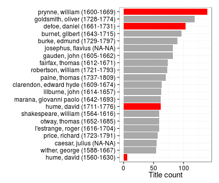
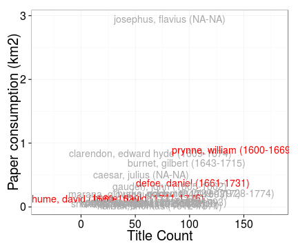

mc <- df[unique(c(grep("Magna", df$publication.title),grep("Carta", df$publication.title), grep("Chart", df$publication.title))),]


 


```
## Error in `[.data.frame`(dfs, , c("author.name", "author.unique", "author.birth", : undefined columns selected
```

```
## Error in eval(expr, envir, enclos): object 'author.birth' not found
```

```
## Error in `$<-.data.frame`(`*tmp*`, "author.name", value = structure(integer(0), .Label = character(0), class = "factor")): replacement has 0 rows, data has 111
```

```
## Error in eval(expr, envir, enclos): object 'author.birth' not found
```


```
## Error in eval(expr, envir, enclos): unknown column 'publication.year'
```

```
## Error in eval(expr, envir, enclos): object 'publication.year' not found
```


```
## Error in `[<-.data.frame`(`*tmp*`, dfs$author.unique == "hume, david (1560-1630)", : replacement has 1 row, data has 0
```

```
## Warning in max(dfs$folio): no non-missing arguments to max; returning -Inf
```

```
## Error in eval(expr, envir, enclos): object 'folio' not found
```

```
## Error in `[.data.frame`(base, names(rows)): undefined columns selected
```


 


```
## Error in eval(expr, envir, enclos): object 'author.gender' not found
```

```
## Error in data.frame(x = structure(NA_integer_, .Label = character(0), class = "factor"), : row names contain missing values
```


```
## Error in dfs[1:ntop, ]: incorrect number of dimensions
```

```
## Error in data.frame(x = structure(NA_integer_, .Label = character(0), class = "factor"), : row names contain missing values
```


```
## Error in eval(expr, envir, enclos): object 'publication.country' not found
```

```
## Error in data.frame(x = structure(NA_integer_, .Label = character(0), class = "factor"), : row names contain missing values
```


```
## Error in eval(expr, envir, enclos): object 'publication.place' not found
```

```
## Warning in max(na.omit(dfs$titles[!is.infinite(dfs$titles)])): no non-
## missing arguments to max; returning -Inf
```

```
## Warning in limits(c(...), "x"): NaNs produced
```

```
## Error in xlab("Title Count") + ylab("Paper consumption (km2)"): non-numeric argument to binary operator
```

```
## Error in eval(expr, envir, enclos): object 'publication.place' not found
```


```
## Error in eval(expr, envir, enclos): object 'subject.topic' not found
```

```
## Error in eval(expr, envir, enclos): object 'publication.year' not found
```


```
## Error in eval(expr, envir, enclos): unknown column 'publication.year'
```

```
## Error: All select() inputs must resolve to integer column positions.
## The following do not:
## *  IV
```

```
## Error in eval(expr, envir, enclos): object 'publication.country' not found
```


```
## Error: All select() inputs must resolve to integer column positions.
## The following do not:
## *  IV
```

```
## Error in eval(expr, envir, enclos): object 'publication.year' not found
```


```
## Error in eval(expr, envir, enclos): unknown column 'publication.year'
```

```
## Error in eval(expr, envir, enclos): object 'publication.year' not found
```
