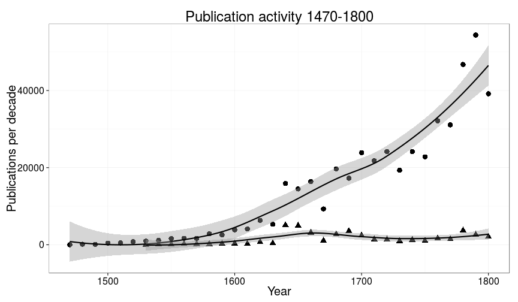
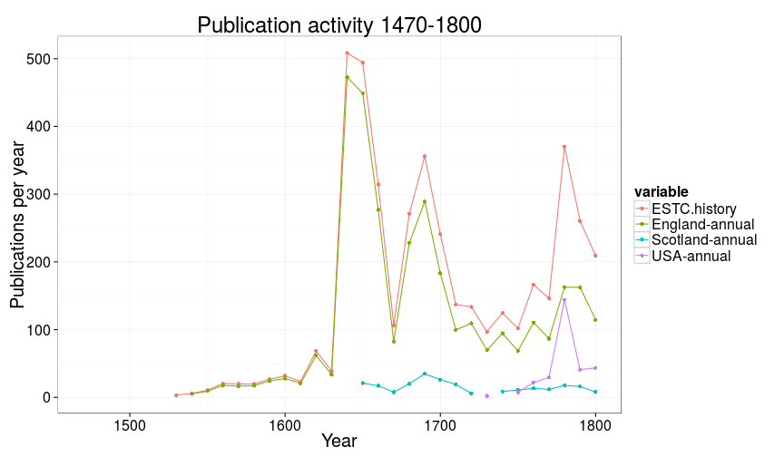

```
## Error in eval(expr, envir, enclos): object 'author.unique' not found
```

```
## Error in dfs[1:ntop, ]: incorrect number of dimensions
```

```
## Error in eval(expr, envir, enclos): object 'publication.year' not found
```


```
## Error in `[.data.frame`(dfs, , c("author_name", "author.unique", "author_birth", : undefined columns selected
```

```
## Error in eval(expr, envir, enclos): object 'dfa' not found
```

```
## Error in arrange_(.data, .dots = lazyeval::lazy_dots(...)): object 'dfa' not found
```

```
## Error in factor(dfa$author_name, levels = unique(dfa$author_name)): object 'dfa' not found
```

```
## Error in nrow(dfa): object 'dfa' not found
```

```
## Error in nrow(dfa): object 'dfa' not found
```

```
## Error in dfa$fill[dfa$author.unique %in% selected.authors] <- "red": object 'dfa' not found
```

```
## Error in ggplot(dfa): object 'dfa' not found
```

```
## Error in eval(expr, envir, enclos): object 'publication.year' not found
```


```
## Error in eval(expr, envir, enclos): object 'author.unique' not found
```

```
## Error in eval(expr, envir, enclos): object 'publication_year' not found
```


```
## Error in eval(expr, envir, enclos): object 'author.unique' not found
```

```
## Error in `$<-.data.frame`(`*tmp*`, "highlight", value = logical(0)): replacement has 0 rows, data has 49045
```

```
## Warning in `[<-.factor`(`*tmp*`, thisvar, value = 0): invalid factor level,
## NA generated
```

```
## Warning in `[<-.factor`(`*tmp*`, thisvar, value = 0): invalid factor level,
## NA generated
```

```
## Warning in `[<-.factor`(`*tmp*`, thisvar, value = 0): invalid factor level,
## NA generated
```

```
## Warning in `[<-.factor`(`*tmp*`, thisvar, value = 0): invalid factor level,
## NA generated
```

```
## Warning in `[<-.factor`(`*tmp*`, thisvar, value = 0): invalid factor level,
## NA generated
```

```
## Warning in `[<-.factor`(`*tmp*`, thisvar, value = 0): invalid factor level,
## NA generated
```

```
## Warning in `[<-.factor`(`*tmp*`, thisvar, value = 0): invalid factor level,
## NA generated
```

```
## Warning in `[<-.factor`(`*tmp*`, thisvar, value = 0): invalid factor level,
## NA generated
```

```
## Warning in `[<-.factor`(`*tmp*`, thisvar, value = 0): invalid factor level,
## NA generated
```

```
## Warning in `[<-.factor`(`*tmp*`, thisvar, value = 0): invalid factor level,
## NA generated
```

```
## Warning in max(dfs$folio): no non-missing arguments to max; returning -Inf
```

```
## Error in eval(expr, envir, enclos): object 'author.unique' not found
```


```
## Error in eval(expr, envir, enclos): object 'author.unique' not found
```

```
## Error in eval(expr, envir, enclos): unknown column 'author.unique'
```

```
## Error in eval(expr, envir, enclos): object 'author.unique' not found
```


```
## Error in dfs[1:ntop, ]: incorrect number of dimensions
```

```
## Error in eval(expr, envir, enclos): object 'author.unique' not found
```


 


 


 

 


```
## Warning: Removed 1 rows containing missing values (geom_point).
```

 

## How does publishing change ?


```
## Warning: Removed 1 rows containing missing values (stat_smooth).
```

```
## Warning: Removed 1 rows containing missing values (stat_smooth).
```

```
## Warning: Removed 2 rows containing missing values (geom_point).
```

 


 


 


  


 

