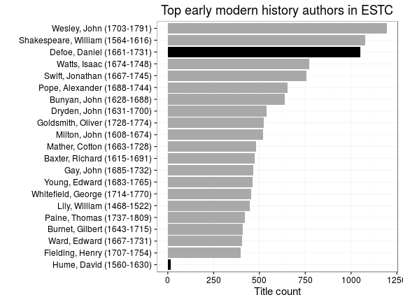 


```
## Warning: Removed 1 rows containing missing values (geom_segment).
```

```
## Warning: Removed 1 rows containing missing values (geom_segment).
```

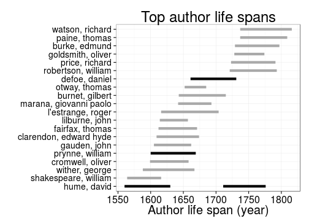 


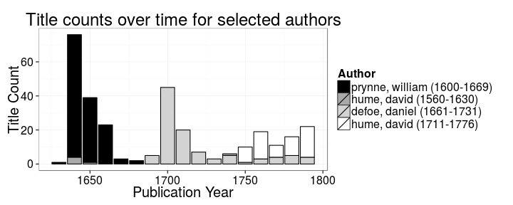 


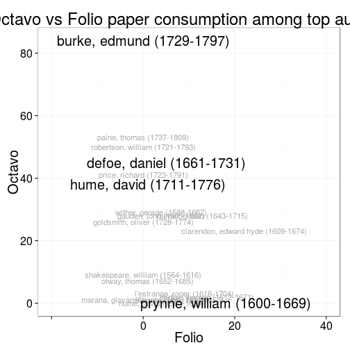 


 


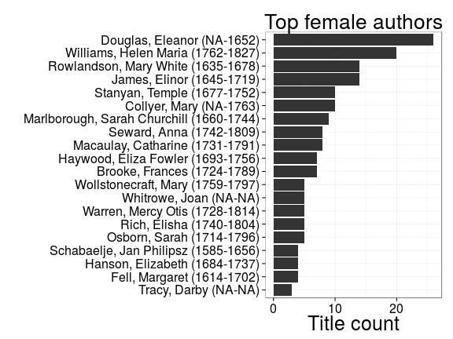 


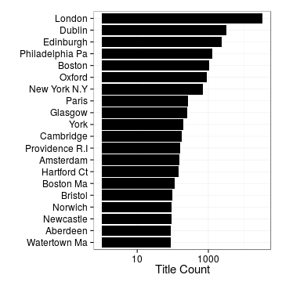 


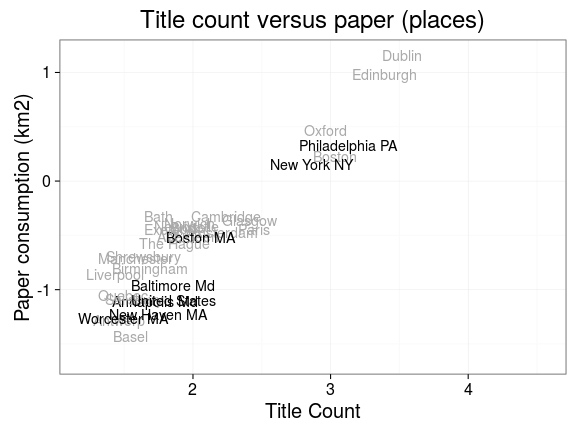 


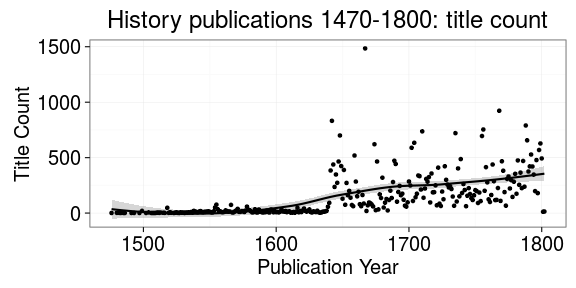 

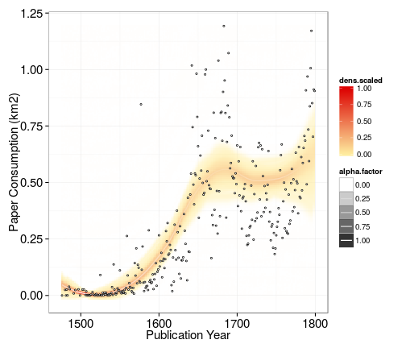 


```
## Warning: Removed 1 rows containing missing values (geom_point).
```

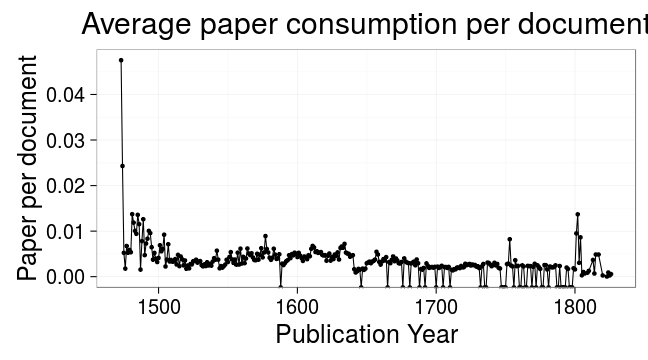 

## How does publishing change ?


```
## Warning: Removed 1 rows containing missing values (stat_smooth).
```

```
## Warning: Removed 1 rows containing missing values (stat_smooth).
```

```
## Warning: Removed 1 rows containing missing values (stat_smooth).
```

```
## Warning: Removed 3 rows containing missing values (geom_point).
```

 


Estimated paper consumption by document size

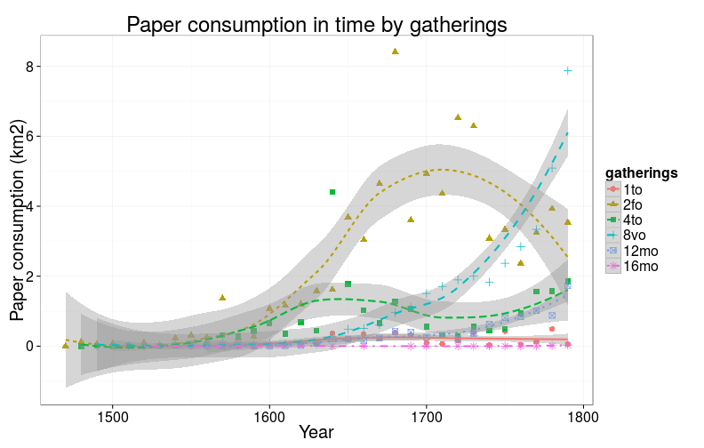 
