## LIBER Analyses


This document provides a reproducible summary of the ESTC history data set (roughly 50,000 documents) used in [Lahti, Ilomaki, Tolonen (2015); Liber Quarterly 25(2), pp.87–116](http://doi.org/10.18352/lq.10112). For details on the data and analysis, see the manuscript. The figures presented on this page are not identical to the original article due to improvements in the analysis pipeline after the article publication (we have checked that qualitative results remain the same). The exact original figures and code can be retrieved upon request.

For further analysis of the overall ESTC data collection (roughly 500,000 documents) see links in the [README file](https://github.com/rOpenGov/estc). 


### Reproducing the analyses

The analysis on this page rely on access to the ESTC data. This data set was obtained from the British Library and is not public. Assuming you have access to the ESTC data, you can reproduce the analyses by first cloning this repository and parsing the raw data file ([instructions](https://github.com/rOpenGov/estc/blob/master/vignettes/tutorial.md)). Full details for reproducing the figures are in the [Rmarkdown source code](https://github.com/rOpenGov/estc/blob/master/inst/examples/20151023-LIBER.Rmd) of this document that you are reading now. After parsing the raw data file and installing the required R packages, you can run the following commands in R (use the inst/examples folder of this repository as the working directory) to generate all the figures:


```r
library(knitr)
knit("20151023-LIBER.Rmd")
```


## Who wrote history ?

### Authors who published the most history titles according to the ESTC

Specific authors are highlighted:

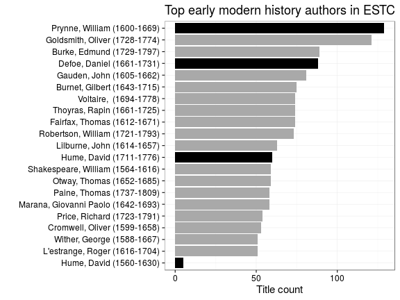


### The life spans of the top authors based on the title count

The visualization also reveals ambiguities arising from authors having the same name but living at different times (e.g. David Hume)

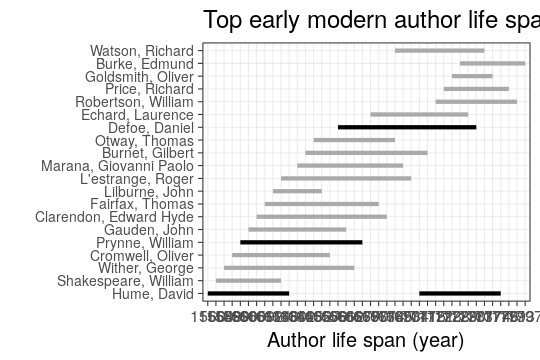


### The title counts per year for selected authors

William Prynne, Daniel Defoe and David Hume (highlighted in Figures 1 and 2) provide an overview of their publishing activity up until 1800.

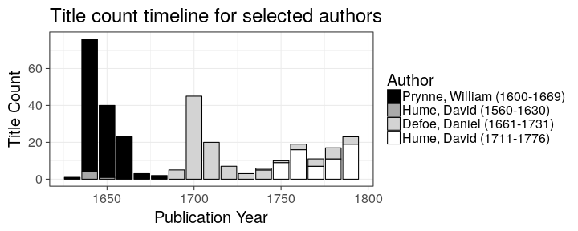


### Title count versus paper consumption among the highlighted authors

The visualization reveals the nature of the author’s publications, distinguishing pamphleteering (many titles, few pages) and the authoring of books (fewer titles, more pages).

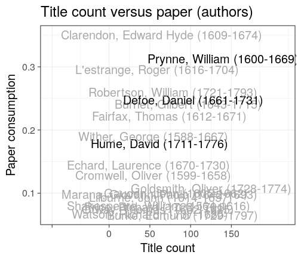

<!--

### The most active known female authors based on the title count

The gender is inferred automatically from the first names

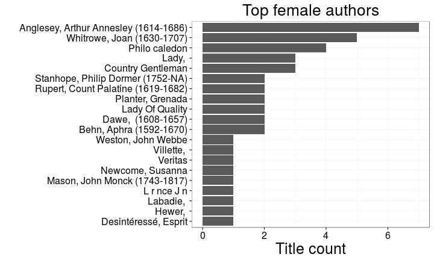

--> 


## Where was history published ?

### Publication volumes at the top publication locations in Britain and Ireland, 1470-1800

The UK map was generated by taking a screencapture of a video produced by running the [analysis code](20151023-LIBER-video.R):


```r
source("20151023-LIBER-video.R")
```

The circle diameter corresponds to the logarithm (log10) of the title count. You can also [download and view the full video](https://raw.githubusercontent.com/rOpenGov/estc/master/inst/examples/figure_20151023_LIBER/liber.mp4).

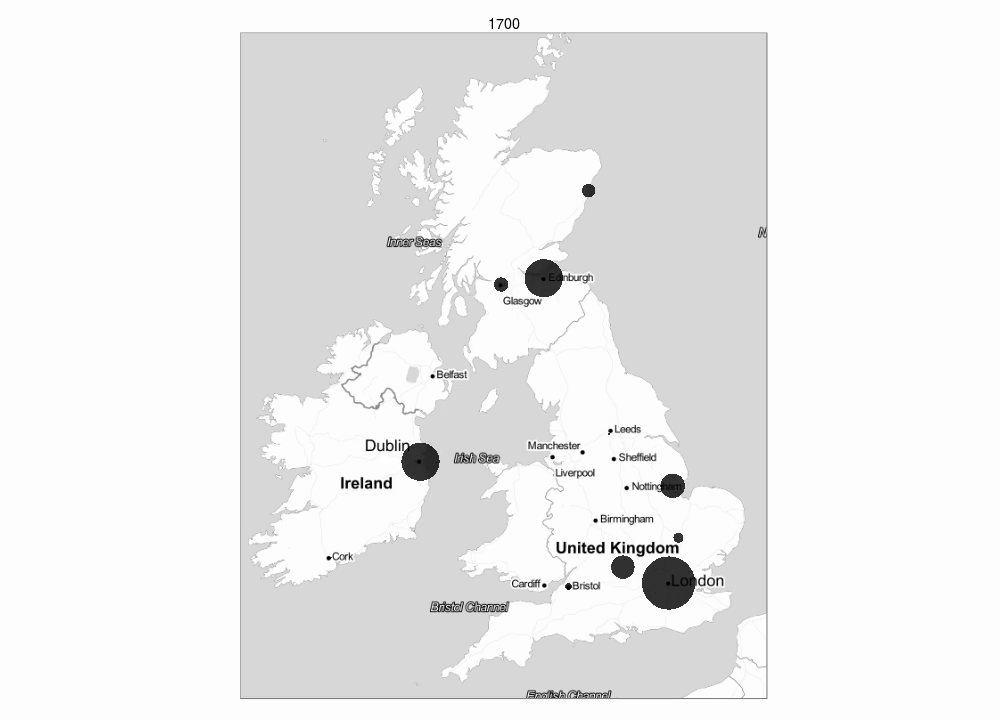


### The top publication places ranked by the title count

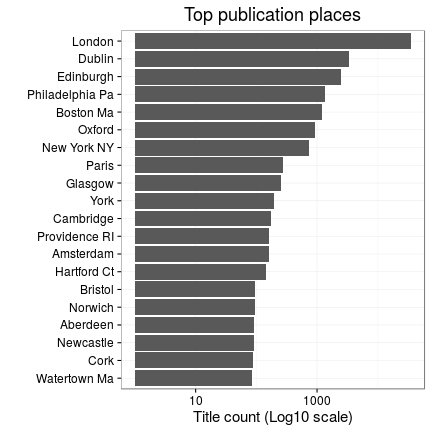


### Title count and overall paper consumption in the top publication locations

The current country of origin is indicated.

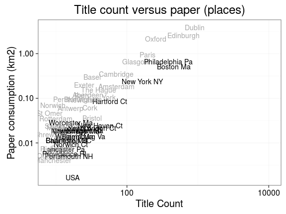


### Title count and paper consumption in Ireland, Scotland and the USA


Estimated gatherings per country:

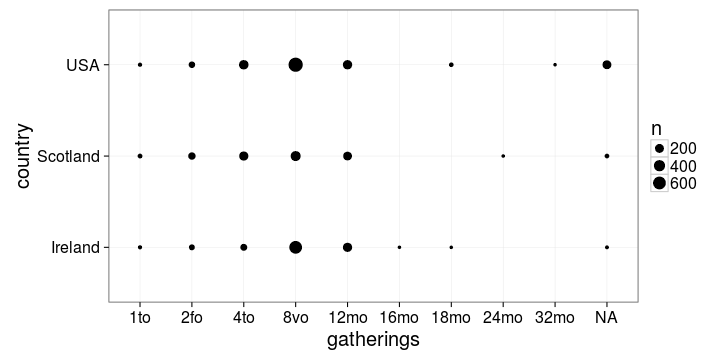

Estimated pagecounts per country:

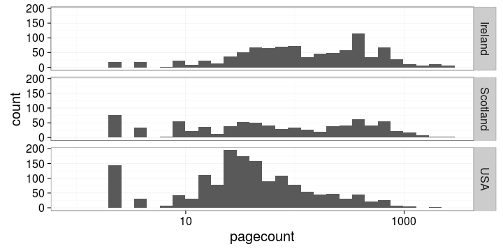

Gatherings vs. pagecounts per country

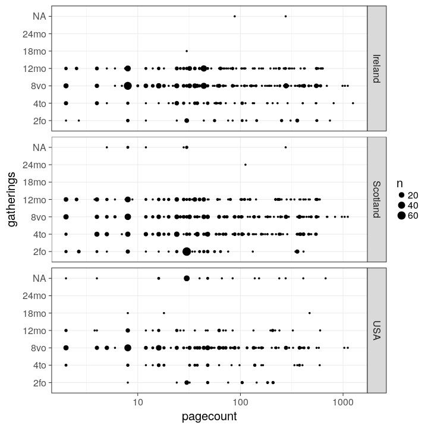

## How does publishing change ?

### Publishing activity among all ESTC documents (balls) and History documents (triangles)

A comparison between the title count for history publications and for all documents in the ESTC catalogue, 1470-1800.

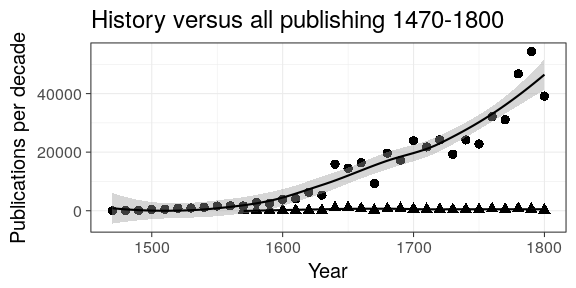


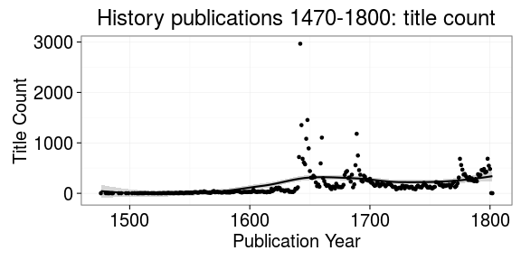


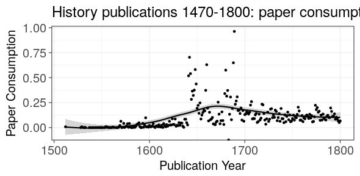

<!--

### Average paper consumption per document in history publications, 1470-1800

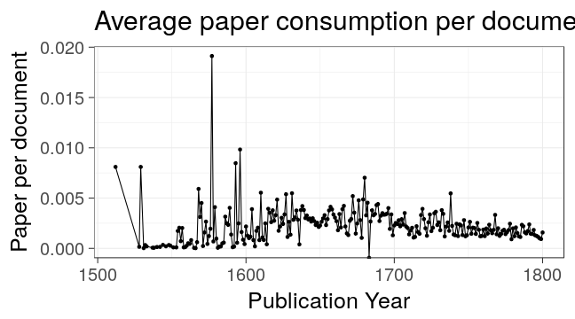


### Paper consumption in books (balls) versus pamphlets (triangles), 1470-1800

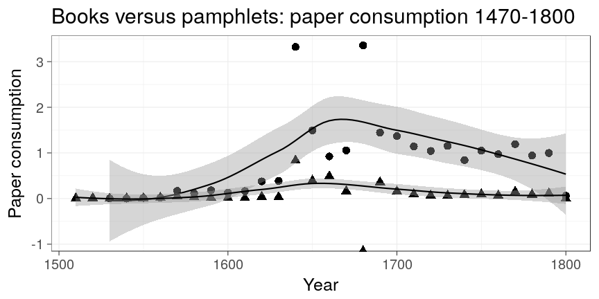


### Paper consumption for different document formats over time

Each point represents a decade. Loess smoothing.


--> 


### Title count between the octavo versus the folio format among the top authors

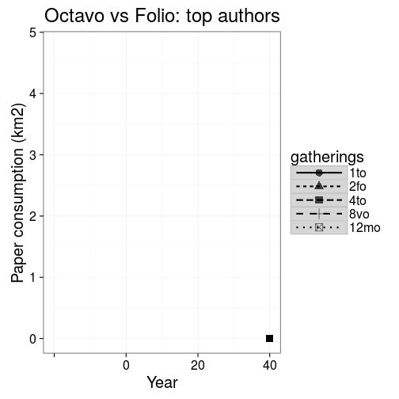

### Edinburgh publishing

The publishing of historical works in Edinburgh on a timeline highlighting the eras of the English Civil War (1642-1651), the Restoration (1660), the Glorious Revolution (1688-1689), the Union Debates (1705-1706) and American Independence (1776).

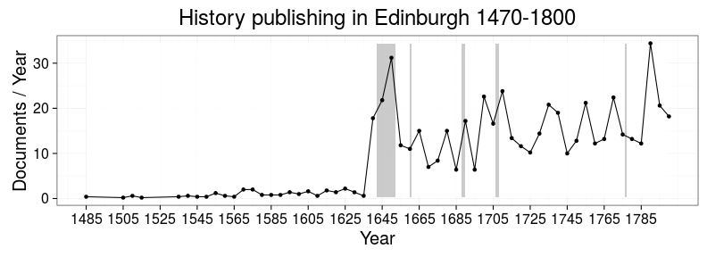

## Session info

This document was created with the following versions:


```r
sessionInfo()
```

```
## R version 3.3.0 (2016-05-03)
## Platform: x86_64-pc-linux-gnu (64-bit)
## Running under: Ubuntu 16.04 LTS
## 
## locale:
##  [1] LC_CTYPE=en_US.UTF-8       LC_NUMERIC=C              
##  [3] LC_TIME=de_BE.UTF-8        LC_COLLATE=en_US.UTF-8    
##  [5] LC_MONETARY=de_BE.UTF-8    LC_MESSAGES=en_US.UTF-8   
##  [7] LC_PAPER=de_BE.UTF-8       LC_NAME=C                 
##  [9] LC_ADDRESS=C               LC_TELEPHONE=C            
## [11] LC_MEASUREMENT=de_BE.UTF-8 LC_IDENTIFICATION=C       
## 
## attached base packages:
## [1] stats     graphics  grDevices utils     datasets  methods   base     
## 
## other attached packages:
##  [1] reshape_0.8.5         gdata_2.17.0          ggthemes_3.0.3       
##  [4] rmarkdown_0.9.6.14    microbiome_0.99.83    phyloseq_1.16.2      
##  [7] knitr_1.13            gridExtra_2.2.1       reshape2_1.4.1       
## [10] magrittr_1.5          estc_0.1.42           stringr_1.0.0        
## [13] tidyr_0.4.1           ggplot2_2.1.0         sorvi_0.7.46         
## [16] tibble_1.0            bibliographica_0.2.21 dplyr_0.4.3          
## [19] devtools_1.11.1      
## 
## loaded via a namespace (and not attached):
##  [1] nlme_3.1-128          matrixStats_0.50.2    doParallel_1.0.10    
##  [4] RColorBrewer_1.1-2    dynamicTreeCut_1.63-1 tools_3.3.0          
##  [7] R6_2.1.2              vegan_2.3-5           rpart_4.1-10         
## [10] Hmisc_3.17-4          DBI_0.4-1             lazyeval_0.1.10      
## [13] BiocGenerics_0.18.0   mgcv_1.8-12           colorspace_1.2-6     
## [16] permute_0.9-0         ade4_1.7-4            nnet_7.3-12          
## [19] withr_1.0.1           moments_0.14          preprocessCore_1.34.0
## [22] chron_2.3-47          WGCNA_1.51            Biobase_2.32.0       
## [25] formatR_1.4           NLP_0.1-9             labeling_0.3         
## [28] slam_0.1-34           scales_0.4.0          tm_0.6-2             
## [31] tgp_2.4-14            digest_0.6.9          foreign_0.8-66       
## [34] XVector_0.12.0        htmltools_0.3.5       tau_0.0-18           
## [37] highr_0.6             RSQLite_1.0.0         impute_1.46.0        
## [40] jsonlite_0.9.21       gtools_3.5.0          acepack_1.3-3.3      
## [43] GO.db_3.3.0           Formula_1.2-1         biomformat_1.0.2     
## [46] Matrix_1.2-6          Rcpp_0.12.5           munsell_0.4.3        
## [49] S4Vectors_0.10.1      maptree_1.4-7         ape_3.5              
## [52] stringi_1.1.1         MASS_7.3-45           zlibbioc_1.18.0      
## [55] rhdf5_2.16.0          plyr_1.8.4            grid_3.3.0           
## [58] parallel_3.3.0        gender_0.5.1          lattice_0.20-33      
## [61] Biostrings_2.40.2     splines_3.3.0         multtest_2.28.0      
## [64] igraph_1.0.1          fastcluster_1.1.20    codetools_0.2-14     
## [67] stats4_3.3.0          babynames_0.2.1       evaluate_0.9         
## [70] latticeExtra_0.6-28   data.table_1.9.6      foreach_1.4.3        
## [73] gtable_0.2.0          assertthat_0.1        survival_2.39-4      
## [76] genderdata_0.5.0      iterators_1.0.8       AnnotationDbi_1.34.3 
## [79] memoise_1.0.0         IRanges_2.6.0         cluster_2.0.4
```

