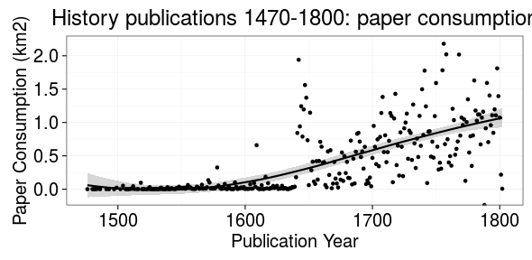

# LIBER publication materials 10/2015


```
## Error in eval(expr, envir, enclos): object 'author_unique' not found
```

```
## Error in dfs[1:ntop, ]: incorrect number of dimensions
```

```
## Warning: Removed 1 rows containing missing values (stat_smooth).
```

```
## Warning: Removed 1 rows containing missing values (stat_smooth).
```

```
## Warning: Removed 1 rows containing missing values (stat_smooth).
```

```
## Warning: Removed 1 rows containing missing values (stat_smooth).
```

```
## Warning: Removed 1 rows containing missing values (stat_smooth).
```

```
## Warning: Removed 5 rows containing missing values (geom_point).
```

 


```
## Error in .check_names_df(x, j): undefined columns: author_name, author_unique, author_birth, author_death
```

```
## Warning: Removed 1 rows containing missing values (geom_segment).
```

```
## Warning: Removed 1 rows containing missing values (geom_segment).
```

```
## Warning: Removed 1 rows containing missing values (geom_segment).
```

```
## Warning: Removed 1 rows containing missing values (geom_segment).
```

```
## Warning: Removed 1 rows containing missing values (geom_segment).
```

```
## Warning: Removed 1 rows containing missing values (geom_segment).
```

```
## Warning: Removed 1 rows containing missing values (geom_segment).
```

```
## Warning: Removed 1 rows containing missing values (geom_segment).
```

```
## Warning: Removed 1 rows containing missing values (geom_segment).
```

```
## Warning: Removed 1 rows containing missing values (geom_segment).
```

```
## Warning: Removed 1 rows containing missing values (geom_segment).
```

```
## Warning: Removed 1 rows containing missing values (geom_segment).
```

```
## Warning: Removed 1 rows containing missing values (geom_segment).
```

```
## Warning: Removed 1 rows containing missing values (geom_segment).
```

```
## Warning: Removed 1 rows containing missing values (geom_segment).
```

```
## Warning: Removed 1 rows containing missing values (geom_segment).
```

```
## Warning: Removed 1 rows containing missing values (geom_segment).
```

```
## Warning: Removed 1 rows containing missing values (geom_segment).
```

```
## Warning: Removed 1 rows containing missing values (geom_segment).
```

```
## Warning: Removed 1 rows containing missing values (geom_segment).
```

```
## Warning: Removed 1 rows containing missing values (geom_segment).
```

```
## Warning: Removed 1 rows containing missing values (geom_segment).
```

```
## Warning: Removed 1 rows containing missing values (geom_segment).
```

```
## Warning: Removed 1 rows containing missing values (geom_segment).
```

```
## Warning: Removed 1 rows containing missing values (geom_segment).
```

```
## Warning: Removed 1 rows containing missing values (geom_segment).
```

```
## Warning: Removed 1 rows containing missing values (geom_segment).
```

```
## Warning: Removed 1 rows containing missing values (geom_segment).
```

```
## Warning: Removed 1 rows containing missing values (geom_segment).
```

```
## Warning: Removed 1 rows containing missing values (geom_segment).
```

```
## Warning: Removed 1 rows containing missing values (geom_segment).
```

```
## Warning: Removed 1 rows containing missing values (geom_segment).
```

```
## Warning: Removed 2 rows containing missing values (geom_segment).
```

```
## Warning: Removed 1 rows containing missing values (geom_segment).
```

```
## Warning: Removed 1 rows containing missing values (geom_segment).
```

```
## Warning: Removed 1 rows containing missing values (geom_segment).
```

```
## Warning: Removed 1 rows containing missing values (geom_segment).
```

```
## Warning: Removed 1 rows containing missing values (geom_segment).
```

```
## Warning: Removed 1 rows containing missing values (geom_segment).
```

 


```
## Error in eval(expr, envir, enclos): object 'author_unique' not found
```

```
## Error in eval(expr, envir, enclos): object 'author_unique' not found
```


```
## Error in eval(expr, envir, enclos): object 'author_unique' not found
```

```
## Error in `$<-.data.frame`(`*tmp*`, "highlight", value = logical(0)): replacement has 0 rows, data has 49045
```

```
## Warning in `[<-.factor`(`*tmp*`, thisvar, value = 0): invalid factor level,
## NA generated
```

```
## Warning in `[<-.factor`(`*tmp*`, thisvar, value = 0): invalid factor level,
## NA generated
```

```
## Warning in `[<-.factor`(`*tmp*`, thisvar, value = 0): invalid factor level,
## NA generated
```

```
## Warning in `[<-.factor`(`*tmp*`, thisvar, value = 0): invalid factor level,
## NA generated
```

```
## Warning in `[<-.factor`(`*tmp*`, thisvar, value = 0): invalid factor level,
## NA generated
```

```
## Warning in `[<-.factor`(`*tmp*`, thisvar, value = 0): invalid factor level,
## NA generated
```

```
## Warning in `[<-.factor`(`*tmp*`, thisvar, value = 0): invalid factor level,
## NA generated
```

```
## Warning in `[<-.factor`(`*tmp*`, thisvar, value = 0): invalid factor level,
## NA generated
```

```
## Warning in `[<-.factor`(`*tmp*`, thisvar, value = 0): invalid factor level,
## NA generated
```

```
## Warning in `[<-.factor`(`*tmp*`, thisvar, value = 0): invalid factor level,
## NA generated
```

```
## Warning in max(dfs$folio): no non-missing arguments to max; returning -Inf
```

```
## Error in eval(expr, envir, enclos): object 'author_unique' not found
```


```
## Error in eval(expr, envir, enclos): object 'author_unique' not found
```

```
## Error in eval(expr, envir, enclos): object 'author_unique' not found
```


```
## Error in dfs[1:ntop, ]: incorrect number of dimensions
```

```
## Error in eval(expr, envir, enclos): object 'author_unique' not found
```


 


 


 

 


```
## Warning: Removed 1 rows containing missing values (geom_point).
```

 

## How does publishing change ?


```
## Warning: Removed 1 rows containing missing values (stat_smooth).
```

```
## Warning: Removed 1 rows containing missing values (stat_smooth).
```

```
## Warning: Removed 1 rows containing missing values (stat_smooth).
```

```
## Warning: Removed 3 rows containing missing values (geom_point).
```

 


Estimated paper consumption by document size

 
