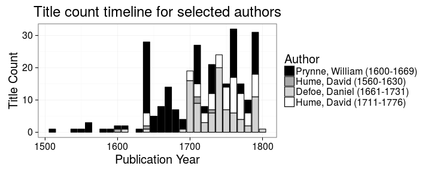

## LIBER Analyses


This document provides a reproducible summary of the ESTC history data set ``50280`` as prepared for our LIBER conference article ([Tolonen](https://github.com/tolonen), [Ilomäki](https://github.com/NVI/), [Lahti](http://www.iki.fi/Leo.Lahti); in review). See also further analyses of this data collection listed in the [README file](https://github.com/rOpenGov/estc).

For details on the data and analysis, see the [Rmarkdown source code of this document](https://github.com/rOpenGov/estc/blob/master/inst/examples/20151023-LIBER.Rmd) and the manuscript (link will be added here when the article is out!).

Do not hesitate to contact us if you have questions.

### Reproducing the analyses

The ESTC data set obtained from the British Library is not public. If you have access to the ESTC data, you can reproduce the analyses by cloning this repository and parsing the raw data file ([instructions](https://github.com/rOpenGov/estc/blob/master/vignettes/tutorial.md)). After parsing the raw data file and installing the required R packages, you can run the following commands in R (use the inst/examples folder of this repository as the working directory) to generate all the figures below. Note that this workflow is updated with new information and is under constant improvement; therefore the figures are not necessarily identical to the ones shown in the publication. Full details for reproducing the figures are in the [Rmarkdown source code of this document](https://github.com/rOpenGov/estc/blob/master/inst/examples/20151023-LIBER.Rmd).


```r
library(knitr)
knit("20151023-LIBER.Rmd")
```


## Who wrote history ?

### Authors who published the most titles on history according to the ESTC catalogue data. Specific authors are highlighted

 


### The life spans of the top authors based on the title count

The visualization also reveals ambiguities arising from authors having the same name but living at different times (e.g. David Hume)

 


### The title counts per year for William Prynne, Daniel Defoe and David Hume (highlighted in Figures 1 and 2) provide an overview of their publishing activity up until 1800.

 


### Title count versus paper consumption among the highlighted authors

The visualization reveals the nature of the author’s publications, distinguishing pamphleteering (many titles, few pages) and the authoring of books (fewer titles, more pages).


 


### The most active known female authors based on the title count

The gender is inferred automatically from the first names

 

## Where was history published ?

### Publication volumes at the top publication locations in Britain and Ireland, 1470-1800

The circle diameter corresponds to the logarithm (log10) of the title count. The UK map was generated by taking a screencapture of a video produced with:


```r
source("20151023-LIBER-video.R")
```


### The top publication places in Britain and North America ranked by the title count

 


### Title count and overall paper consumption in the top publication locations

The current country of origin is indicated.

 


### Title count and paper consumption in Ireland, Scotland and the USA


 


## How does publishing change ?

### Overall publication activity in the complete ESTC (balls) and History documents (triangles)

A comparison between the title count for history publications and for all documents in the ESTC catalogue, 1470-1800.

 


### Title count of history publications, 1470-1800

 

### Paper consumption in history publications, 1470-1800

 


### Average paper consumption per document in history publications, 1470-1800

 


### Paper consumption in books (balls) versus pamphlets (triangles), 1470-1800

 


### Paper consumption for different book formats over time.

Each point represents a decade. Loess smoothing.

 

### Title count between the octavo versus the folio format among the top authors

 

### Edinburgh publishing

The publishing of historical works in Edinburgh on a timeline highlighting the eras of the English Civil War (1642-1651), the Restoration (1660), the Glorious Revolution (1688-1689), the Union Debates (1705-1706) and American Independence (1776).

 

