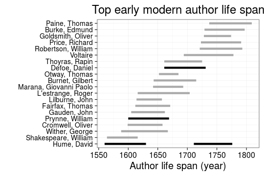

 


```
## Warning in `levels<-`(`*tmp*`, value = if (nl == nL) as.character(labels)
## else paste0(labels, : duplicated levels in factors are deprecated
```

```
## Warning in `levels<-`(`*tmp*`, value = if (nl == nL) as.character(labels)
## else paste0(labels, : duplicated levels in factors are deprecated
```

```
## Warning in `levels<-`(`*tmp*`, value = if (nl == nL) as.character(labels)
## else paste0(labels, : duplicated levels in factors are deprecated
```

```
## Warning in `levels<-`(`*tmp*`, value = if (nl == nL) as.character(labels)
## else paste0(labels, : duplicated levels in factors are deprecated
```

```
## Warning in `levels<-`(`*tmp*`, value = if (nl == nL) as.character(labels)
## else paste0(labels, : duplicated levels in factors are deprecated
```

```
## Warning: Removed 1 rows containing missing values (geom_segment).
```

```
## Warning: Removed 1 rows containing missing values (geom_segment).
```

 


 


```
## Error in `[<-.data.frame`(`*tmp*`, dfs$author_unique == "hume, david (1560-1630)", : replacement has 1 row, data has 0
```

```
## Warning in max(dfs$folio): no non-missing arguments to max; returning -Inf
```

```
## Error in eval(expr, envir, enclos): object 'folio' not found
```

```
## Error in `[.data.frame`(base, names(rows)): undefined columns selected
```


 


 


 


```
## Error in eval(expr, envir, enclos): object 'publication.country' not found
```

 


```
## Error in xlab("Title Count") + ylab("Paper consumption (km2)"): non-numeric argument to binary operator
```

 


```
## Error in eval(expr, envir, enclos): object 'subject.topic' not found
```

```
## Error in eval(expr, envir, enclos): object 'publication_year' not found
```


 

 


```
## Warning: Removed 1 rows containing missing values (geom_path).
```

```
## Warning: Removed 3 rows containing missing values (geom_point).
```

 
