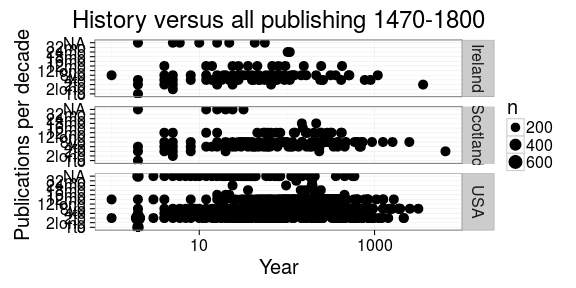
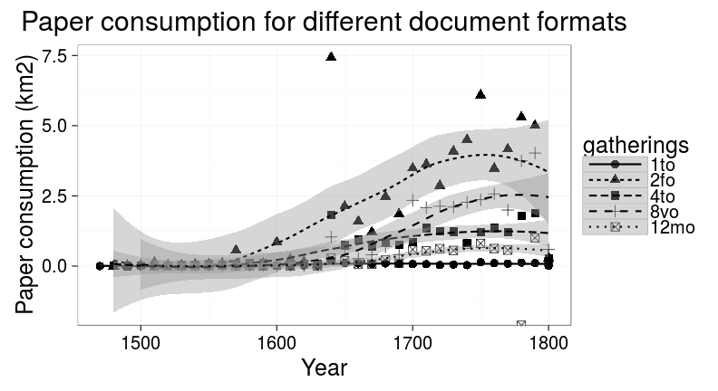

 


```
## Warning: Removed 1 rows containing missing values (geom_segment).
```

```
## Warning: Removed 1 rows containing missing values (geom_segment).
```

 


 


 


 


The UK map was generated by taking a screencapture of a video produced with:


 


```r
theme_set(theme_bw(15))
df2 <- df %>%
    filter(!is.na(publication_country)) %>%
    group_by(publication_country) %>%
    summarize(paper = sum(paper.consumption.km2, na.rm = TRUE),
	      docs = n()) %>%
    arrange(desc(docs)) %>%
    filter(publication_country %in% c("Scotland", "Ireland", "USA"))

p1 <- ggplot(df2, aes(x = publication_country, y = docs)) + geom_bar(stat = "identity") + ggtitle("Title count") + theme(axis.text.x = element_text(angle = 45, hjust = 1)) + ylab("Documents") + xlab("")
p2 <- ggplot(df2, aes(x = publication_country, y = paper)) + geom_bar(stat = "identity") + ggtitle("Paper consumption") + theme(axis.text.x = element_text(angle = 45, hjust = 1)) + ylab("Paper (km2)") + xlab("")
grid.arrange(p1, p2, nrow = 1)
```

 


 

 


 

 


```
## Warning: Removed 1 rows containing missing values (geom_point).
```

 

## How does publishing change ?


```
## Warning: Removed 1 rows containing missing values (stat_smooth).
```

```
## Warning: Removed 1 rows containing missing values (stat_smooth).
```

```
## Warning: Removed 2 rows containing missing values (geom_point).
```

 

Each point represents a decade. Loess smoothing.

 


