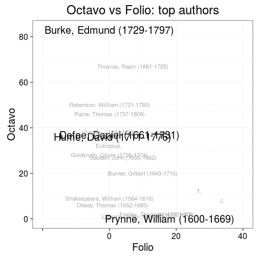
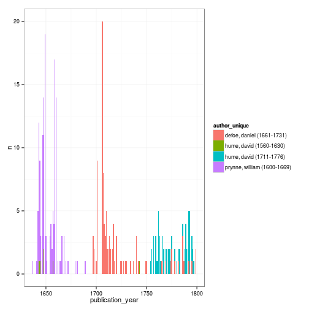

 


```
## Warning: Removed 1 rows containing missing values (geom_segment).
```

```
## Warning: Removed 1 rows containing missing values (geom_segment).
```

 


 


  


 


 


 


 


 


 


 

 


```
## Warning: Removed 1 rows containing missing values (geom_path).
```

```
## Warning: Removed 3 rows containing missing values (geom_point).
```

 
