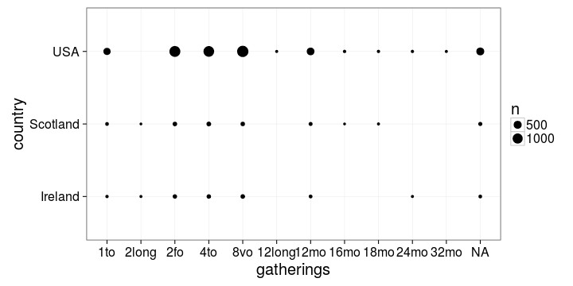
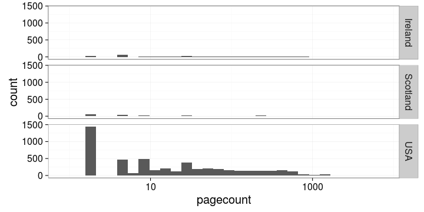

## LIBER Analyses


```
## Error in gzfile(file, "rb"): cannot open the connection
```

```
## Error in eval(expr, envir, enclos): object 'publication_year' not found
```

This document provides a reproducible summary of the ESTC history data set (roughly 50,000 documents) as prepared for our [Liber Quarterly article](http://liber.library.uu.nl/index.php/lq) ([Tolonen](https://github.com/tolonen), [Ilomäki](https://github.com/NVI/), [Lahti](http://www.iki.fi/Leo.Lahti); in review). See also further analyses of this data collection listed in the [README file](https://github.com/rOpenGov/estc). For details on the data and analysis, see the manuscript (link will be added here when the article is out!). Do not hesitate to contact us if you have questions. The figures may be slightly different than in the original article due to improvements in the analysis pipeline.

### Reproducing the analyses

The ESTC data set obtained from the British Library is not public. If you have access to the ESTC data, you can reproduce the analyses by first cloning this repository and parsing the raw data file ([instructions](https://github.com/rOpenGov/estc/blob/master/vignettes/tutorial.md)). Note that this workflow is updated with new information and is under constant improvement; therefore the figures are not necessarily identical to the ones shown in the publication. Full details for reproducing the figures are in the [Rmarkdown source code](https://github.com/rOpenGov/estc/blob/master/inst/examples/20151023-LIBER.Rmd). After parsing the raw data file and installing the required R packages, you can run the following commands in R (use the inst/examples folder of this repository as the working directory) to generate all the figures:


```r
library(knitr)
knit("20151023-LIBER.Rmd")
```


## Who wrote history ?

### Authors who published the most history titles according to the ESTC

Specific authors are highlighted:


```
## Error in dfs$names: $ operator is invalid for atomic vectors
```

```
## Error in p + guides(fill = "none"): non-numeric argument to binary operator
```

```
## Error in p + ylab("Title count"): non-numeric argument to binary operator
```

```
## Error in p + scale_fill_manual(values = c("darkgray", "black")): non-numeric argument to binary operator
```

```
## Error in p + ggtitle("Top early modern history authors in ESTC"): non-numeric argument to binary operator
```

```
##    [1] NA NA  4 NA NA NA  4 NA NA  4  4  4  4 NA NA NA NA NA  2  2  4  4 NA
##   [24] NA  4  4 NA NA NA NA NA  4 NA  4  4 NA NA NA  2 NA NA NA  4  4 NA NA
##   [47]  2 NA NA NA  4 NA NA NA NA NA NA NA  2 NA NA  8  4  4 NA NA  4  5 NA
##   [70] NA  4  2 NA  4 NA NA NA NA NA  4 NA NA NA NA NA NA  4  2 NA  2 NA  4
##   [93]  4 NA NA NA NA  4 NA NA NA  2 NA  4  4  2 NA NA NA NA NA NA NA  4 NA
##  [116] NA  4 NA  2  4  2 NA NA NA  4  2 NA NA NA NA  2 NA NA NA NA NA NA NA
##  [139] NA NA NA NA NA NA  4  4 NA NA NA NA NA  4  4  4 NA  4  4 NA NA  4  4
##  [162]  4  4  2 NA NA NA  4  4 NA NA NA  4 NA NA  2  4 NA  4  4 NA NA  4 NA
##  [185] NA  4 NA NA NA NA  2 NA NA NA  4 NA NA  4  4 NA  4 NA NA NA NA NA NA
##  [208] NA NA NA  4 NA NA NA NA NA NA NA NA NA NA NA NA NA NA NA NA NA NA NA
##  [231] NA NA NA NA NA NA NA NA NA NA NA  4 NA NA NA NA NA NA NA NA NA NA NA
##  [254] NA NA NA NA NA NA NA NA NA NA NA NA NA NA NA NA  4 NA NA NA NA NA NA
##  [277] NA NA NA NA NA NA NA NA NA NA NA NA NA NA NA NA NA NA NA  4 NA NA NA
##  [300] NA NA NA NA NA NA NA NA NA NA NA NA NA NA NA NA NA NA NA NA NA NA NA
##  [323] NA NA NA  2 NA NA  4 NA  2 NA NA NA  4 NA  4 NA NA NA  4 NA  2  4  4
##  [346] NA  4  4  4  4 NA NA NA NA NA NA  4  4 NA  4  4  4 NA  2 NA NA NA NA
##  [369] NA  4 NA NA NA  4 NA NA  4  4  4 NA  4 NA NA NA NA NA  4  4 NA NA NA
##  [392]  4 NA NA NA NA NA NA NA NA NA NA  6  4 NA  4  4  4  4 NA NA NA NA NA
##  [415]  4 NA NA NA NA NA NA NA NA NA NA  2  6 NA NA  4 NA NA  4 NA NA NA NA
##  [438] NA NA 10 NA NA NA NA NA NA NA NA NA NA NA  4 NA NA NA NA NA NA NA NA
##  [461] NA NA NA NA NA NA NA NA NA NA NA NA NA NA NA NA NA NA NA NA NA NA NA
##  [484] NA NA NA NA NA NA  4 NA NA NA NA NA NA NA NA NA NA NA NA NA NA NA NA
##  [507] NA NA NA NA NA NA NA NA  4 NA NA  4 NA NA NA NA NA NA NA NA NA NA NA
##  [530] NA NA NA NA  2  7 NA  4 NA  4 NA NA NA NA NA NA NA NA  4 NA  6 NA NA
##  [553] NA NA NA NA NA NA NA NA  7 NA NA NA NA  4 NA  8 NA NA NA  2  4 NA NA
##  [576] NA  2  9 NA NA NA  4 NA NA NA NA NA NA NA NA NA NA NA  4 NA  2 NA NA
##  [599] NA NA  7 NA NA NA NA NA NA NA NA NA NA NA NA NA NA  4  7  4 NA NA NA
##  [622] NA  4 NA NA NA NA NA  4 NA NA NA  8 NA NA NA NA NA  2 NA  7  4 NA NA
##  [645] NA  7 NA NA NA NA NA NA NA NA  8 NA NA NA NA NA NA  6 10 NA NA NA NA
##  [668] NA NA NA NA NA NA NA  9 NA NA  7 NA NA NA NA NA NA NA  4 NA  7 NA NA
##  [691] NA NA NA NA NA NA  6 NA NA NA NA NA NA NA NA NA NA NA NA NA NA NA NA
##  [714] NA NA NA NA NA NA NA NA NA  4  4 NA  4 NA NA NA NA  4 NA  2 NA NA NA
##  [737]  4 NA  2 NA NA  4 NA  4 NA NA NA NA NA NA NA NA NA NA NA NA  4 NA NA
##  [760] NA  4 NA NA NA NA NA NA NA NA NA NA NA NA NA NA  4 NA NA  4 NA  4 NA
##  [783] NA  4  2 NA NA  2  4 NA NA NA NA NA NA NA NA NA NA NA NA  4 NA NA  4
##  [806] NA 10 NA NA NA NA  2  4 NA  4 NA NA  4 NA NA NA NA NA NA  4 NA NA NA
##  [829] NA NA  4 NA NA  4  4 NA NA NA NA NA NA NA  4 NA NA NA NA  2 NA NA NA
##  [852] NA NA NA NA NA NA NA NA NA NA NA NA NA NA NA NA NA  4  4  4  4  4  4
##  [875]  4  8 NA  4  4  4 NA NA  4  4  4  4  4  4  4  4 NA  2 NA  4 NA  4 NA
##  [898]  4  4  4 NA  4 NA NA  4  6  4 NA  4  4 NA  4  2  4  4  4  4 NA NA  4
##  [921]  4 NA  4  2 NA  4 NA  2 NA NA NA  4 NA  8 NA NA NA  8 NA  4 NA NA NA
##  [944] NA  4  4  4 NA  4 NA  4  4 NA  4  4  4  4  4  4  4  4 NA NA NA  2 NA
##  [967] NA NA  4 NA  4  4  4 NA NA NA  4 NA NA NA NA NA NA  2  4 NA  4 NA NA
##  [990] NA  4 NA  4 NA NA  4 NA NA NA NA  4  4 NA NA NA NA NA NA NA  2 NA NA
## [1013] NA  4 NA NA NA NA NA NA NA NA NA NA NA  4 NA  4 NA NA NA NA  4  2 NA
## [1036] NA NA NA NA  4  4  4  2  4 NA NA NA NA NA NA  4 NA NA NA  4 NA NA NA
## [1059]  4 NA NA NA NA  4  4  4 NA NA  4 NA NA NA NA NA NA NA NA NA  2 NA NA
## [1082] NA NA NA NA NA  4  4 NA  4 NA NA NA NA NA NA NA NA NA NA  4 NA NA  4
## [1105] NA NA NA NA NA  4 NA NA  4 NA  4 NA NA NA NA NA  4 NA NA  4 NA  4  4
## [1128] NA NA  4 NA NA NA NA NA NA NA NA NA  4 NA NA NA NA NA NA NA NA  4 NA
## [1151] NA  4 NA NA NA NA NA NA NA NA  4 NA NA  4 NA NA NA NA NA NA NA NA NA
## [1174] NA NA NA NA NA  4 NA NA  4  4 NA NA  4 NA NA NA NA NA  4 NA NA NA NA
## [1197] NA  4  4 NA  4 NA NA NA  4 NA NA NA NA NA NA NA  2 NA  4  4 NA NA NA
## [1220] NA NA NA NA NA NA NA NA  2 NA NA NA NA NA NA  2  2 NA NA NA  2 NA NA
## [1243]  4  4 NA  4 NA NA NA NA NA NA NA NA NA NA NA NA NA NA  4 NA NA NA NA
## [1266]  4 NA NA NA  4  4 NA NA  4 NA NA NA NA  4 NA NA NA NA  4 NA NA NA NA
## [1289]  4 NA NA NA  4 NA NA NA  4 NA NA NA NA NA  4  4 NA NA NA NA NA NA NA
## [1312]  2 NA NA  4  4 NA  4 NA NA NA NA NA NA NA NA  4  4 NA NA NA  4  4 NA
## [1335] NA  4 NA  4 NA NA  2  4 NA  4 NA NA NA NA NA NA  4  4  4 NA  4  7  4
## [1358] NA  4 NA  2  4 NA NA  2 NA NA NA  4  4 NA NA NA NA NA NA NA NA NA NA
## [1381]  4 NA NA  4  4  4 NA NA NA  4  4 NA NA  4 NA  4 NA NA NA  4 NA NA NA
## [1404] NA  4 NA NA NA  4 NA  4  2  2  4  4  4  4  4 NA NA NA NA NA NA NA  2
## [1427]  2 NA NA  4  4  9  4  4 NA NA NA  4 NA NA  4 NA  4  4  4 NA
```


### The life spans of the top authors based on the title count

The visualization also reveals ambiguities arising from authors having the same name but living at different times (e.g. David Hume)


```
## Error in .check_names_df(x, j): undefined columns: author, author_birth, author_death
```


### The title counts per year for selected authors

William Prynne, Daniel Defoe and David Hume (highlighted in Figures 1 and 2) provide an overview of their publishing activity up until 1800.


```
## Error in eval(expr, envir, enclos): unknown column 'author'
```

```
## Error in eval(expr, envir, enclos): object 'publication_decade' not found
```


### Title count versus paper consumption among the highlighted authors

The visualization reveals the nature of the author’s publications, distinguishing pamphleteering (many titles, few pages) and the authoring of books (fewer titles, more pages).


```
## Error in eval(expr, envir, enclos): unknown column 'author'
```

```
## Error in eval(expr, envir, enclos): object 'titles' not found
```


### The most active known female authors based on the title count

The gender is inferred automatically from the first names


```
## Error in dfs$names: $ operator is invalid for atomic vectors
```

```
## Error in eval(expr, envir, enclos): object 'titles' not found
```


## Where was history published ?

### Publication volumes at the top publication locations in Britain and Ireland, 1470-1800

The UK map was generated by taking a screencapture of a video produced by running the [analysis code](20151023-LIBER-video.R):


```r
source("20151023-LIBER-video.R")
```

The circle diameter corresponds to the logarithm (log10) of the title count. You can also [download and view the full video](https://raw.githubusercontent.com/rOpenGov/estc/master/inst/examples/liber.mp4).


### The top publication places ranked by the title count


```
## Error in dfs$names: $ operator is invalid for atomic vectors
```

```
## Error in eval(expr, envir, enclos): object 'titles' not found
```


### Title count and overall paper consumption in the top publication locations

The current country of origin is indicated.


```
## Warning in max(na.omit(dfs$titles[!is.infinite(dfs$titles)])): no non-
## missing arguments to max; returning -Inf
```

```
## Warning in limits(c(...), "x"): NaNs produced
```

```
## Warning in rep(no, length.out = length(ans)): 'x' is NULL so the result
## will be NULL
```

```
## Error in ifelse(!is.na(self$limits), self$limits, self$range$range): replacement has length zero
```


### Title count and paper consumption in Ireland, Scotland and the USA


```
## Error in eval(expr, envir, enclos): unknown column 'country'
```

```
## Error in eval(expr, envir, enclos): object 'docs' not found
```


Estimated gatherings per country:


```
## Error: All select() inputs must resolve to integer column positions.
## The following do not:
## *  gatherings
## *  country
```



Estimated pagecounts per country:


```
## Error in eval(expr, envir, enclos): object 'pagecount' not found
```

```
## Error in layout_base(data, rows, drop = drop): At least one layer must contain all variables used for facetting
```



Gatherings vs. pagecounts per country


```
## Error in eval(expr, envir, enclos): object 'pagecount' not found
```

```
## Error in layout_base(data, rows, drop = drop): At least one layer must contain all variables used for facetting
```


## How does publishing change ?

### Publishing activity among all ESTC documents (balls) and History documents (triangles)

A comparison between the title count for history publications and for all documents in the ESTC catalogue, 1470-1800.


```
## Error in eval(expr, envir, enclos): unknown column 'publication_year'
```

```
## Error in eval(expr, envir, enclos): object 'publication_year' not found
```


```
## Error in eval(expr, envir, enclos): object 'publication_year' not found
```


### Average paper consumption per document in history publications, 1470-1800


```
## Error in eval(expr, envir, enclos): unknown column 'publication_year'
```

```
## Error in eval(expr, envir, enclos): object 'publication_year' not found
```


### Paper consumption in books (balls) versus pamphlets (triangles), 1470-1800


```
## Error in eval(expr, envir, enclos): unknown column 'publication_decade'
```

```
## Error in eval(expr, envir, enclos): object 'publication_decade' not found
```


### Paper consumption for different document formats over time

Each point represents a decade. Loess smoothing.


### Title count between the octavo versus the folio format among the top authors


```
## Error in xuniq[[i]]: subscript out of bounds
```

```
## Error in eval(expr, envir, enclos): unknown column 'author'
```

```
## Error in `[<-.data.frame`(`*tmp*`, dfs$author == "Hume, David (1560-1630)", : replacement has 1 row, data has 0
```

```
## Error in eval(expr, envir, enclos): object 'folio' not found
```


### Edinburgh publishing

The publishing of historical works in Edinburgh on a timeline highlighting the eras of the English Civil War (1642-1651), the Restoration (1660), the Glorious Revolution (1688-1689), the Union Debates (1705-1706) and American Independence (1776).


```
## Error in split.default(X, group): first argument must be a vector
```


## Session info

This document was created with the following versions:


```r
sessionInfo()
```

```
## R version 3.2.2 (2015-08-14)
## Platform: x86_64-pc-linux-gnu (64-bit)
## Running under: Ubuntu 15.10
## 
## locale:
##  [1] LC_CTYPE=en_US.UTF-8       LC_NUMERIC=C              
##  [3] LC_TIME=en_US.UTF-8        LC_COLLATE=en_US.UTF-8    
##  [5] LC_MONETARY=en_US.UTF-8    LC_MESSAGES=en_US.UTF-8   
##  [7] LC_PAPER=en_US.UTF-8       LC_NAME=C                 
##  [9] LC_ADDRESS=C               LC_TELEPHONE=C            
## [11] LC_MEASUREMENT=en_US.UTF-8 LC_IDENTIFICATION=C       
## 
## attached base packages:
## [1] stats     graphics  grDevices utils     datasets  methods   base     
## 
## other attached packages:
##  [1] lubridate_1.5.0       animation_2.4         mapproj_1.2-4        
##  [4] maps_3.0.2            gisfin_0.9.25         R6_2.1.1             
##  [7] rgdal_1.1-3           sp_1.2-1              ggmap_2.6            
## [10] magrittr_1.5          scimapClient_0.2.1    ggthemes_3.0.1       
## [13] rmarkdown_0.9.4       reshape_0.8.5         gdata_2.17.0         
## [16] rCharts_0.4.5         gridExtra_2.0.0       reshape2_1.4.1       
## [19] tidyr_0.3.1           dplyr_0.4.3           knitr_1.12           
## [22] ggplot2_2.0.0         estc_0.1.34           sorvi_0.7.34         
## [25] bibliographica_0.1.45 stringr_1.0.0        
## 
## loaded via a namespace (and not attached):
##  [1] Rcpp_0.12.3         lattice_0.20-33     deldir_0.1-9       
##  [4] png_0.1-7           gtools_3.5.0        assertthat_0.1     
##  [7] digest_0.6.9        slam_0.1-32         plyr_1.8.3         
## [10] evaluate_0.8        coda_0.18-1         highr_0.5.1        
## [13] RgoogleMaps_1.2.0.7 lazyeval_0.1.10     spdep_0.5-92       
## [16] genderdata_0.5.0    geosphere_1.5-1     whisker_0.4        
## [19] Matrix_1.2-3        tau_0.0-18          gender_0.5.1.9000  
## [22] splines_3.2.2       proto_0.3-10        labeling_0.3       
## [25] munsell_0.4.2       htmltools_0.3       codetools_0.2-14   
## [28] XML_3.98-1.3        MASS_7.3-45         grid_3.2.2         
## [31] nlme_3.1-122        gtable_0.1.2        DBI_0.3.1          
## [34] formatR_1.2.1       scales_0.3.0        stringi_1.0-1      
## [37] LearnBayes_2.15     NLP_0.1-8           boot_1.3-17        
## [40] rjson_0.2.15        RColorBrewer_1.1-2  tools_3.2.2        
## [43] RJSONIO_1.3-0       jpeg_0.1-8          parallel_3.2.2     
## [46] yaml_2.1.13         tm_0.6-2            colorspace_1.2-6
```

