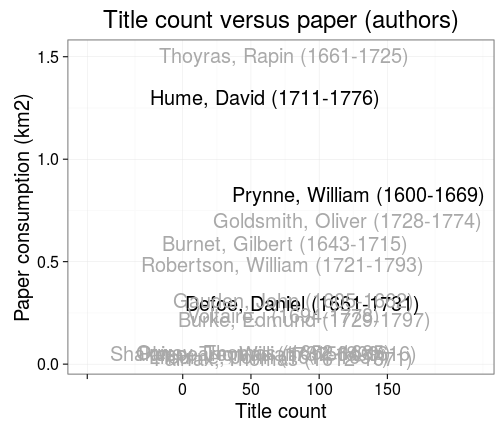
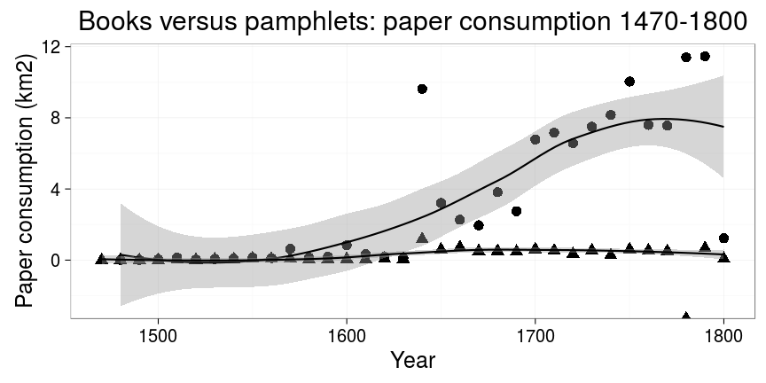

## LIBER Analyses


This document provides a reproducible summary of the ESTC history data set (the preprocessed data set covers ``50280`` documents) as prepared for our [Liber Quarterly article](http://liber.library.uu.nl/index.php/lq) ([Tolonen](https://github.com/tolonen), [Ilomäki](https://github.com/NVI/), [Lahti](http://www.iki.fi/Leo.Lahti); in review). See also further analyses of this data collection listed in the [README file](https://github.com/rOpenGov/estc). For details on the data and analysis, see the manuscript (link will be added here when the article is out!). Do not hesitate to contact us if you have questions.

### Reproducing the analyses

The ESTC data set obtained from the British Library is not public. If you have access to the ESTC data, you can reproduce the analyses by first cloning this repository and parsing the raw data file ([instructions](https://github.com/rOpenGov/estc/blob/master/vignettes/tutorial.md)). Note that this workflow is updated with new information and is under constant improvement; therefore the figures are not necessarily identical to the ones shown in the publication. Full details for reproducing the figures are in the [Rmarkdown source code](https://github.com/rOpenGov/estc/blob/master/inst/examples/20151023-LIBER.Rmd). After parsing the raw data file and installing the required R packages, you can run the following commands in R (use the inst/examples folder of this repository as the working directory) to generate all the figures:


```r
library(knitr)
knit("20151023-LIBER.Rmd")
```


## Who wrote history ?

### Authors who published the most history titles according to the ESTC

Specific authors are highlighted:

 


### The life spans of the top authors based on the title count

The visualization also reveals ambiguities arising from authors having the same name but living at different times (e.g. David Hume)

 


### The title counts per year for selected authors

William Prynne, Daniel Defoe and David Hume (highlighted in Figures 1 and 2) provide an overview of their publishing activity up until 1800.


```
## Warning: Removed 3 rows containing missing values (position_stack).
```

 


### Title count versus paper consumption among the highlighted authors

The visualization reveals the nature of the author’s publications, distinguishing pamphleteering (many titles, few pages) and the authoring of books (fewer titles, more pages).

 


### The most active known female authors based on the title count

The gender is inferred automatically from the first names

 

## Where was history published ?

### Publication volumes at the top publication locations in Britain and Ireland, 1470-1800

The UK map was generated by taking a screencapture of a video produced with:


```r
source("20151023-LIBER-video.R")
```

The circle diameter corresponds to the logarithm (log10) of the title count. You can also [download and view the full video](https://raw.githubusercontent.com/rOpenGov/estc/master/inst/examples/liber.mp4).


### The top publication places ranked by the title count

 


### Title count and overall paper consumption in the top publication locations

The current country of origin is indicated.

 


### Title count and paper consumption in Ireland, Scotland and the USA


 


## How does publishing change ?

### Publishing activity among all ESTC documents (balls) and History documents (triangles)

A comparison between the title count for history publications and for all documents in the ESTC catalogue, 1470-1800.

 


### Title count of history publications, 1470-1800

 

### Paper consumption in history publications, 1470-1800

 


### Average paper consumption per document in history publications, 1470-1800

 


### Paper consumption in books (balls) versus pamphlets (triangles), 1470-1800

 


### Paper consumption for different document formats over time

Each point represents a decade. Loess smoothing.

 

### Title count between the octavo versus the folio format among the top authors

 

### Edinburgh publishing

The publishing of historical works in Edinburgh on a timeline highlighting the eras of the English Civil War (1642-1651), the Restoration (1660), the Glorious Revolution (1688-1689), the Union Debates (1705-1706) and American Independence (1776).

 

## Session info

This document was created with the following versions:


```r
sessionInfo()
```

```
## R version 3.2.2 (2015-08-14)
## Platform: x86_64-pc-linux-gnu (64-bit)
## Running under: Ubuntu 15.04
## 
## locale:
##  [1] LC_CTYPE=en_US.UTF-8       LC_NUMERIC=C              
##  [3] LC_TIME=en_US.UTF-8        LC_COLLATE=en_US.UTF-8    
##  [5] LC_MONETARY=en_US.UTF-8    LC_MESSAGES=en_US.UTF-8   
##  [7] LC_PAPER=en_US.UTF-8       LC_NAME=C                 
##  [9] LC_ADDRESS=C               LC_TELEPHONE=C            
## [11] LC_MEASUREMENT=en_US.UTF-8 LC_IDENTIFICATION=C       
## 
## attached base packages:
## [1] stats     graphics  grDevices utils     datasets  methods   base     
## 
## other attached packages:
##  [1] devtools_1.9.1        lubridate_1.3.3       animation_2.4        
##  [4] mapproj_1.2-4         maps_3.0.0-2          gisfin_0.9.25        
##  [7] R6_2.1.1              rgdal_1.0-7           sp_1.2-1             
## [10] ggmap_2.5.2           magrittr_1.5          scimapClient_0.2.1   
## [13] ggthemes_2.2.1        rmarkdown_0.8.1       reshape2_1.4.1       
## [16] reshape_0.8.5         gdata_2.17.0          rCharts_0.4.5        
## [19] gridExtra_2.0.0       tidyr_0.3.1           sorvi_0.7.32         
## [22] dplyr_0.4.3           knitr_1.11            ggplot2_1.0.1        
## [25] estc_0.1.31           bibliographica_0.1.37 stringr_1.0.0        
## 
## loaded via a namespace (and not attached):
##  [1] Rcpp_0.12.1         lattice_0.20-33     deldir_0.1-9       
##  [4] png_0.1-7           gtools_3.5.0        assertthat_0.1     
##  [7] digest_0.6.8        slam_0.1-32         plyr_1.8.3         
## [10] evaluate_0.8        coda_0.18-1         highr_0.5.1        
## [13] RgoogleMaps_1.2.0.7 lazyeval_0.1.10     spdep_0.5-88       
## [16] genderdata_0.5.0    geosphere_1.4-3     whisker_0.4        
## [19] Matrix_1.2-2        tau_0.0-18          gender_0.5.1       
## [22] splines_3.2.2       proto_0.3-10        labeling_0.3       
## [25] munsell_0.4.2       htmltools_0.2.6     codetools_0.2-14   
## [28] XML_3.98-1.3        MASS_7.3-44         grid_3.2.2         
## [31] nlme_3.1-122        gtable_0.1.2        DBI_0.3.1          
## [34] formatR_1.2.1       scales_0.3.0        stringi_1.0-1      
## [37] LearnBayes_2.15     NLP_0.1-8           boot_1.3-17        
## [40] rjson_0.2.15        RColorBrewer_1.1-2  tools_3.2.2        
## [43] RJSONIO_1.3-0       jpeg_0.1-8          parallel_3.2.2     
## [46] yaml_2.1.13         tm_0.6-2            colorspace_1.2-6   
## [49] memoise_0.2.1
```
