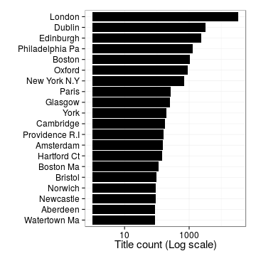
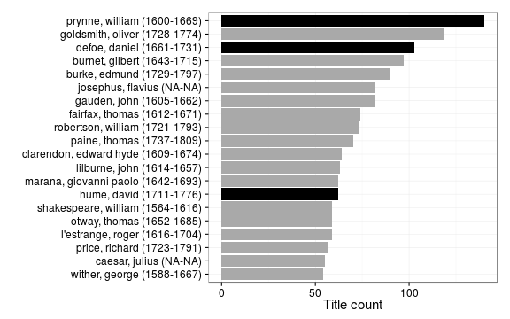

```
## Error in eval(expr, envir, enclos): object 'author_unique' not found
```

```
## Error in dfs[1:ntop, ]: incorrect number of dimensions
```

```
## Error in eval(expr, envir, enclos): object 'author.birth' not found
```


```
## Error in `[.data.frame`(dfs, , c("author_name", "author_unique", "author_birth", : undefined columns selected
```

```
## Warning in `levels<-`(`*tmp*`, value = if (nl == nL) as.character(labels)
## else paste0(labels, : duplicated levels in factors are deprecated
```

```
## Warning in `levels<-`(`*tmp*`, value = if (nl == nL) as.character(labels)
## else paste0(labels, : duplicated levels in factors are deprecated
```

```
## Warning in `levels<-`(`*tmp*`, value = if (nl == nL) as.character(labels)
## else paste0(labels, : duplicated levels in factors are deprecated
```

```
## Warning in `levels<-`(`*tmp*`, value = if (nl == nL) as.character(labels)
## else paste0(labels, : duplicated levels in factors are deprecated
```

```
## Warning in `levels<-`(`*tmp*`, value = if (nl == nL) as.character(labels)
## else paste0(labels, : duplicated levels in factors are deprecated
```

 


```
## Error in eval(expr, envir, enclos): object 'author_unique' not found
```

```
## Error in eval(expr, envir, enclos): object 'author_unique' not found
```


```
## Error in eval(expr, envir, enclos): object 'author_unique' not found
```

```
## Error in `$<-.data.frame`(`*tmp*`, "highlight", value = logical(0)): replacement has 0 rows, data has 50280
```

```
## Warning in `[<-.factor`(`*tmp*`, thisvar, value = 0): invalid factor level,
## NA generated
```

```
## Warning in `[<-.factor`(`*tmp*`, thisvar, value = 0): invalid factor level,
## NA generated
```

```
## Warning in `[<-.factor`(`*tmp*`, thisvar, value = 0): invalid factor level,
## NA generated
```

```
## Warning in `[<-.factor`(`*tmp*`, thisvar, value = 0): invalid factor level,
## NA generated
```

```
## Warning in `[<-.factor`(`*tmp*`, thisvar, value = 0): invalid factor level,
## NA generated
```

```
## Warning in `[<-.factor`(`*tmp*`, thisvar, value = 0): invalid factor level,
## NA generated
```

```
## Warning in `[<-.factor`(`*tmp*`, thisvar, value = 0): invalid factor level,
## NA generated
```

```
## Warning in `[<-.factor`(`*tmp*`, thisvar, value = 0): invalid factor level,
## NA generated
```

```
## Warning in `[<-.factor`(`*tmp*`, thisvar, value = 0): invalid factor level,
## NA generated
```

```
## Warning in `[<-.factor`(`*tmp*`, thisvar, value = 0): invalid factor level,
## NA generated
```

```
## Warning in max(dfs$folio): no non-missing arguments to max; returning -Inf
```

```
## Error in eval(expr, envir, enclos): object 'author_unique' not found
```

```
## Error in layout_base(data, rows, drop = drop): At least one layer must contain all variables used for facetting
```


```
## Error in eval(expr, envir, enclos): unknown column 'author_unique'
```

```
## Error in eval(expr, envir, enclos): object 'author_unique' not found
```

```
## Error in eval(expr, envir, enclos): object 'author_unique' not found
```


```
## Error in dfs[1:ntop, ]: incorrect number of dimensions
```

```
## Error in eval(expr, envir, enclos): object 'author_unique' not found
```


 


```
## Error in eval(expr, envir, enclos): object 'publication.country' not found
```

```
## Error in dfs[1:ntop, ]: incorrect number of dimensions
```

 


```
## Error in xlab("Title Count") + ylab("Paper consumption (km2)"): non-numeric argument to binary operator
```

 


```
## Error in eval(expr, envir, enclos): object 'subject.topic' not found
```

```
## Error in eval(expr, envir, enclos): object 'publication_year' not found
```


 

 


```
## Warning: Removed 1 rows containing missing values (geom_path).
```

```
## Warning: Removed 3 rows containing missing values (geom_point).
```

 
