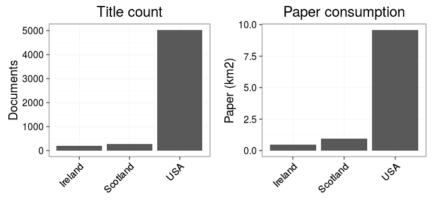

 

 


 


 


 


The UK map was generated by taking a screencapture of a video produced with:


```r
source("20151023-LIBER-video.R")
```


 


 


 


 


 

 


```
## Warning: Removed 1 rows containing missing values (geom_point).
```

 

## How does publishing change ?


```
## Warning: Removed 1 rows containing missing values (stat_smooth).
```

```
## Warning: Removed 1 rows containing missing values (stat_smooth).
```

```
## Warning: Removed 2 rows containing missing values (geom_point).
```

 

Each point represents a decade. Loess smoothing.

 


 


 

