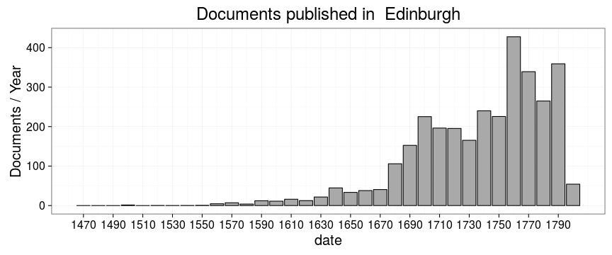
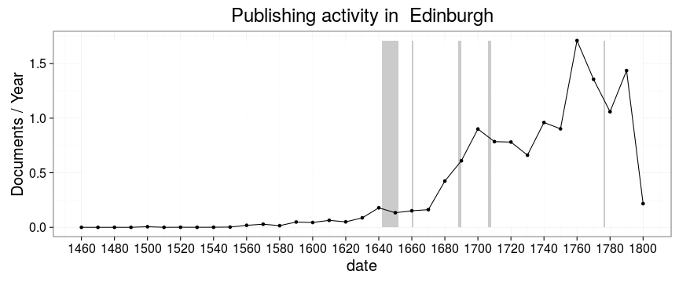
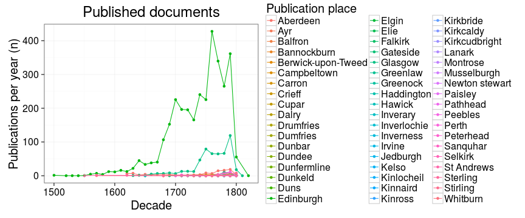
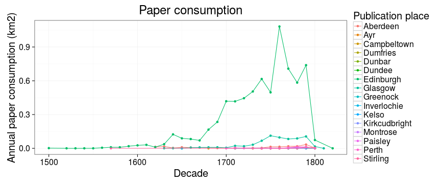

```
## Error in tapply(df$unity, list(df$publication_decade, df$publication_place), : arguments must have same length
```

```
## Error in publications[is.na(publications)] <- 0: object 'publications' not found
```

```
## Error in eval(expr, envir, enclos): object 'publications' not found
```

```
## Error in melt(publications): object 'publications' not found
```

```
## Error in names(dfm) <- c("Time", "Place", "Documents"): object 'dfm' not found
```

```
## Error in filter_(.data, .dots = lazyeval::lazy_dots(...)): object 'dfm' not found
```

```
## Error in transform(dfm, date = as.character(Time)): object 'dfm' not found
```

```
## Error: Key column 'Place' does not exist in input.
```

```
## Error in eval(expr, envir, enclos): object 'dfs' not found
```

```
## Error in eval(expr, envir, enclos): object 'dfs' not found
```

```
## Error in ggplot(dfs, aes(x = date, y = varname)): object 'dfs' not found
```

```
## Error in eval(expr, envir, enclos): object 'p' not found
```

```
## Error in eval(expr, envir, enclos): object 'p' not found
```

```
## Error in eval(expr, envir, enclos): object 'p' not found
```

```
## Error in eval(expr, envir, enclos): object 'p' not found
```

```
## Error in print(p): object 'p' not found
```

```
## Error in tapply(df$unity, list(df$publication.timeunit, df$publication_place), : arguments must have same length
```

```
## Error in publications[is.na(publications)] <- 0: object 'publications' not found
```

```
## Error in eval(expr, envir, enclos): object 'publications' not found
```

```
## Error in melt(publications): object 'publications' not found
```

```
## Error in names(dfm) <- c("Time", "Place", "Documents"): object 'dfm' not found
```

```
## Error in filter_(.data, .dots = lazyeval::lazy_dots(...)): object 'dfm' not found
```

```
## Error in transform(dfm, date = as.character(Time)): object 'dfm' not found
```

```
## Error in match(x, table, nomatch = 0L): object 'dfm' not found
```

```
## Error in eval(expr, envir, enclos): object 'dfs' not found
```

```
## Error in eval(expr, envir, enclos): object 'dfs' not found
```

```
## Error in na.omit(dfs$date): object 'dfs' not found
```

```
## Error in data.frame(xmin = rect_left[-length(rect_left)], xmax = rect_left[-1], : object 'rect_left' not found
```

```
## Error in nrow(rectangles): object 'rectangles' not found
```

```
## Error in fortify(data): object 'rectangles' not found
```

```
## Error in fortify(data): object 'dfs' not found
```

```
## Error in fortify(data): object 'dfs' not found
```

```
## Error in seq(min(dfs$date), max(dfs$date), 20): object 'dfs' not found
```



```
## Error in nrow(dfs): object 'dfs' not found
```

```
## Error in dfs$highlight <- hits: object 'dfs' not found
```

```
## Error in fortify(data): object 'dfs' not found
```

```
## Error in seq(min(dfs$date), max(dfs$date), 20): object 'dfs' not found
```





