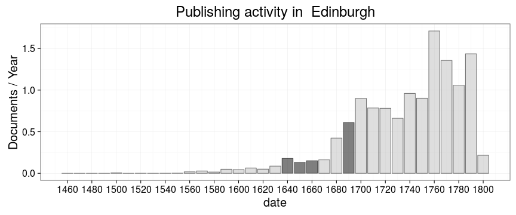

```
## Error in tapply(df$unity, list(df$publication_decade, df$publication_place), : arguments must have same length
```


```
## Error in tapply(df$unity, list(df$publication.timeunit, df$publication_place), : arguments must have same length
```




