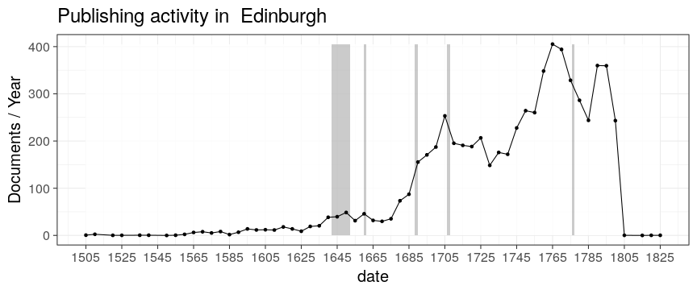
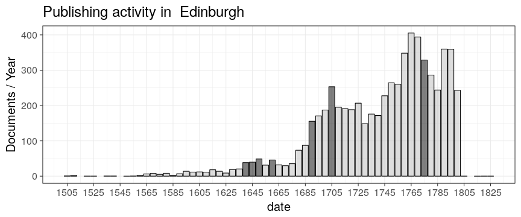

```
## Error in tapply(df$unity, list(df$publication.timeunit, df$publication_place), : arguments must have same length
```

```
## Warning in grid.Call.graphics(L_rect, x$x, x$y, x$width, x$height,
## resolveHJust(x$just, : semi-transparency is not supported on this device:
## reported only once per page
```



```
## Warning in grid.Call.graphics(L_rect, x$x, x$y, x$width, x$height,
## resolveHJust(x$just, : semi-transparency is not supported on this device:
## reported only once per page
```




