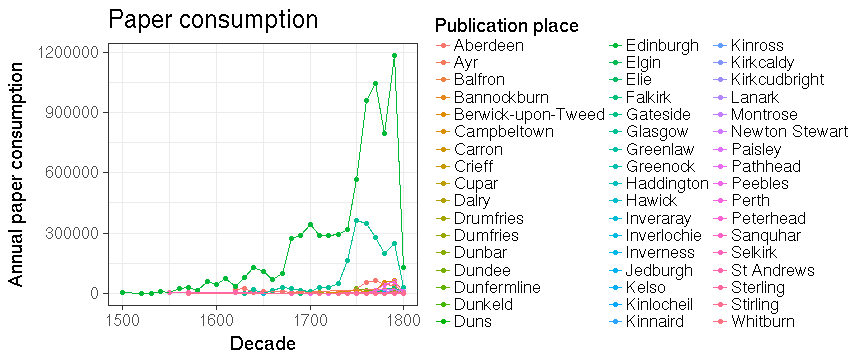

```
## Error in data.frame(indices, value = values): arguments imply differing number of rows: 2, 0
```

```
## Error: All columns must be named
```

 

```
## Error in data.frame(indices, value = values): arguments imply differing number of rows: 2, 0
```

```
## Error: All columns must be named
```

```
## Warning in min(dfs$varname): no non-missing arguments to min; returning Inf
```

```
## Warning in max(dfs$varname): no non-missing arguments to max; returning -
## Inf
```

```
## Error: Discrete value supplied to continuous scale
```

 


  
