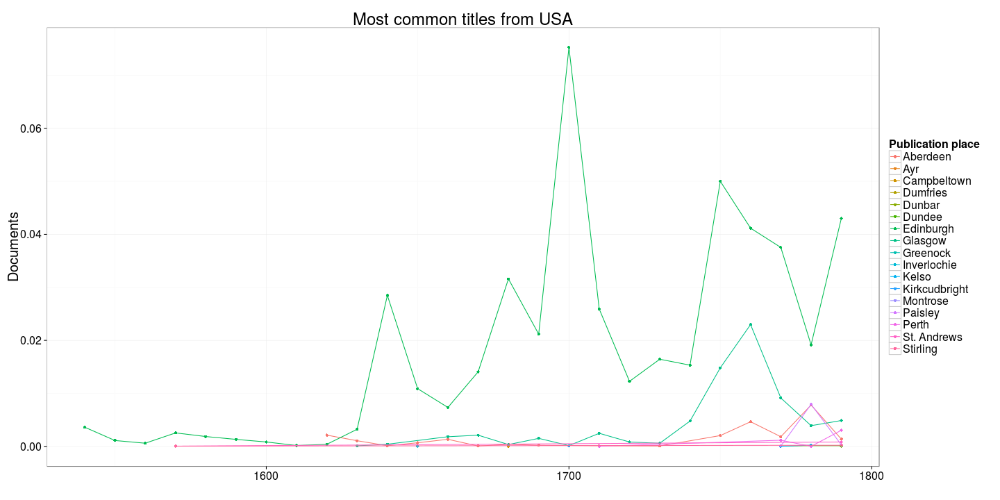
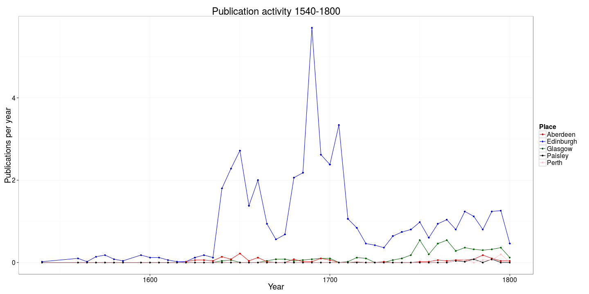

Read the preprocessed ESTC data table and load tools:


```r
# Pick USA documents only
sel.country <- "USA"
df <- filter(df.preprocessed, country == sel.country)
```

We have 41017 documents from USA.


## Most common authors from USA


```r
p <- top_plot(df, "author", 20)
p <- p + ggtitle(paste("Most common authors from", sel.country))
p <- p + ylab("Documents") + xlab("")
print(p)
```


## Top titles 


```r
p <- top_plot(df, "title", 20)
p <- p + ggtitle(paste("Most common titles from", sel.country))
p <- p + ylab("Documents") + xlab("")
print(p)
```




## Historical publication volumes for top-5 publication places

Average annual output for each decade is shown by lines, the actual annual document counts are shown by points. 


```
## Error in tapply(df$unity, list(df$publication_decade, df$publication_place), : arguments must have same length
```

```
## Error in publications[is.na(publications)] <- 0: object 'publications' not found
```

```
## Error in eval(expr, envir, enclos): object 'publications' not found
```

```
## Error in tapply(df$unity, list(df$publication_year, df$publication_place), : arguments must have same length
```

```
## Error in publications.annual[is.na(publications.annual)] <- 0: object 'publications.annual' not found
```

```
## Error in is.data.frame(x): object 'publications' not found
```

```
## Error in eval(expr, envir, enclos): object 'publications' not found
```

```
## Error in eval(expr, envir, enclos): object 'publications.annual' not found
```

```
## Error in melt(publications): object 'publications' not found
```

```
## Error in melt(publications.annual): object 'publications.annual' not found
```

```
## Error in names(dfm.annual) <- c("Time", "Place", "Documents"): object 'dfm.annual' not found
```

```
## Error in fortify(data): object 'dfm.annual' not found
```

```
## Error: Insufficient values in manual scale. 54 needed but only 5 provided.
```


