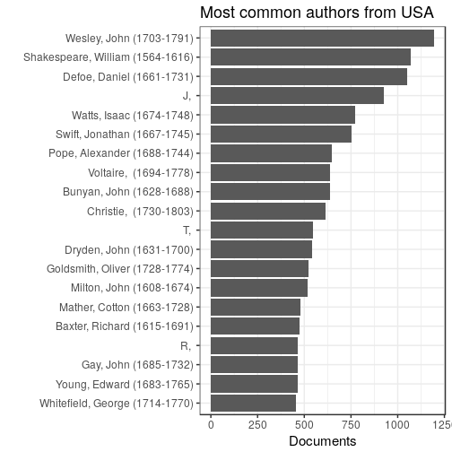
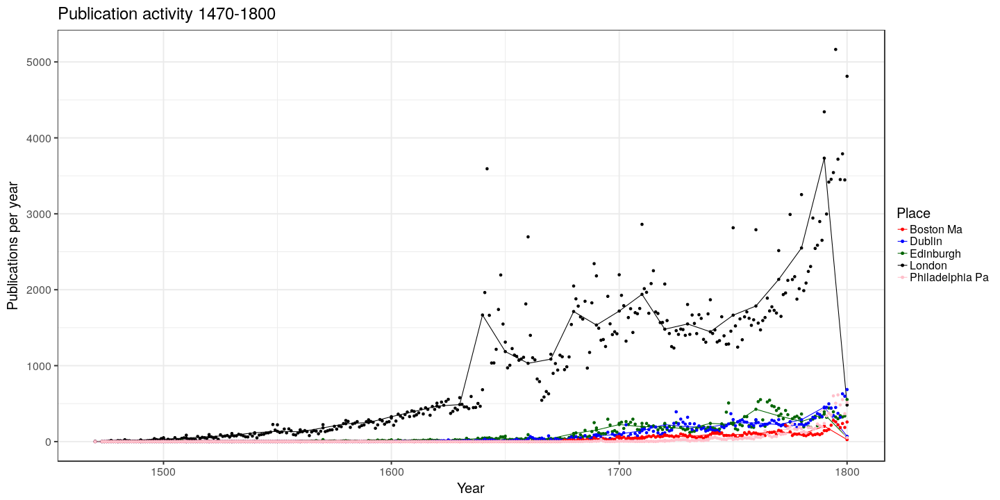

Read the preprocessed ESTC data table and load tools:


```r
# Complete data
df <- read.csv(file = "estc.csv", sep = "|")

# Pick USA documents only
country <- "USA"
df <- filter(df, publication.country == country)
```

```
## Error in eval(expr, envir, enclos): object 'publication.country' not found
```

We have 50295 documents from USA.


## Most common authors from USA


```r
p <- top_plot(df, "author.unique", 20)
```

```
## Error in dfs[1:ntop, ]: incorrect number of dimensions
```

```r
p <- p + ggtitle(paste("Most common authors from", country))
p <- p + ylab("Documents") + xlab("")
print(p)
```

```
## Warning: Removed 9 rows containing missing values (geom_point).
```

```
## Warning: Removed 9 rows containing missing values (geom_path).
```

 


## Top titles 


```r
p <- top_plot(df, "publication.title", 20)
```

```
## Error in dfs[1:ntop, ]: incorrect number of dimensions
```

```r
p <- p + ggtitle(paste("Most common titles from", country))
p <- p + ylab("Documents") + xlab("")
print(p)
```

```
## Warning: Removed 9 rows containing missing values (geom_point).
```

```
## Warning: Removed 9 rows containing missing values (geom_path).
```

 


## Historical publication volumes for top-5 publication places

Average annual output for each decade is shown by lines, the actual annual document counts are shown by points. 


```
## Error in tapply(df$unity, list(df$publication.decade, df$publication.place), : arguments must have same length
```

```
## Error in tapply(df$unity, list(df$publication.year, df$publication.place), : arguments must have same length
```

```
## Error in publications.annual[is.na(publications.annual)] <- 0: object 'publications.annual' not found
```

```
## Error in eval(expr, envir, enclos): object 'publications.annual' not found
```

```
## Error in melt(publications.annual): object 'publications.annual' not found
```

```
## Error in names(dfm.annual) <- c("Time", "Place", "Documents"): object 'dfm.annual' not found
```

```
## Error in do.call("layer", list(mapping = mapping, data = data, stat = stat, : object 'dfm.annual' not found
```

 


