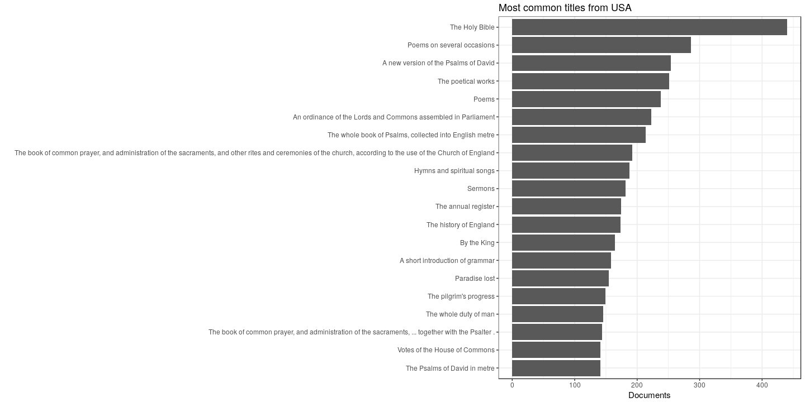

Read the preprocessed ESTC data table and load tools:


```r
# Complete data
df <- read.csv(file = "estc.csv", sep = "|")

# Pick USA documents only
country <- "USA"
df <- filter(df, publication.country == country)
```

We have 3488 documents from USA.


## Most common authors from USA


```r
p <- top_plot(df, "author.unique", 20)
p <- p + ggtitle(paste("Most common authors from", country))
p <- p + ylab("Documents") + xlab("")
print(p)
```

 


## Top titles 


```r
p <- top_plot(df, "publication.title", 20)
p <- p + ggtitle(paste("Most common titles from", country))
p <- p + ylab("Documents") + xlab("")
print(p)
```

 


## Historical publication volumes for top-5 publication places

Average annual output for each decade is shown by lines, the actual annual document counts are shown by points. 

 


