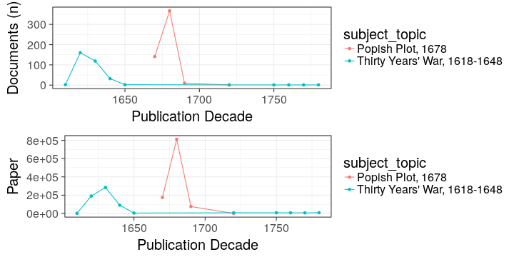

# Princeton summaries

Read the preprocessed ESTC data table and load tools:


```
## Warning: Removed 2 rows containing missing values (geom_point).
```

```
## Warning: Removed 2 rows containing missing values (geom_path).
```

```
## Warning: Removed 2 rows containing missing values (geom_point).
```

```
## Warning: Removed 2 rows containing missing values (geom_path).
```

 


 


