# Scotland publishing summaries

Read the preprocessed ESTC data table and load tools:


We have 741 documents from Scotland.


## Most common authors from Scotland

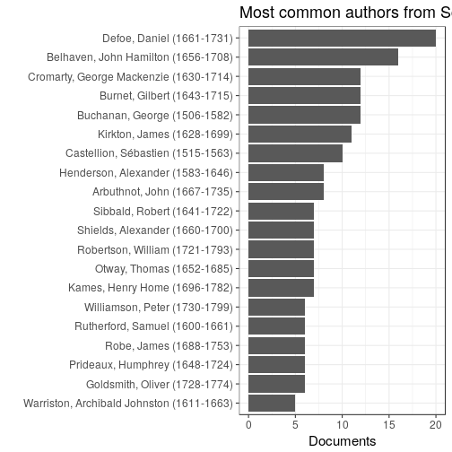


## Publication timeline for top-10 authors

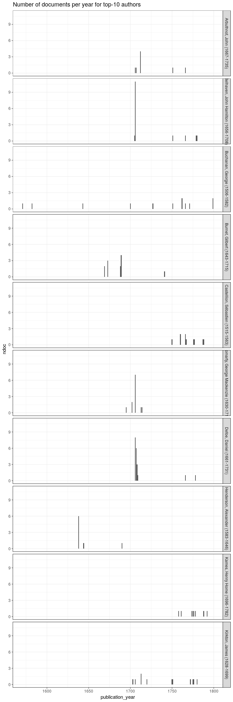


## Most common publication places in Scotland

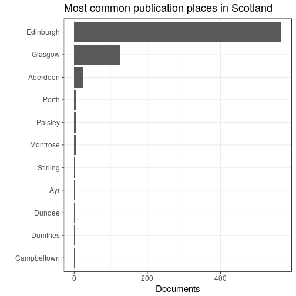


## Top titles 

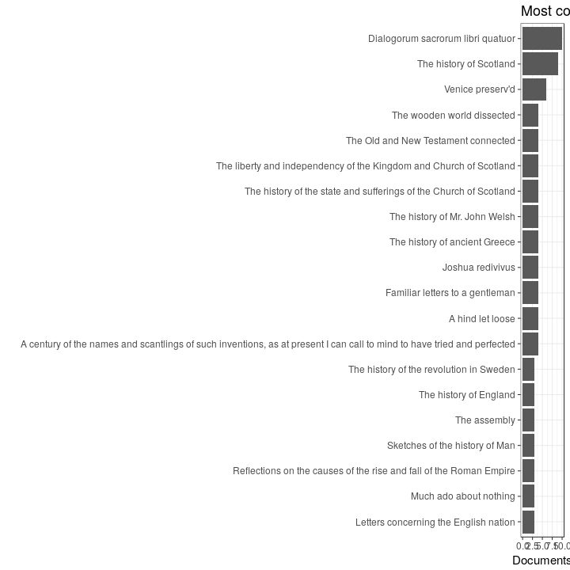


## Authors born before 500AD

Authors born before 500 AD: paper consumption per decade in Scotland and globally. Top-10 authors shown for clarity in each case.


```
## Warning: Removed 4 rows containing missing values (position_stack).
```

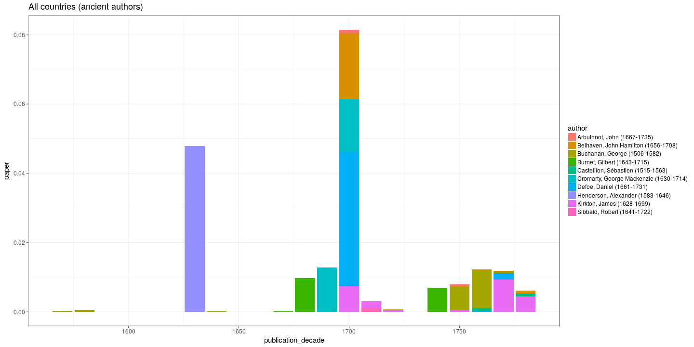

```
## Warning: Removed 4 rows containing missing values (position_stack).
```


List of authors born before 500AD:


```
## 
##                        Abercromby, Patrick (1656-1716) 
##                                                      2 
##                                 Adamson, H (1581-1639) 
##                                                      1 
##                           Adamson, Patrick (1537-1592) 
##                                                      3 
##                            Addison, Joseph (1672-1719) 
##                                                      3 
##                          Addison, Lancelot (1632-1703) 
##                                                      1 
##                    Albemarle, George Monck (1608-1670) 
##                                                      5 
##                      Alletz, Pons Augustin (1705-1785) 
##                                                      5 
##                             Alsop, Vincent (1630-1703) 
##                                                      1 
##                              Alves, Robert (1745-1794) 
##                                                      1 
##                            Anderson, James (1662-1728) 
##                                                      2 
##                            Arbuthnot, John (1667-1735) 
##                                                      8 
##                 Argyll, Archibald Campbell (1598-1661) 
##                                                      2 
##                 Argyll, Archibald Campbell (1629-1685) 
##                                                      1 
##         Argyll, Archibald Campbell Earl Of (1629-1685) 
##                                                      2 
##                              Armour, James (1702-1722) 
##                                                      1 
##                            Armstrong, John (1771-1797) 
##                                                      1 
##                            Arnall, William (1700-1736) 
##                                                      1 
##                    Arniston, Robert Dundas (1713-1787) 
##                                                      1 
##                                Arnot, Hugo (1749-1786) 
##                                                      2 
##                           Arrowsmith, John (1602-1659) 
##                                                      1 
##                        Atholl, John Murray (1660-1724) 
##                                                      2 
##                            Baillie, Robert (1599-1662) 
##                                                      2 
##                               Baine, James (1710-1790) 
##                                                      1 
##                   Balcarres, Colin Lindsay (1652-1722) 
##                                                      1 
##                               Bancks, John (1709-1751) 
##                                                      1 
##                            Bannatyne, John (1641-1707) 
##                                                      1 
##                               Bate, George (1608-1669) 
##                                                      1 
##                             Bates, William (1625-1699) 
##                                                      1 
##                    Belhaven, John Hamilton (1656-1708) 
##                                                     16 
##                           Bennet, Benjamin (1674-1726) 
##                                                      1 
##                           Bergman, Torbern (1735-1784) 
##                                                      1 
##                          Bèze, Théodore De (1519-1605) 
##                                                      2 
##                          Blackwell, Thomas (1701-1757) 
##                                                      2 
##                                Blair, Hugh (1718-1800) 
##                                                      3 
##                              Boece, Hector (1465-1536) 
##                                                      1 
##                Bolingbroke, Henry St. John (1678-1751) 
##                                                      1 
##                   Bossuet, Jacques Bénigne (1627-1704) 
##                                                      1 
##                             Boswell, James (1740-1795) 
##                                                      1 
##                             Boyd, Zacharie (1585-1653) 
##                                                      3 
##                                Brown, John (1610-1679) 
##                                                      2 
##                                Brown, John (1722-1787) 
##                                                      3 
##                                Brown, John (1735-1788) 
##                                                      1 
##                             Bruce, William (1630-1710) 
##                                                      1 
##                           Buchanan, George (1506-1582) 
##                                                     12 
##                               Burgh, James (1714-1775) 
##                                                      1 
##                              Burke, Edmund (1729-1797) 
##                                                      1 
##                            Burnet, Gilbert (1643-1715) 
##                                                     12 
##                         Byfield, Nathanael (1653-1733) 
##                                                      1 
##                          Calderwood, David (1575-1650) 
##                                                      3 
##                           Campbell, George (1719-1796) 
##                                                      3 
##                               Cant, Andrew (1590-1663) 
##                                                      1 
##                         Carstairs, William (1649-1715) 
##                                                      1 
##                              Caryl, Joseph (1602-1673) 
##                                                      1 
##                      Castellion, Sébastien (1515-1563) 
##                                                     10 
##                               Clark, James (1660-1723) 
##                                                      3 
##                             Clarke, Samuel (1599-1682) 
##                                                      2 
##                                Clerk, John (1676-1755) 
##                                                      2 
##                          Cockburn, William (1662-1751) 
##                                                      1 
##                             Colville, John (1542-1605) 
##                                                      1 
##                             Comber, Thomas (1645-1699) 
##                                                      1 
## Condorcet, Jean-antoine-nicolas De Caritat (1743-1794) 
##                                                      1 
##                              Cooper, Myles (1737-1785) 
##                                                      1 
##                  Court De Gébelin, Antoine (1725-1784) 
##                                                      1 
##                            Craufurd, David (1665-1726) 
##                                                      2 
##                           Crawfurd, George (1681-1748) 
##                                                      5 
##                        Crécy, Louis Verjus (1629-1709) 
##                                                      2 
##                 Cromarty, George Mackenzie (1630-1714) 
##                                                     12 
##                           Cromwell, Oliver (1599-1658) 
##                                                      4 
##                        Crookshank, William (1712-1769) 
##                                                      5 
##                      Cullen, Francis Grant (1658-1726) 
##                                                      2 
##                               Currie, John (1679-1765) 
##                                                      1 
##                           Dalrymple, David (1726-1792) 
##                                                      4 
##                               Davies, John (1625-1693) 
##                                                      1 
##                             Davies, Samuel (1723-1761) 
##                                                      1 
##                              Defoe, Daniel (1661-1731) 
##                                                     20 
##                        Dickinson, Jonathan (1688-1747) 
##                                                      4 
##                              Dickson, Adam (1721-1776) 
##                                                      2 
##                           Dopping, Anthony (1643-1697) 
##                                                      1 
##                     Douglas, Basil William (1763-1794) 
##                                                      2 
##                             Douglas, James (1651-1744) 
##                                                      1 
##                            Douglas, Robert (1594-1674) 
##                                                      5 
##                          Drummond, William (1585-1649) 
##                                                      3 
##           Du Bartas, Guillaume De Salluste (1544-1590) 
##                                                      1 
##                           Du Moulin, Peter (1601-1684) 
##                                                      1 
##                          Duncan, Alexander (1708-1795) 
##                                                      1 
##                          Edwards, Jonathan (1703-1758) 
##                                                      4 
##                     Elchies, Patrick Grant (1690-1754) 
##                                                      1 
##                    Elibank, Patrick Murray (1703-1778) 
##                                                      1 
##                               Entick, John (1703-1773) 
##                                                      1 
##                            Erskine, Andrew (1739-1793) 
##                                                      1 
##                          Erskine, Ebenezer (1680-1754) 
##                                                      1 
##                             Erskine, Ralph (1685-1752) 
##                                                      3 
##                               Evelyn, John (1655-1699) 
##                                                      1 
##                            Fleming, Robert (1660-1716) 
##                                                      1 
##                           Fletcher, Andrew (1655-1716) 
##                                                      4 
##                             Forbes, Duncan (1644-1704) 
##                                                      2 
##                             Forbes, Duncan (1685-1747) 
##                                                      2 
##                               Forbes, John (1593-1648) 
##                                                      1 
##                Gardenstone, Francis Garden (1721-1793) 
##                                                      1 
##                              Geddes, James (1710-1745) 
##                                                      1 
##                          Gerard, Alexander (1728-1795) 
##                                                      1 
##                                  Gib, Adam (1714-1788) 
##                                                      2 
##                                 Glas, John (1695-1773) 
##                                                      2 
##              Glencairn, William Cunningham (1610-1664) 
##                                                      1 
##                       Goguet, Antoine-yves (1716-1758) 
##                                                      2 
##                          Goldsmith, Oliver (1728-1774) 
##                                                      6 
##                            Goodall, Walter (1706-1766) 
##                                                      2 
##                          Gordon, Alexander (1669-1752) 
##                                                      1 
##                               Gordon, John (1715-1775) 
##                                                      1 
##                            Gower, Humphrey (1638-1711) 
##                                                      1 
##                             Graham, Dougal (1724-1779) 
##                                                      1 
##                               Graham, John (1648-1689) 
##                                                      1 
##                             Grant, William (1781-1678) 
##                                                      1 
##                               Gray, Andrew (1633-1656) 
##                                                      2 
##                              Grotius, Hugo (1583-1645) 
##                                                      4 
##                             Guild, William (1586-1657) 
##                                                      4 
##                              Guthrie, John (1632-1669) 
##                                                      1 
##                              Guthry, Henry (1600-1676) 
##                                                      2 
##                           Gyllenborg, Carl (1679-1746) 
##                                                      1 
##                Haddington, Thomas Hamilton (1721-1794) 
##                                                      1 
##                     Halifax, George Savile (1633-1695) 
##                                                      4 
##                                 Hall, John (1627-1656) 
##                                                      1 
##                               Hall, Joseph (1574-1656) 
##                                                      4 
##                            Hamilton, Basil (1671-1701) 
##                                                      1 
##                          Hamilton, Charles (1738-1800) 
##                                                      1 
##                            Hamilton, James (1606-1649) 
##                                                      2 
##                    Hamilton, James Douglas (1658-1712) 
##                                                      1 
##                           Hamilton, Robert (1650-1701) 
##                                                      1 
##                          Hamilton, William (1616-1651) 
##                                                      1 
##                               Harvey, John (1702-1729) 
##                                                      2 
##                   Haversham, John Thompson (1647-1710) 
##                                                      2 
##                       Henderson, Alexander (1583-1646) 
##                                                      8 
##                              Hervey, James (1714-1758) 
##                                                      2 
##                                Hill, Aaron (1685-1750) 
##                                                      1 
##                                Howie, John (1735-1793) 
##                                                      1 
##                                Hume, David (1560-1630) 
##                                                      5 
##                                Hume, David (1711-1776) 
##                                                      4 
##                           Jameson, William (1689-1720) 
##                                                      2 
##                           Jeffreys, George (1645-1689) 
##                                                      1 
##                            Johnson, Samuel (1709-1784) 
##                                                      2 
##                           Johnston, Robert (1567-1639) 
##                                                      1 
##                          Johnstone, George (1730-1787) 
##                                                      1 
##                          Johnstoun, Arthur (1587-1641) 
##                                                      1 
##                          Kames, Henry Home (1696-1782) 
##                                                      7 
##                              Keith, Robert (1681-1757) 
##                                                      3 
##                              King, William (1663-1712) 
##                                                      1 
##                               Kirke, Percy (1646-1691) 
##                                                      1 
##                             Kirkton, James (1628-1699) 
##                                                     11 
##                                 Knox, John (1505-1572) 
##                                                      4 
##                          L'estrange, Roger (1616-1704) 
##                                                      1 
##                              Lambert, John (1619-1683) 
##                                                      2 
##                          Lenthall, William (1591-1662) 
##                                                      1 
##                            Leslie, Charles (1650-1722) 
##                                                      4 
##                           Lilburne, Robert (1613-1665) 
##                                                      4 
##                             Lindsay, David (1490-1555) 
##                                                      2 
##                            Lindsay, Robert (1500-1565) 
##                                                      3 
##                           Lithgow, William (1582-1645) 
##                                                      2 
##                           Lockhart, George (1681-1732) 
##                                                      2 
##                              Logan, George (1678-1755) 
##                                                      3 
##                       Lothian, Robert Kerr (1636-1703) 
##                                                      1 
##                      Lothian, William Kerr (1605-1675) 
##                                                      1 
##           Louvet De Couvray, Jean-baptiste (1760-1797) 
##                                                      1 
##                        Lovat, Simon Fraser (1668-1747) 
##                                                      1 
##                             Ludlow, Edmund (1617-1692) 
##                                                      1 
##                             Macbride, John (1651-1718) 
##                                                      2 
##                       Machiavelli, Niccolò (1469-1527) 
##                                                      1 
##                          Mackenzie, George (1636-1691) 
##                                                      1 
##                      Mackenzie, Sir George (1636-1691) 
##                                                      1 
##                           Mackmillan, John (1669-1753) 
##                                                      1 
##                             Maclean, Allan (1725-1784) 
##                                                      1 
##                          Macpherson, James (1736-1796) 
##                                                      1 
##                          Maitland, William (1693-1757) 
##                                                      1 
##                                Major, John (1469-1550) 
##                                                      1 
##                         Malcolm, Alexander (1685-1763) 
##                                                      2 
##                 Manchester, Edward Montagu (1602-1671) 
##                                                      2 
##                    Marchmont, Patrick Hume (1641-1724) 
##                                                      4 
##                            Martin, Richard (1570-1618) 
##                                                      1 
##                           Mathison, Thomas (1721-1760) 
##                                                      1 
##                               Maxwel, Hugh (1682-1751) 
##                                                      1 
##                             Mcward, Robert (1633-1687) 
##                                                      2 
##                              Mead, Matthew (1630-1699) 
##                                                      1 
##                            Meldrum, George (1635-1709) 
##                                                      3 
##                     Melfort, John Drummond (1649-1714) 
##                                                      1 
##                            Melville, James (1535-1617) 
##                                                      2 
##                            Melville, James (1556-1614) 
##                                                      1 
##                         Middleton, Charles (1650-1719) 
##                                                      1 
##                             Millar, Robert (1672-1752) 
##                                                      2 
##                               Milton, John (1608-1674) 
##                                                      2 
##                           Mitchel, William (1671-1740) 
##                                                      4 
##                     Monboddo, James Burnet (1714-1799) 
##                                                      1 
##                       Moncrieff, Alexander (1695-1761) 
##                                                      1 
##           Montesquieu, Charles De Secondat (1689-1755) 
##                                                      5 
##                     Montrose, James Graham (1612-1650) 
##                                                      1 
##                   Montrose, William Graham (1712-1790) 
##                                                      1 
##                            Morison, Thomas (1558-1603) 
##                                                      2 
##                    Morton, William Douglas (1584-1648) 
##                                                      1 
##                              Mure, William (1594-1657) 
##                                                      3 
##                              Newbery, John (1713-1767) 
##                                                      1 
##                               Nye, Stephen (1648-1719) 
##                                                      1 
##                     Orford, Edward Russell (1653-1727) 
##                                                      3 
##                              Otway, Thomas (1652-1685) 
##                                                      7 
##                            Partridge, John (1644-1715) 
##                                                      1 
##                             Pascal, Blaise (1623-1662) 
##                                                      1 
##                             Paterson, John (1604-1679) 
##                                                      1 
##                          Paterson, William (1658-1719) 
##                                                      2 
##                       Payne, Henry Neville (1672-1710) 
##                                                      2 
##                           Peden, Alexander (1626-1686) 
##                                                      1 
##                       Pennecuik, Alexander (1652-1722) 
##                                                      2 
##                       Pennecuik, Alexander (1652-1730) 
##                                                      2 
##                        Pitcairn, Archibald (1652-1713) 
##                                                      3 
##                               Powle, Henry (1630-1692) 
##                                                      1 
##                             Price, Richard (1723-1791) 
##                                                      1 
##                         Prideaux, Humphrey (1648-1724) 
##                                                      6 
##                          Pufendorf, Samuel (1632-1694) 
##                                                      1 
##                          Pulteney, William (1684-1764) 
##                                                      2 
##                                  Pym, John (1584-1643) 
##                                                      1 
##               Queensberry, Charles Douglas (1698-1778) 
##                                                      1 
##                 Queensberry, James Douglas (1662-1711) 
##                                                      2 
##                          Rabaut, Jean-paul (1743-1793) 
##                                                      1 
##                              Ramsay, James (1733-1789) 
##                                                      2 
##                             Renwick, James (1662-1688) 
##                                                      3 
##                                Robe, James (1688-1753) 
##                                                      6 
##                         Robertson, William (1721-1793) 
##                                                      7 
##                         Robertson, William (1740-1793) 
##                                                      1 
##                       Romney, Henry Sidney (1641-1704) 
##                                                      1 
##                            Ross, Alexander (1647-1720) 
##                                                      1 
##                              Rule, Gilbert (1629-1701) 
##                                                      2 
##                           Russell, William (1639-1683) 
##                                                      1 
##                         Rutherford, Samuel (1600-1661) 
##                                                      6 
##                  Sackville, George Germain (1716-1785) 
##                                                      1 
##                              Sadler, Ralph (1507-1587) 
##                                                      2 
##                                 Sage, John (1652-1711) 
##                                                      1 
##                              Savile, Henry (1642-1687) 
##                                                      1 
##                         Schomberg, Charles (1645-1693) 
##                                                      1 
##               Schomberg, Friedrich Hermann (1615-1690) 
##                                                      2 
##                            Sempill, Robert (1530-1595) 
##                                                      4 
##                       Shakespeare, William (1564-1616) 
##                                                      5 
##                              Shaw, Lachlan (1692-1777) 
##                                                      2 
##                          Sherlock, William (1641-1707) 
##                                                      3 
##                         Shields, Alexander (1660-1700) 
##                                                      7 
##                            Sibbald, Robert (1641-1722) 
##                                                      7 
##                           Sidney, Algernon (1622-1683) 
##                                                      2 
##                            Snodgrass, John (1744-1797) 
##                                                      1 
##                             Spalding, John (1609-1670) 
##                                                      1 
##                           Spotiswood, John (1667-1728) 
##                                                      1 
##                         Stackhouse, Thomas (1680-1752) 
##                                                      3 
##                     Stair, James Dalrymple (1619-1695) 
##                                                      1 
##                     Starhemberg, Guidobald (1657-1737) 
##                                                      1 
##                              Sterry, Peter (1613-1672) 
##                                                      1 
##                             Stewart, James (1635-1713) 
##                                                      2 
##                             Stewart, James (1635-1715) 
##                                                      3 
##                Stirling, William Alexander (1568-1640) 
##                                                      2 
##                Strafford, Thomas Wentworth (1593-1641) 
##                                                      1 
##                            Stuart, Gilbert (1742-1786) 
##                                                      3 
##                            Swift, Jonathan (1667-1745) 
##                                                      1 
##                             Symson, Andrew (1638-1712) 
##                                                      2 
##                            Talbot, William (1659-1730) 
##                                                      1 
##                            Temple, William (1628-1699) 
##                                                      2 
##                              Tennent, John (1710-1748) 
##                                                      1 
##                  Teviot, Thomas Livingston (1652-1711) 
##                                                      1 
##                              Thom, William (1710-1790) 
##                                                      5 
##                            Tillotson, John (1630-1694) 
##                                                      1 
##                     Tilly, Jean T'serclaes (1559-1632) 
##                                                      1 
##                              Titus, Silius (1623-1704) 
##                                                      2 
##                               Toland, John (1670-1722) 
##                                                      1 
##                    Turretin, Jean-alphonse (1671-1737) 
##                                                      1 
##                              Ussher, James (1581-1656) 
##                                                      1 
##                                Vane, Henry (1612-1662) 
##                                                      1 
##                             Vernon, Edward (1684-1757) 
##                                                      1 
##                               Vicars, John (1580-1652) 
##                                                      1 
##                   Waldeck, Georg Friedrich (1620-1692) 
##                                                      2 
##                             Walker, George (1645-1690) 
##                                                      1 
##                            Walker, Patrick (1666-1745) 
##                                                      1 
##                            Wallace, Robert (1697-1771) 
##                                                      1 
##                               Ward, Edward (1667-1731) 
##                                                      4 
##              Warriston, Archibald Johnston (1611-1663) 
##                                                      5 
##                             Webster, James (1658-1720) 
##                                                      2 
##                             Welwood, James (1652-1727) 
##                                                      3 
##                               Wesley, John (1703-1791) 
##                                                      1 
##                        Whichcote, Benjamin (1609-1683) 
##                                                      1 
##                         Whitefield, George (1714-1770) 
##                                                      2 
##                                Wilde, John (1590-1669) 
##                                                      1 
##                          Williams, William (1634-1700) 
##                                                      1 
##                          Williamson, Peter (1730-1799) 
##                                                      6 
##                             Willison, John (1680-1750) 
##                                                      1 
##                            Wilson, William (1690-1741) 
##                                                      2 
##                             Winzet, Ninian (1518-1592) 
##                                                      2 
##                            Wishart, George (1599-1671) 
##                                                      2 
##                            Wishart, George (1703-1785) 
##                                                      2 
##                              Withers, John (1669-1729) 
##                                                      1 
##                          Witherspoon, John (1723-1794) 
##                                                      3 
##                             Wodrow, Robert (1679-1734) 
##                                                      2 
##                          Wolseley, William (1640-1697) 
##                                                      1 
##                                 Wood, John (1705-1754) 
##                                                      1 
##                 Worcester, Edward Somerset (1601-1667) 
##                                                      4 
##                            Wright, William (1659-1723) 
##                                                      3
```

We have 741 documents from 296 unique
authors born before 500 AD who have published in Scotland.


## Historical publication volumes for all publication places in Scotland

Average annual output for each decade are indicated by lines, the annual document counts are shown by points. 

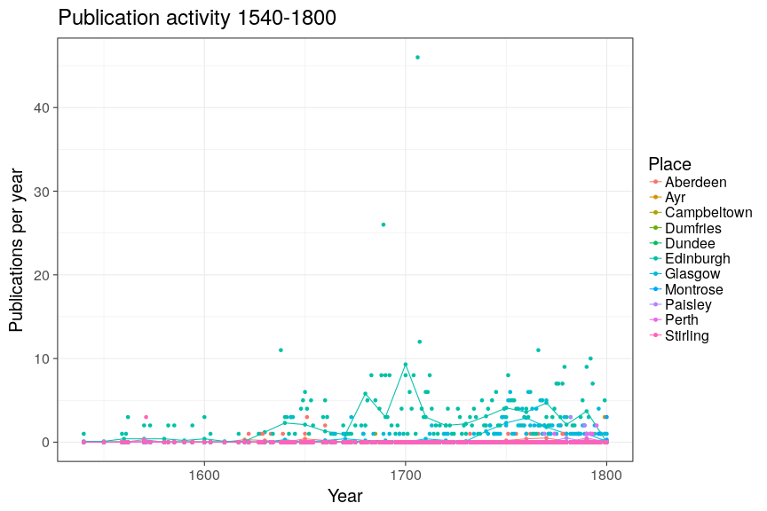


## Historical publication volumes for top-5 publication places in Scotland

Average annual output for each decade are indicated by lines, the annual document counts are shown by points. 

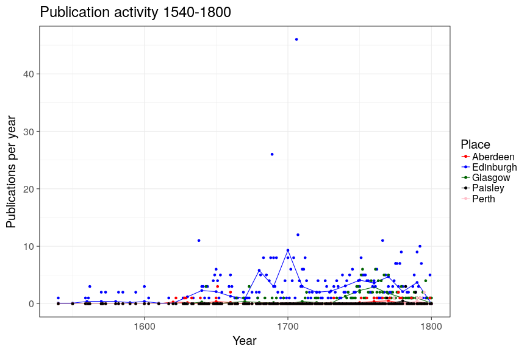


## Publishing in Scotland versus London 1700 


We have 525 documents from Scotland and 0 documents from London during 1700-1800. Average annual output for each decade are indicated by lines (passing through the middle point at each decade 1705, 1715 etc), the annual document counts are shown by points.

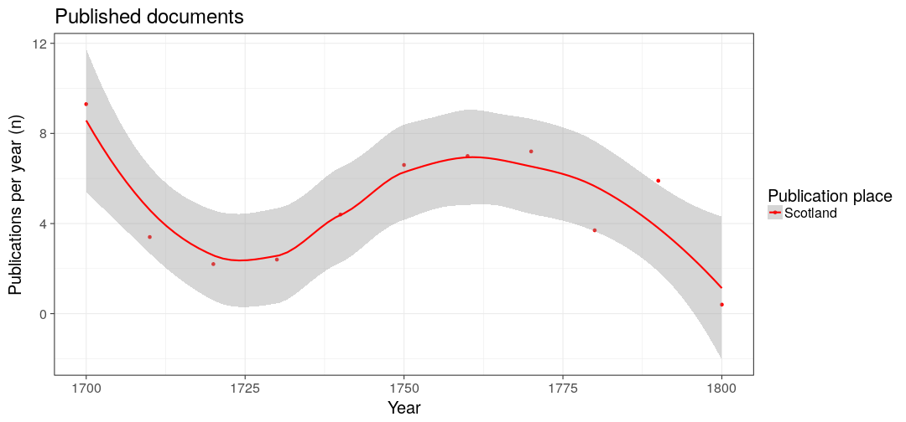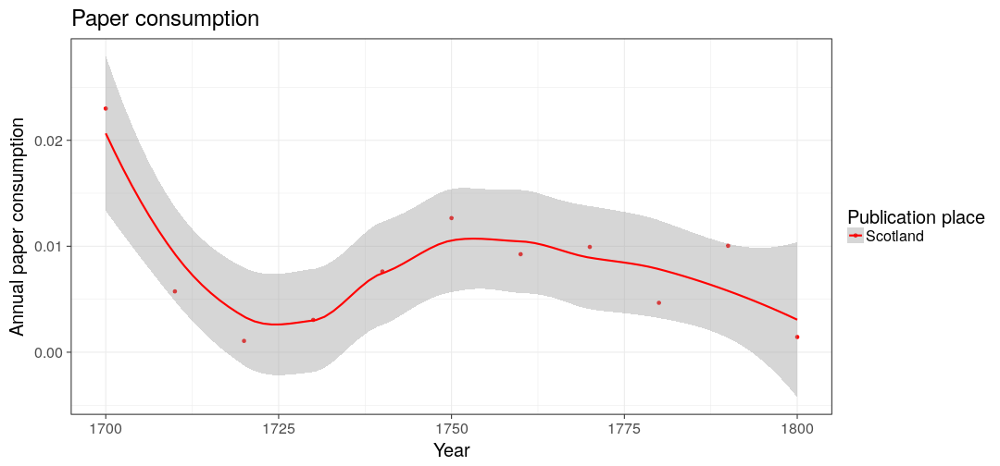


## Comparing selected authors

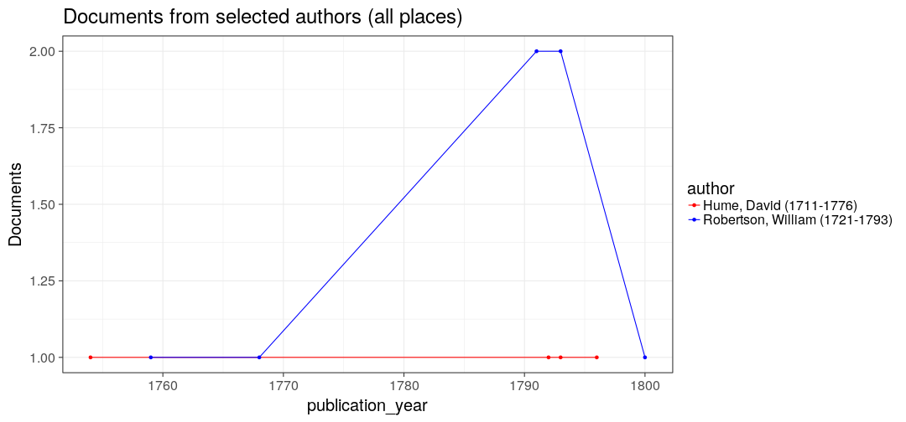

```
## Warning: Removed 579 rows containing missing values (geom_point).
```

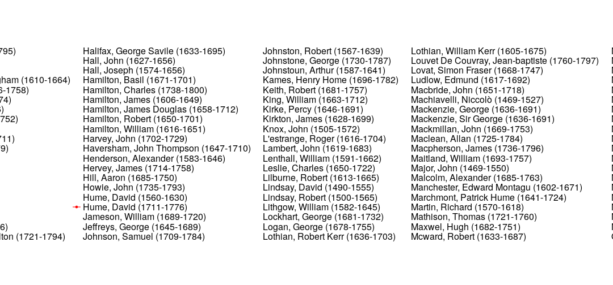

```
## Warning: Unknown column 'PANEL'
```

```
## Warning: Unknown column 'PANEL'
```

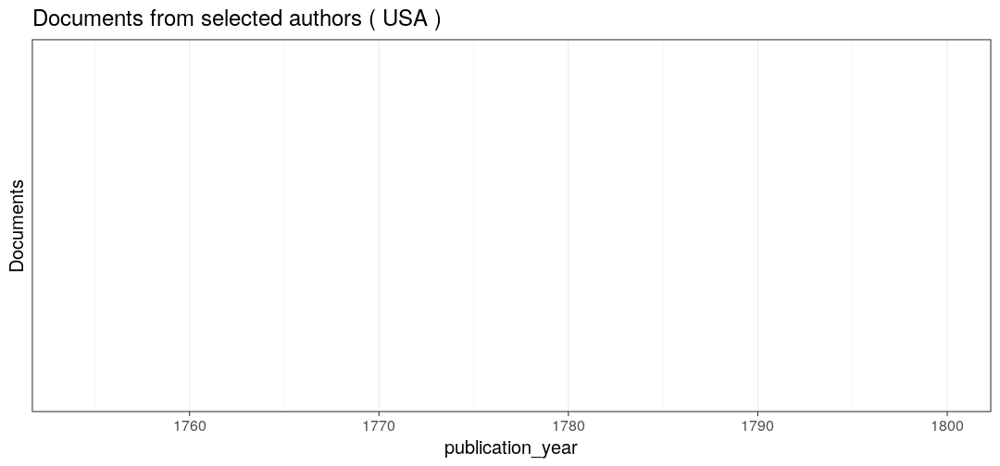

```
## Warning: Unknown column 'PANEL'

## Warning: Unknown column 'PANEL'
```

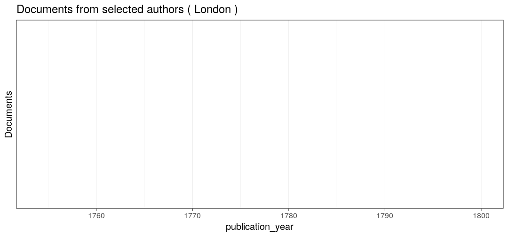

## Authors from different periods publishing in 1750-1799

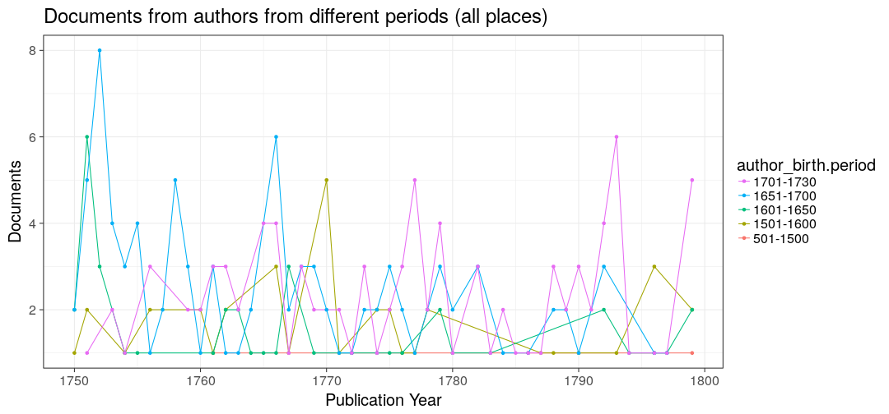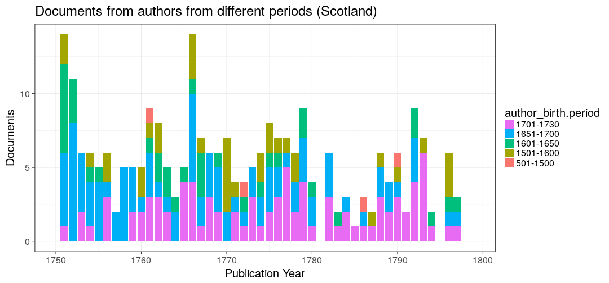

