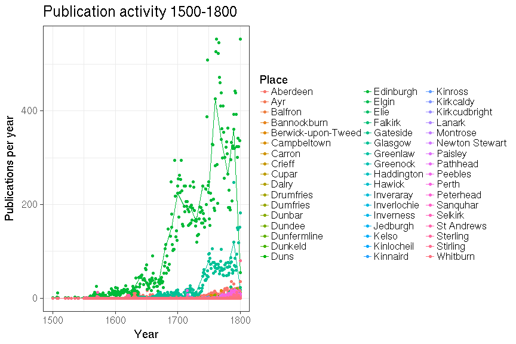

# Scotland publishing summaries

Read the preprocessed ESTC data table and load tools:


We have 39393 documents from Scotland.


## Most common authors from Scotland


## Publication timeline for top-10 authors


## Most common publication places in Scotland


## Top titles 


## Authors born before 500AD

Only authors with over 10 publications.

 * Ennen 500AD syntyneiden kirjoittajien julkaisujen esiintymat koko aikajanalla, painomaarat per vuosi, kaikki julkaisupaikat.
 * Ennen 500AD syntyneiden kirjoittajien julkaisujen esiintymat koko aikajanalla, painomaarat per vuosi Skotlannissa.


```
## 
##                    Ramsay, Allan (1685-1758) 
##                                          191 
##                   Erskine, Ralph (1685-1752) 
##                                          180 
##                   Boston, Thomas (1677-1732) 
##                                          156 
##                   Willison, John (1680-1750) 
##                                          145 
##              Pitcairn, Archibald (1652-1713) 
##                                          115 
##                    Defoe, Daniel (1661-1731) 
##                                          110 
##                     Bunyan, John (1628-1688) 
##                                           96 
##                     Gray, Andrew (1633-1656) 
##                                           92 
##                      Brown, John (1722-1787) 
##                                           84 
##               Whitefield, George (1714-1770) 
##                                           78 
##                Erskine, Ebenezer (1680-1754) 
##                                           76 
##                  Addison, Joseph (1672-1719) 
##                                           75 
##                    Young, Edward (1683-1765) 
##                                           70 
##                     Milton, John (1608-1674) 
##                                           66 
##                    Hervey, James (1714-1758) 
##                                           64 
##                   Thomson, James (1700-1748) 
##                                           61 
##                  Swift, Jonathan (1667-1745) 
##                                           60 
##             Shakespeare, William (1564-1616) 
##                                           60 
##                  Pope, Alexander (1688-1744) 
##                                           60 
##               Rutherford, Samuel (1600-1661) 
##                                           59 
##                    Burns, Robert (1759-1796) 
##                                           56 
##                    Durham, James (1622-1658) 
##                                           55 
##                 Ruddiman, Thomas (1674-1757) 
##                                           52 
##                     Watts, Isaac (1674-1748) 
##                                           47 
##                   Maxwell, James (1720-1800) 
##                                           46 
##                Kames, Henry Home (1696-1782) 
##                                           46 
##           Hamilton, James George (1755-1769) 
##                                           46 
##                       Owen, John (1616-1683) 
##                                           44 
##                Mackenzie, George (1636-1691) 
##                                           44 
##                        Gay, John (1685-1732) 
##                                           44 
##                  Vincent, Thomas (1634-1678) 
##                                           43 
##                       Glas, John (1695-1773) 
##                                           43 
##                     Clark, James (1660-1723) 
##                                           42 
##                   Lindsay, David (1490-1555) 
##                                           40 
##                  Fielding, Henry (1707-1754) 
##                                           40 
##                       Hog, James (1658-1734) 
##                                           39 
##          Belhaven, John Hamilton (1656-1708) 
##                                           39 
##             Pennecuik, Alexander (1652-1730) 
##                                           38 
##                     Dryden, John (1631-1700) 
##                                           38 
##                 Buchanan, George (1506-1582) 
##                                           38 
##                   Henry, Matthew (1662-1714) 
##                                           37 
##                  Sibbald, Robert (1641-1722) 
##                                           36 
##                 Guthrie, William (1620-1665) 
##                                           36 
##                  Dodsley, Robert (1703-1764) 
##                                           36 
##                   Rowe, Nicholas (1674-1718) 
##                                           35 
##                  Burnet, Gilbert (1643-1715) 
##                                           35 
##      Douglas Of Douglas, Archibald (1748-NA) 
##                                           32 
##                  Cullen, William (1710-1790) 
##                                           32 
##                Congreve, William (1670-1729) 
##                                           31 
##                Williamson, Peter (1730-1799) 
##                                           30 
##                   Scougal, Henry (1650-1678) 
##                                           30 
##                     Flavel, John (1630-1691) 
##                                           30 
##                Drummond, William (1585-1649) 
##                                           30 
##                Witherspoon, John (1723-1794) 
##                                           28 
##               Hutcheson, Francis (1694-1746) 
##                                           28 
##                 Farquhar, George (1677-1707) 
##                                           28 
##                   Duncan, Andrew (1744-1626) 
##                                           28 
##                Cordier, Mathurin (1479-1564) 
##                                           28 
##                  Sempill, Robert (1530-1595) 
##                                           27 
##                     Russel, Robert (1692-NA) 
##                                           27 
##                Edwards, Jonathan (1703-1758) 
##                                           27 
##                Doddridge, Philip (1702-1751) 
##                                           27 
##                   Dickson, David (1583-1663) 
##                                           27 
##       Cromarty, George Mackenzie (1630-1714) 
##                                           27 
##                     Beattie, James (1735-NA) 
##                                           27 
##                Sherlock, William (1641-1707) 
##                                           26 
##                 Dalrymple, David (1726-1792) 
##                                           26 
##                   Ambrose, Isaac (1604-1664) 
##                                           26 
##                  Walker, Patrick (1666-1745) 
##                                           25 
##                   Renwick, James (1662-1688) 
##                                           25 
##               Shields, Alexander (1660-1700) 
##                                           24 
##               Le Sage, Alain René (1668-1747) 
##                                           24 
##                Goldsmith, Oliver (1728-1774) 
##                                           24 
##      Galloway, Alexander Stewart (1694-1773) 
##                                           24 
##                   Fife, James Duff (1729-NA) 
##                                           24 
##                   Caesar, Julius (1558-1636) 
##                                           24 
##                    Blair, Robert (1699-1746) 
##                                           24 
##          Smollett, Tobias George (1721-1771) 
##                                           23 
##                    Otway, Thomas (1652-1685) 
##                                           23 
##                 Monro, Alexander (1697-1767) 
##                                           23 
##                        Gib, Adam (1714-1788) 
##                                           23 
##    Douglas, Archibald James Edward (1748-NA) 
##                                           23 
##                   Cibber, Colley (1671-1757) 
##                                           23 
##                  Baxter, Richard (1615-1691) 
##                                           23 
##                      Moor, James (1712-1779) 
##                                           22 
##                      Brown, John (1610-1679) 
##                                           22 
##                     Bisset, John (1692-1756) 
##                                           22 
##                    Anderson, James (1739-NA) 
##                                           22 
##                   Jamieson, John (1759-1708) 
##                                           21 
##                      Hume, David (1711-1776) 
##                                           21 
##                         Home, John (1722-NA) 
##                                           21 
##                    Dyer, William (1696-1696) 
##                                           21 
##                Crawford, William (1676-1742) 
##                                           21 
##                     Bell, Benjamin (1749-NA) 
##                                           21 
##                    Thom, William (1710-1790) 
##                                           20 
##                  Steele, Richard (1672-1729) 
##                                           20 
##           Montgomerie, Alexander (1545-1611) 
##                                           20 
## Montesquieu, Charles De Secondat (1689-1755) 
##                                           20 
##                      Locke, John (1632-1704) 
##                                           20 
##               Halyburton, Thomas (1674-1712) 
##                                           20 
##                   Graham, Dougal (1724-1779) 
##                                           20 
##                      Erskine, John (1721-NA) 
##                                           20 
##                   Dickson, David (1709-1780) 
##                                           20 
##                     Currie, John (1679-1765) 
##                                           20 
##                  Wilson, William (1690-1741) 
##                                           19 
##           Rowe, Elizabeth Singer (1674-1737) 
##                                           19 
##             Moncrieff, Alexander (1695-1761) 
##                                           19 
##                      Heron, Robert (1764-NA) 
##                                           19 
##                   Guild, William (1586-1657) 
##                                           19 
##                  Gordon, Alexander (1743-NA) 
##                                           19 
##                   Garrick, David (1717-1779) 
##                                           19 
##                    Dalrymple, John (1726-NA) 
##                                           19 
##             Castellion, Sébastien (1515-1563) 
##                                           19 
##                   Calder, Robert (1658-1723) 
##                                           19 
##                   Anderson, John (1667-1721) 
##                                           19 
##                     Ward, Edward (1667-1731) 
##                                           18 
##     Queensberry, Charles Douglas (1698-1778) 
##                                           18 
##                    Pomfret, John (1667-1702) 
##                                           18 
##            Morton, James Douglas (1702-1768) 
##                                           18 
##                Leechman, William (1706-1785) 
##                                           18 
##                  Johnson, Samuel (1709-1784) 
##                                           18 
##                   Forbes, Duncan (1685-1747) 
##                                           18 
##                    Fisher, James (1697-1775) 
##                                           18 
##                 Craghead, Robert (1684-1738) 
##                                           18 
##                      Blair, Hugh (1718-1800) 
##                                           18 
##                    Binning, Hugh (1627-1653) 
##                                           18 
##                Wilson, Alexander (1766-1786) 
##                                           17 
##                Wedderburn, David (1580-1646) 
##                                           17 
##                   Webster, James (1658-1720) 
##                                           17 
##               Webster, Alexander (1707-1784) 
##                                           17 
##                  Shepard, Thomas (1605-1649) 
##                                           17 
##                  Rollock, Robert (1555-1599) 
##                                           17 
##                 Ogilvie, William (1736-1729) 
##                                           17 
##                   Monro, Alexander (1733-NA) 
##                                           17 
##                  Mcewen, William (1735-1762) 
##                                           17 
##                    Kirkwood, James (1698-NA) 
##                                           17 
##                         Hart, John (1682-NA) 
##                                           17 
##                   Fisher, Edward (1627-1655) 
##                                           17 
##                   Butler, Samuel (1612-1680) 
##                                           17 
##                   Bruce, Archibald (1746-NA) 
##                                           17 
##                  Arbuthnot, John (1667-1735) 
##                                           17 
##               Allestree, Richard (1619-1681) 
##                                           17 
##                    Adam, Alexander (1741-NA) 
##                                           17 
##                    Whytt, Robert (1714-1766) 
##                                           16 
##                 Spotiswood, John (1667-1728) 
##                                           16 
##                     Shirra, Robert (1724-NA) 
##                                           16 
##               Shenstone, William (1714-1763) 
##                                           16 
##                    Purves, James (1734-1795) 
##                                           16 
##                Macpherson, James (1736-1796) 
##                                           16 
##                    Logan, George (1678-1755) 
##                                           16 
##                  Gordon, William (1763-1751) 
##                                           16 
##                   Gordon, Robert (1696-1772) 
##                                           16 
##                   Brooks, Thomas (1608-1680) 
##                                           16 
##                     Wilson, John (1654-1719) 
##                                           15 
##                      Welch, John (1624-1681) 
##                                           15 
##                  Ridpath, George (1717-1726) 
##                                           15 
##                Fergusson, Robert (1750-1774) 
##                                           15 
##                 Campbell, George (1719-1796) 
##                                           15 
##                    Rule, Gilbert (1629-1701) 
##                                           14 
##                  Rollin, Charles (1661-1741) 
##                                           14 
##                   Pirie, Alexander (1737-NA) 
##                                           14 
##                  Parnell, Thomas (1679-1718) 
##                                           14 
##                     Muir, Thomas (1765-1798) 
##                                           14 
##                  Mclean, Archibald (1733-NA) 
##                                           14 
##                Love, Christopher (1618-1651) 
##                                           14 
##                   Justice, James (1698-1763) 
##                                           14 
##                  Home, Alexander (1715-1786) 
##                                           14 
##                    Gregory, John (1724-1773) 
##                                           14 
##                 Fletcher, Andrew (1655-1716) 
##                                           14 
##                    Dickson, John (1628-1700) 
##                                           14 
##                        Derham, W (1657-1735) 
##                                           14 
##                 Dalrymple, David (1665-1721) 
##                                           14 
##                 Cuninghame, John (1717-1740) 
##                                           14 
##                   Bruce, Michael (1746-1767) 
##                                           14 
##                     Young, David (1785-1759) 
##                                           13 
##                 Sutherland, John (1661-1733) 
##                                           13 
##                 Sinclair, George (1797-1696) 
##                                           13 
##                     Scott, William (1750-NA) 
##                                           13 
##                   Salmon, Thomas (1679-1767) 
##                                           13 
##               Robertson, William (1721-1793) 
##                                           13 
##              Moray, James Stuart (1708-1767) 
##                                           13 
##                   Macneill, Hector (1746-NA) 
##                                           13 
##                   Kirkton, James (1628-1699) 
##                                           13 
##                  Irvine, Alexander (1754-NA) 
##                                           13 
##                      Home, Francis (1719-NA) 
##                                           13 
##             Henderson, Alexander (1583-1646) 
##                                           13 
##                   Guthrie, James (1612-1661) 
##                                           13 
##                   Gregory, David (1659-1708) 
##                                           13 
##                     Gray, Thomas (1716-1771) 
##                                           13 
##                     Fraser, Hugh (1703-1770) 
##                                           13 
##                   Fordyce, James (1720-1796) 
##                                           13 
##               Fife, William Duff (1697-1763) 
##                                           13 
##                     Ferrier, James (1744-NA) 
##                                           13 
##                    Erskine, John (1695-1768) 
##                                           13 
##                   Duncan, Andrew (1560-1626) 
##                                           13 
##            Cullen, Francis Grant (1658-1726) 
##                                           13 
##                 Carlyle, Alexander (1722-NA) 
##                                           13 
##                   Boyd, Zacharie (1585-1653) 
##                                           13 
##                  Alleine, Joseph (1634-1668) 
##                                           13 
##         Abercorn, James Hamilton (1712-1789) 
##                                           13 
##                      Thomson, John (1733-NA) 
##                                           12 
##           Rousseau, Jean-jacques (1712-1778) 
##                                           12 
##         Rosebery, James Primrose (1691-1755) 
##                                           12 
##                Pulteney, William (1684-1764) 
##                                           12 
##                 Philips, Ambrose (1674-1749) 
##                                           12 
##                    Oliphant, James (1734-NA) 
##                                           12 
##                 Monteith, Robert (1707-1776) 
##                                           12 
##                 Marshall, Walter (1628-1680) 
##                                           12 
##                  Maclaurin, John (1693-1754) 
##                                           12 
##              Hopetoun, John Hope (1704-1781) 
##                                           12 
##                     Home, George (1641-1716) 
##                                           12 
##                 Hoadly, Benjamin (1676-1761) 
##                                           12 
##                   Gregory, James (1753-1675) 
##                                           12 
##                Gillespie, George (1613-1648) 
##                                           12 
##               Douglas, Archibald (1691-1761) 
##                                           12 
##                 Donaldson, James (1697-1713) 
##                                           12 
##                       Burn, John (1744-1793) 
##                                           12 
##                         Bell, John (1763-NA) 
##                                           12 
##             Atholl, James Murray (1690-1764) 
##                                           12 
##                    Agnew, Andrew (1687-1771) 
##                                           12 
##                      Adamson, John (1741-NA) 
##                                           12 
##        Abernethy-drummond, William (1719-NA) 
##                                           12 
##                   Walker, Robert (1716-1783) 
##                                           11 
##                     Simson, John (1668-1740) 
##                                           11 
##                 Shaw-stewart, John (1739-NA) 
##                                           11 
##          Selkirk, Dunbar Douglas (1722-1799) 
##                                           11 
##                     Ross, Andrew (1771-1749) 
##                                           11 
##                      Robe, James (1688-1753) 
##                                           11 
##       Queensberry, William Douglas (1725-NA) 
##                                           11 
##             Pennecuik, Alexander (1652-1722) 
##                                           11 
##                 Peden, Alexander (1626-1686) 
##                                           11 
##                       Newton, John (1725-NA) 
##                                           11 
##                  Meston, William (1688-1745) 
##                                           11 
##                  Meldrum, George (1635-1709) 
##                                           11 
##                    Mallet, David (1705-1765) 
##                                           11 
##               Mackenzie, Alexander (1735-NA) 
##                                           11 
##                  Linné, Carl Von (1707-1778) 
##                                           11 
##                       Hill, George (1750-NA) 
##                                           11 
##                Hamilton, William (1704-1754) 
##                                           11 
##                   Hamilton, Robert (1743-NA) 
##                                           11 
##                    Fraser, James (1639-1699) 
##                                           11 
##                  Fowler, William (1560-1612) 
##                                           11 
##                    Forbes, James (1689-1761) 
##                                           11 
##                   Cocker, Edward (1631-1675) 
##                                           11 
##      Bolingbroke, Henry St. John (1678-1751) 
##                                           11 
##                       Blair, James (1656-NA) 
##                                           11 
##            Aberdeen, George Gordon (1722-NA) 
##                                           11
```

We have 15388 documents from 247 unique
authors born before 500 AD who have published in Scotland.


## Historical publication volumes for all publication places in Scotland

Average annual output for each decade are indicated by lines, the annual document counts are shown by points. 




## Historical publication volumes for top-5 publication places in Scotland

Average annual output for each decade are indicated by lines, the annual document counts are shown by points. 


## Publishing in Scotland versus London 1700 


We have 33750 documents from Scotland and 205048 documents from London during 1700-1800. Average annual output for each decade are indicated by lines (passing through the middle point at each decade 1705, 1715 etc), the annual document counts are shown by points.


```
## Warning: Removed 3 rows containing non-finite values (stat_smooth).
```


## Comparing selected authors


## Authors from different periods publishing in 1750-1799


