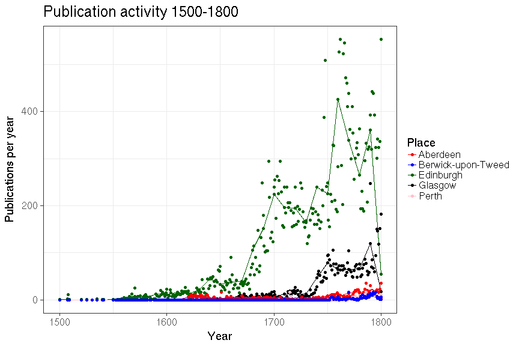
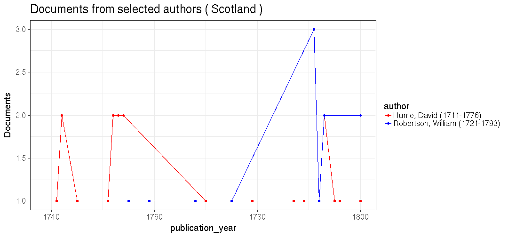
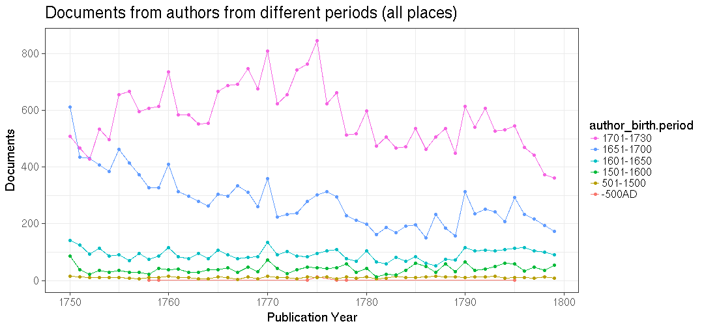

# Scotland publishing summaries

Read the preprocessed ESTC data table and load tools:


We have 39393 documents from Scotland.


## Most common authors from Scotland


## Publication timeline for top-10 authors


## Most common publication places in Scotland


## Top titles 


## Authors born before 500AD

May contain errneous birth years - helps with quality control, too !

 * Ennen 500AD syntyneiden kirjoittajien julkaisujen esiintymat koko aikajanalla, painomaarat per vuosi, kaikki julkaisupaikat.
 * Ennen 500AD syntyneiden kirjoittajien julkaisujen esiintymat koko aikajanalla, painomaarat per vuosi Skotlannissa.


```
## 
##         Abercrombie, Stewart (18-NA)              Ainslie, Thomas (18-NA) 
##                                    3                                    1 
##              Alexander, John (18-NA)          Anderson, Elizabeth (18-NA) 
##                                    1                                    1 
##            Anderson, Patrick (18-NA)            Anderson, William (18-NA) 
##                                    1                                    1 
##             Archibald, David (17-NA)                Arnot, Robert (18-NA) 
##                                    1                                    1 
##             Austin, Margaret (18-NA)                Blair, Thomas (18-NA) 
##                                    1                                    1 
##                      Boyd, W (18-NA)                 Brown, Janet (18-NA) 
##                                    1                                    2 
##              Buchanan, James (18-NA)                Cameron, John (18-NA) 
##                                    1                                    2 
##              Campbell, Angus (18-NA)              Campbell, David (18-NA) 
##                                    1                                    4 
##            Campbell, Gabriel (18-NA)           Campbell, Gabriel] (18-NA) 
##                                    1                                    1 
##               Campbell, John (18-NA)               Campbell, Mary (18-NA) 
##                                    2                                    1 
##              Chartier, Alain (15-NA)               Clark, James (18-1723) 
##                                    1                                    1 
##             Cockburn, Robert (18-NA)            Coltellini, Marco (18-NA) 
##                                    2                                    1 
##           Copland, Alexander (18-NA)              Craufurd, James (17-NA) 
##                                    5                                    1 
##                Cross, Robert (18-NA)                 Dick, John (18-1684) 
##                                    1                                    2 
##              Dickson, George (17-NA)             Douglas, William (17-NA) 
##                                    1                                    4 
##           Drummond, Margaret (18-NA)           Drummond, Thomas (18-1780) 
##                                    1                                    6 
##            Dundas, William (17-1673)                 Echlin, John (18-NA) 
##                                    1                                    1 
##    Federico, Gennaro Antonio (18-NA)           Ferguson, Robert (18-1714) 
##                                    1                                    2 
##                Fleming, John (18-NA)          Forbes, Alexander (17-1672) 
##                                    1                                    1 
##                Forbes, David (18-NA)              Forbes, Francis (18-NA) 
##                                    1                                    1 
##               Forbes, George (17-NA)               Forbes, Walter (17-NA) 
##                                    7                                    1 
##              Forbes, William (18-NA)              Forrester, John (18-NA) 
##                                    3                                    2 
##           Forsyth, Alexander (18-NA)            Fraser, Alexander (18-NA) 
##                                    1                                    1 
##               Fulton, Robert (18-NA)                Fyfe, Gilbert (17-NA) 
##                                    1                                    1 
##                  Fyfe, James (18-NA)             Gardiner, Robert (18-NA) 
##                                    1                                    3 
##             Gibson, Margaret (18-NA)              Gibson, William (18-NA) 
##                                    1                                    2 
##            Gordon, Alexander (18-NA)                 Gordon, Hugh (18-NA) 
##                                    1                                    1 
##            Gordon, William (18-1751)                  Gould, John (18-NA) 
##                                    1                                    1 
##                Graham, James (18-NA)             Graham, Robert (18-1797) 
##                                    1                                    1 
##                  Gray, James (18-NA)                 Gray, Robert (17-NA) 
##                                    1                                    1 
##                Gregory, John (18-NA)         Haliburton, Margaret (18-NA) 
##                                    1                                    1 
##                Hall, James (18-1745)        Hamilton, Elisabeth (18-1762) 
##                                    1                                    1 
##             Hammond, Charles (17-NA)                Hancock, John (18-NA) 
##                                    2                                    1 
##            Hanscome, Jacobus (18-NA)            Harding, Robert (18-1767) 
##                                    1                                    1 
##             Harper, Thomas (18-1788)              Harper, William (18-NA) 
##                                    1                                    7 
##                  Hay, Robert (18-NA)                Hemming, John (18-NA) 
##                                    1                                    1 
##             Henderson, David (18-NA)               Heriot, George (18-NA) 
##                                    3                                    2 
##                  Hogan, John (18-NA)                 Hog, William (18-NA) 
##                                    1                                    3 
##                 Holden, John (18-NA)                   Hus, Jan (17-1415) 
##                                    3                                    1 
##                Hutton, James (18-NA)             Johnston, Andrew (18-NA) 
##                                    1                                    2 
##                Kelly, John (18-1751)              Kennedy, Thomas (17-NA) 
##                                    1                                    1 
##              Kincaid, Thomas (17-NA)                   Knox, John (18-NA) 
##                                    2                                    1 
##                   Lang, Hugo (18-NA)                 Lawson, John (18-NA) 
##                                    1                                    3 
##          Livingston, Michael (17-NA)          Macdonald, Donald (18-1746) 
##                                    1                                    2 
##           Macfarlane, John (18-1771)         Macintosh, William (18-1799) 
##                                    4                                    1 
##              Mackie, William (18-NA)               Marchant, John (18-NA) 
##                                    7                                    2 
##               Marshall, Jane (18-NA)             Martin, Thomas (18-1771) 
##                                    3                                    1 
##             Maxwell, Henry (18-1798)              Mckenzie, Rorie (17-NA) 
##                                    1                                    1 
##                Menzies, John (18-NA)          Mitchell, William (17-1792) 
##                                    4                                    2 
##                Moir, James (18-1786)              Murray, Mungo (17-1770) 
##                                    2                                    6 
##            Neilson, William] (18-NA)              Ogilvie, George (18-NA) 
##                                    1                                    1 
##              Paterson, Janet (18-NA)               Paterson, John (18-NA) 
##                                    1                                    1 
##               Paterson, Mary (18-NA)          Porteous, Archibald (17-NA) 
##                                    1                                    1 
##                  Reid, James (18-NA)                Reid, William (18-NA) 
##                                    1                                    3 
##            Robertson, Thomas (18-NA)                  Ross, David (18-NA) 
##                                    1                                    1 
##                   Row, James (17-NA)                Russell, John (18-NA) 
##                                    9                                    1 
##                 Rymer, David (18-NA)             Sanders, William (17-NA) 
##                                    1                                    1 
##                   Shaw, John (18-NA)          Sinclair, Henrietta (18-NA) 
##                                    1                                    1 
##           Smith, Alexander (18-1726)               Smith, David (17-1792) 
##                                    1                                    1 
##                  Smith, Hugh (18-NA)            Stevenson, Robert (18-NA) 
##                                    1                                    1 
##                Stewart, Jean (18-NA)             Stuart, Margaret (18-NA) 
##                                    1                                    1 
## Sulpitius Verulanus, Joannes (15-NA)                 Telfer, Jean (18-NA) 
##                                    8                                    1 
##            Thomson, Margaret (18-NA)              Turnbul, Alison (17-NA) 
##                                    1                                    2 
##                Walker, Peter (17-NA)                Watson, Adam] (18-NA) 
##                                    2                                    2 
##              Watson, Frances (18-NA)              Watt, Elizabeth (18-NA) 
##                                    1                                    1 
##                   Webster, H (18-NA)             Webster, James (18-1720) 
##                                    2                                    1 
##                Wilson, James (18-NA)                   Wood, Hugh (17-NA) 
##                                    2                                    1 
##                  Young, John (18-NA) 
##                                    1
```

We have 278 documents from 135 unique
authors born before 500 AD who have published in Scotland.


## Historical publication volumes for all publication places in Scotland

Average annual output for each decade are indicated by lines, the annual document counts are shown by points. 


## Historical publication volumes for top-5 publication places in Scotland

Average annual output for each decade are indicated by lines, the annual document counts are shown by points. 




## Publishing in Scotland versus London 1700 


We have 33750 documents from Scotland and 205048 documents from London during 1700-1800. Average annual output for each decade are indicated by lines (passing through the middle point at each decade 1705, 1715 etc), the annual document counts are shown by points.


```
## Warning: Removed 3 rows containing non-finite values (stat_smooth).
```


## Comparing selected authors


```
## Warning: Removed 5295 rows containing missing values (geom_point).
```



```
## Warning: Removed 614 rows containing missing values (geom_point).
```


## Authors from different periods publishing in 1750-1799



