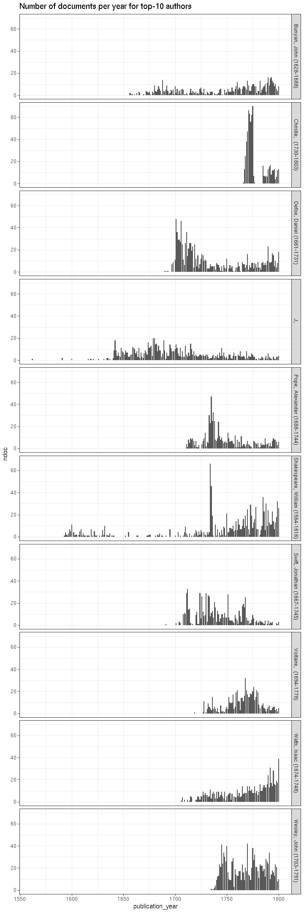
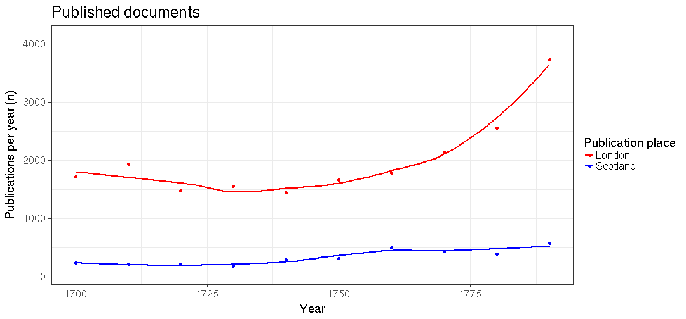
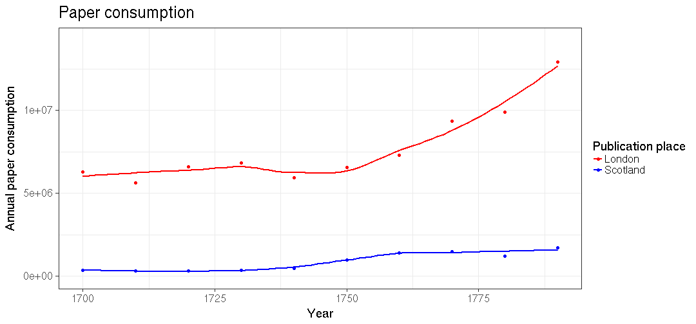

# Scotland publishing summaries

Read the preprocessed ESTC data table and load tools:


We have 2848 documents from Scotland.


## Most common authors from Scotland

 


## Publication timeline for top-10 authors

 


## Most common publication places in Scotland

 


## Top titles 

 


## Authors born before 500AD

 * Ennen 500AD syntyneiden kirjoittajien julkaisujen esiintymat koko aikajanalla, painomaarat per vuosi, kaikki julkaisupaikat.
 * Ennen 500AD syntyneiden kirjoittajien julkaisujen esiintymat koko aikajanalla, painomaarat per vuosi Skotlannissa.


```
## named integer(0)
```

We have 3 documents from 0 unique
authors born before 500 AD who have published in Scotland.


## Historical publication volumes for all publication places in Scotland

Average annual output for each decade are indicated by lines, the annual document counts are shown by points. 

 


## Historical publication volumes for top-5 publication places in Scotland

Average annual output for each decade are indicated by lines, the annual document counts are shown by points. 

 


## Publishing in Scotland versus London 1700 


We have 1262 documents from Scotland and 10691 documents from London during 1700-1800. Average annual output for each decade are indicated by lines (passing through the middle point at each decade 1705, 1715 etc), the annual document counts are shown by points.


```
## Warning: Removed 1 rows containing missing values (stat_smooth).
```

```
## Warning: Removed 1 rows containing missing values (stat_smooth).
```

```
## Warning: Removed 2 rows containing missing values (geom_point).
```

 

```
## Warning: Removed 1 rows containing missing values (stat_smooth).
```

```
## Warning: Removed 1 rows containing missing values (stat_smooth).
```

```
## Warning: Removed 2 rows containing missing values (geom_point).
```

 


## Comparing selected authors


```
## Warning in min(x): no non-missing arguments to min; returning Inf
```

```
## Warning in max(x): no non-missing arguments to max; returning -Inf
```

```
## Error in seq.default(from = best$lmin, to = best$lmax, by = best$lstep): 'from' must be of length 1
```

```
## Error in seq.default(from = best$lmin, to = best$lmax, by = best$lstep): 'from' must be of length 1
```

```
## Error in seq.default(from = best$lmin, to = best$lmax, by = best$lstep): 'from' must be of length 1
```

## Authors from different periods publishing in 1750-1799


  
