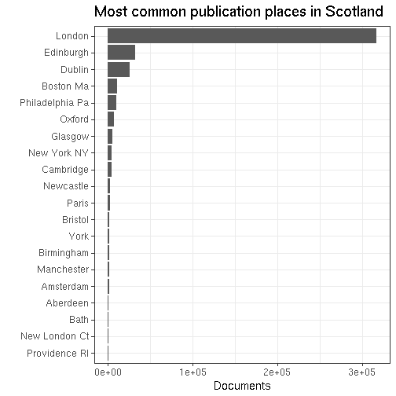

# Scotland publishing summaries

Read the preprocessed ESTC data table and load tools:


We have 461276 documents from Scotland.


## Most common authors from Scotland


## Publication timeline for top-10 authors


## Most common publication places in Scotland




## Top titles 


```
## Error in dfs$names: $ operator is invalid for atomic vectors
```


## Authors born before 500AD

 * Ennen 500AD syntyneiden kirjoittajien julkaisujen esiintymat koko aikajanalla, painomaarat per vuosi, kaikki julkaisupaikat.
 * Ennen 500AD syntyneiden kirjoittajien julkaisujen esiintymat koko aikajanalla, painomaarat per vuosi Skotlannissa.


```
## Error in eval(expr, envir, enclos): object 'author.birth' not found
```

```
## 
##    Goldsmith, Oliver (1728-1774)         Wesley, John (1703-1791) 
##                               40                               64 
##      Pope, Alexander (1688-1744)         Watts, Isaac (1674-1748) 
##                               84                               87 
##      Swift, Jonathan (1667-1745)        Defoe, Daniel (1661-1731) 
##                               89                              102 
##         Dryden, John (1631-1700)         Milton, John (1608-1674) 
##                              121                              123 
##         Bunyan, John (1628-1688) Shakespeare, William (1564-1616) 
##                              133                              144
```

We have 987 documents from 10 unique
authors born before 500 AD who have published in Scotland.


## Historical publication volumes for all publication places in Scotland

Average annual output for each decade are indicated by lines, the annual document counts are shown by points. 


## Historical publication volumes for top-5 publication places in Scotland

Average annual output for each decade are indicated by lines, the annual document counts are shown by points. 


## Publishing in Scotland versus London 1700 


We have 33750 documents from Scotland and 205048 documents from London during 1700-1800. Average annual output for each decade are indicated by lines (passing through the middle point at each decade 1705, 1715 etc), the annual document counts are shown by points.


```
## Warning: Removed 3 rows containing non-finite values (stat_smooth).
```


## Comparing selected authors


```
## Warning in min(x): no non-missing arguments to min; returning Inf
```

```
## Warning in max(x): no non-missing arguments to max; returning -Inf
```

```
## Error in seq.default(from = best$lmin, to = best$lmax, by = best$lstep): 'from' must be of length 1
```


```
## Error in seq.default(from = best$lmin, to = best$lmax, by = best$lstep): 'from' must be of length 1
```

```
## Error in seq.default(from = best$lmin, to = best$lmax, by = best$lstep): 'from' must be of length 1
```

## Authors from different periods publishing in 1750-1799


```
## Error in cut.default(df$author.birth, breaks = c(-Inf, 501, 1500, 1600, : 'x' must be numeric
```

```
## Error in eval(expr, envir, enclos): object 'author.birth.period' not found
```

```
## Error in eval(expr, envir, enclos): unknown column 'author.birth.period'
```

```
## Error in eval(expr, envir, enclos): object 'ndoc' not found
```


```
## Error in eval(expr, envir, enclos): unknown column 'author.birth.period'
```

```
## Error in eval(expr, envir, enclos): object 'author.birth.period' not found
```
