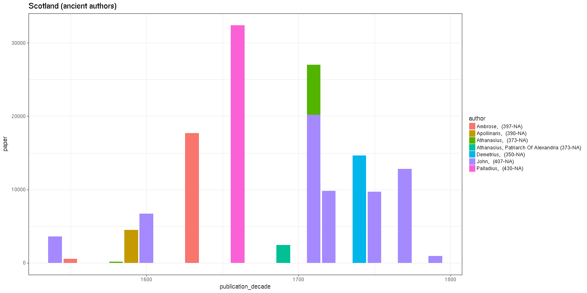

# Scotland publishing summaries

Read the preprocessed ESTC data table and load tools:


We have 40238 documents from Scotland.


## Most common authors from Scotland


## Publication timeline for top-10 authors


## Most common publication places in Scotland


## Top titles 


## Authors born before 500AD

Authors born before 500 AD: paper consumption per decade in Scotland and globally. Top-10 authors shown for clarity in each case.


```
## Warning: Removed 1 rows containing missing values (position_stack).
```




List of authors born before 500AD:


```
## 
##      Aelian, NA (3-NA) Hierocles, NA (430-NA)    Longinus, NA (1-NA) 
##                      1                      2                      6
```

We have 9 documents from 3 unique
authors born before 500 AD who have published in Scotland.


## Historical publication volumes for all publication places in Scotland

Average annual output for each decade are indicated by lines, the annual document counts are shown by points. 


```
## Error in tapply(df$unity, list(df$publication_decade, df$publication_place), : arguments must have same length
```

```
## Error in publications[is.na(publications)] <- 0: object 'publications' not found
```

```
## Error in eval(expr, envir, enclos): object 'publications' not found
```

```
## Error in tapply(df$unity, list(df$publication_year, df$publication_place), : arguments must have same length
```

```
## Error in publications.annual[is.na(publications.annual)] <- 0: object 'publications.annual' not found
```

```
## Error in melt(publications): object 'publications' not found
```

```
## Error in melt(publications.annual): object 'publications.annual' not found
```

```
## Error in names(dfm.annual) <- c("Time", "Place", "Documents"): object 'dfm.annual' not found
```

```
## Error in fortify(data): object 'dfm.annual' not found
```


## Historical publication volumes for top-5 publication places in Scotland

Average annual output for each decade are indicated by lines, the annual document counts are shown by points. 


```
## Error in tapply(df$unity, list(df$publication_decade, df$publication_place), : arguments must have same length
```

```
## Error in publications[is.na(publications)] <- 0: object 'publications' not found
```

```
## Error in eval(expr, envir, enclos): object 'publications' not found
```

```
## Error in tapply(df$unity, list(df$publication_year, df$publication_place), : arguments must have same length
```

```
## Error in publications.annual[is.na(publications.annual)] <- 0: object 'publications.annual' not found
```

```
## Error in is.data.frame(x): object 'publications' not found
```

```
## Error in eval(expr, envir, enclos): object 'publications' not found
```

```
## Error in eval(expr, envir, enclos): object 'publications.annual' not found
```

```
## Error in melt(publications): object 'publications' not found
```

```
## Error in melt(publications.annual): object 'publications.annual' not found
```

```
## Error in names(dfm.annual) <- c("Time", "Place", "Documents"): object 'dfm.annual' not found
```

```
## Error in fortify(data): object 'dfm.annual' not found
```

```
## Error: Insufficient values in manual scale. 54 needed but only 5 provided.
```


## Publishing in Scotland versus London 1700 


We have 34459 documents from Scotland and 204976 documents from London during 1700-1800. Average annual output for each decade are indicated by lines (passing through the middle point at each decade 1705, 1715 etc), the annual document counts are shown by points.


```
## Warning: Removed 9 rows containing non-finite values (stat_smooth).
```

```
## Warning in simpleLoess(y, x, w, span, degree = degree, parametric =
## parametric, : span too small. fewer data values than degrees of freedom.
```

```
## Warning in simpleLoess(y, x, w, span, degree = degree, parametric =
## parametric, : at 1719.6
```

```
## Warning in simpleLoess(y, x, w, span, degree = degree, parametric =
## parametric, : radius 0.16
```

```
## Warning in simpleLoess(y, x, w, span, degree = degree, parametric =
## parametric, : all data on boundary of neighborhood. make span bigger
```

```
## Warning in simpleLoess(y, x, w, span, degree = degree, parametric =
## parametric, : pseudoinverse used at 1719.6
```

```
## Warning in simpleLoess(y, x, w, span, degree = degree, parametric =
## parametric, : neighborhood radius 0.4
```

```
## Warning in simpleLoess(y, x, w, span, degree = degree, parametric =
## parametric, : reciprocal condition number 1
```

```
## Warning in simpleLoess(y, x, w, span, degree = degree, parametric =
## parametric, : at 1800.4
```

```
## Warning in simpleLoess(y, x, w, span, degree = degree, parametric =
## parametric, : radius 0.16
```

```
## Warning in simpleLoess(y, x, w, span, degree = degree, parametric =
## parametric, : all data on boundary of neighborhood. make span bigger
```

```
## Warning in simpleLoess(y, x, w, span, degree = degree, parametric =
## parametric, : There are other near singularities as well. 0.16
```

```
## Warning in simpleLoess(y, x, w, span, degree = degree, parametric =
## parametric, : zero-width neighborhood. make span bigger

## Warning in simpleLoess(y, x, w, span, degree = degree, parametric =
## parametric, : zero-width neighborhood. make span bigger
```

```
## Warning: Computation failed in `stat_smooth()`:
## NA/NaN/Inf in foreign function call (arg 5)
```


## Comparing selected authors


```
## Warning: Removed 5942 rows containing missing values (geom_point).
```


```
## Warning: Removed 946 rows containing missing values (geom_point).
```


## Authors from different periods publishing in 1750-1799


