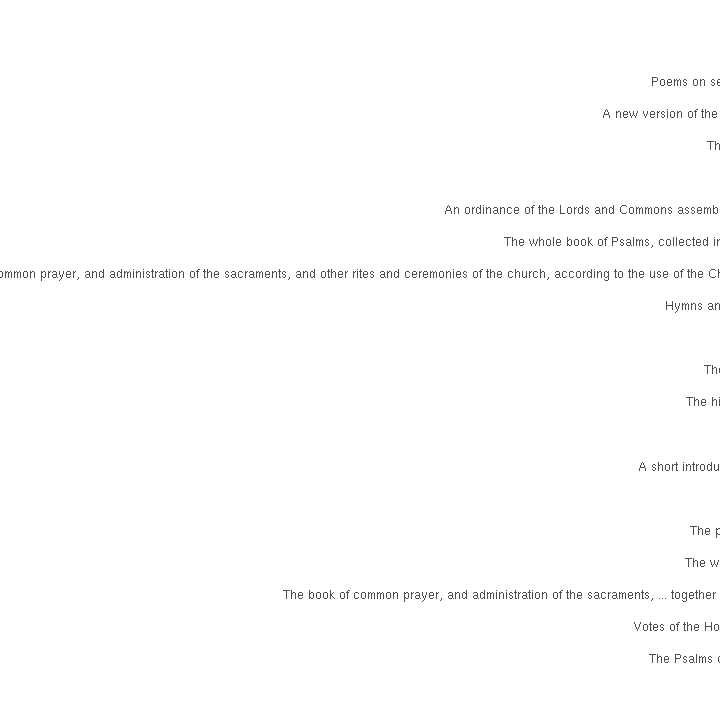

# Scotland publishing summaries

Read the preprocessed ESTC data table and load tools:


We have 40124 documents from Scotland.


## Most common authors from Scotland


## Publication timeline for top-10 authors


## Most common publication places in Scotland


## Top titles 




## Authors born before 500AD

Authors born before 500 AD: paper consumption per decade in Scotland and globally. Top-10 authors shown for clarity in each case.


List of authors born before 500AD:


```
## 
## Demetrius,  (350-NA) 
##                    2
```

We have 2 documents from 1 unique
authors born before 500 AD who have published in Scotland.


## Historical publication volumes for all publication places in Scotland

Average annual output for each decade are indicated by lines, the annual document counts are shown by points. 


## Historical publication volumes for top-5 publication places in Scotland

Average annual output for each decade are indicated by lines, the annual document counts are shown by points. 


## Publishing in Scotland versus London 1700 


We have 33447 documents from Scotland and 200035 documents from London during 1700-1800. Average annual output for each decade are indicated by lines (passing through the middle point at each decade 1705, 1715 etc), the annual document counts are shown by points.


```
## Warning in grid.Call.graphics(C_polygon, x$x, x$y, index): semi-
## transparency is not supported on this device: reported only once per page
```


```
## Warning in grid.Call.graphics(C_polygon, x$x, x$y, index): semi-
## transparency is not supported on this device: reported only once per page
```


## Comparing selected authors


## Authors from different periods publishing in 1750-1799


