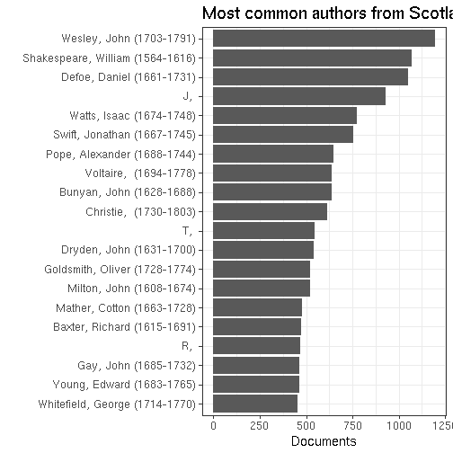

# Scotland publishing summaries

Read the preprocessed ESTC data table and load tools:


We have 39393 documents from Scotland.


## Most common authors from Scotland




## Publication timeline for top-10 authors


## Most common publication places in Scotland


## Top titles 


## Authors born before 500AD

Only authors with over 10 publications.

 * Ennen 500AD syntyneiden kirjoittajien julkaisujen esiintymat koko aikajanalla, painomaarat per vuosi, kaikki julkaisupaikat.
 * Ennen 500AD syntyneiden kirjoittajien julkaisujen esiintymat koko aikajanalla, painomaarat per vuosi Skotlannissa.


```
## named integer(0)
```

We have 278 documents from 0 unique
authors born before 500 AD who have published in Scotland.


## Historical publication volumes for all publication places in Scotland

Average annual output for each decade are indicated by lines, the annual document counts are shown by points. 


## Historical publication volumes for top-5 publication places in Scotland

Average annual output for each decade are indicated by lines, the annual document counts are shown by points. 


## Publishing in Scotland versus London 1700 


We have 33750 documents from Scotland and 205048 documents from London during 1700-1800. Average annual output for each decade are indicated by lines (passing through the middle point at each decade 1705, 1715 etc), the annual document counts are shown by points.


```
## Warning: Removed 3 rows containing non-finite values (stat_smooth).
```


## Comparing selected authors


## Authors from different periods publishing in 1750-1799


