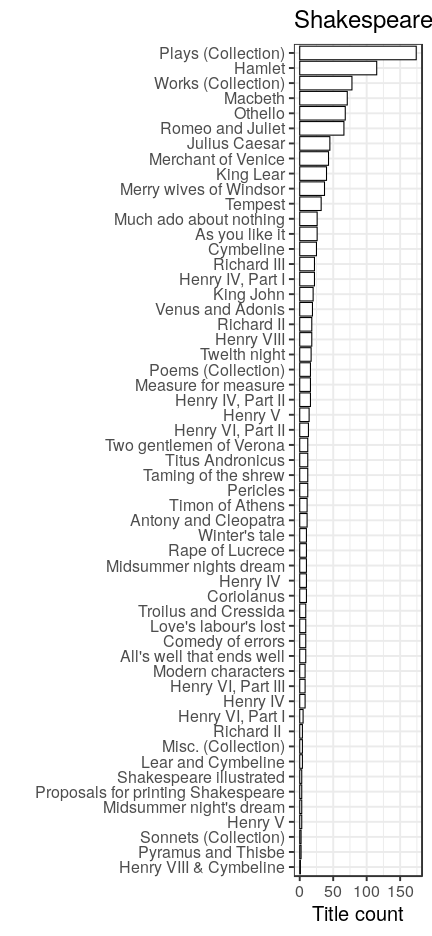
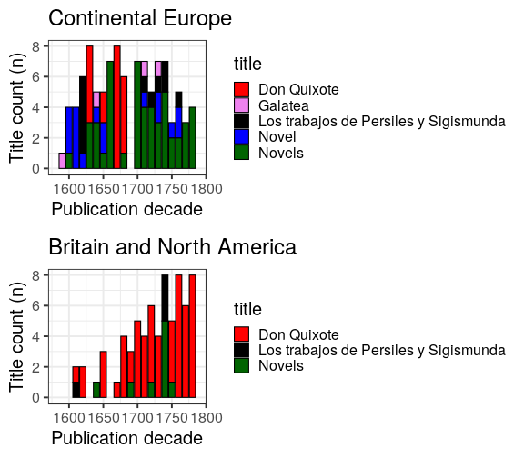
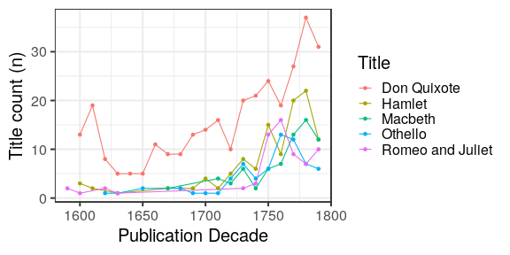

We are a team of an early modern intellectual historian [Mikko Tolonen](https://twitter.com/mikko_tolonen) and a data scientist in the field of bioinformatics ([Leo Lahti](http://www.iki.fi/Leo.Lahti)). Often on Friday nights we skype to discuss what should we do in the domain of digital humanities that nicely combines our interests. Today’s task was to do something to celebrate Shakespeare & Cervantes.

We have a peculiar interest in [library
catalogues](https://www.liberquarterly.eu/article/10.18352/lq.10112/)
so we decided to build on that. We used the [CERL Heritage of the
Printed Book Catalogue (HPB)](https://www.cerl.org/resources/hpb/main)
and [British Library’s English Short-Title Catalogue
(ESTC)](http://estc.bl.uk/F/?func=file&file_name=login-bl-estc) to
analyse the early modern publishing (1593-1800) of Shakespeare and
Cervantes. Here are some graphs that we thought you might find
interesting. All illustrations are based on combined data from the
ESTC and CERL catalogues unless otherwise mentioned.

In the ESTC and CERL catalogues, we have metadata on roughly 0.5 and 5
million documents in total, respectively, covering publication
activity around 1470-1800. With a combination of
[automated](https://github.com/rOpenGov/estc) and manual data
processing, we identified for Shakespeare 1307
documents in total (ESTC `rsum(tabs$Shakespeare$source == "estc")`;
CERL 239), and for Cervantes `r
nrow(tabs$Shakespeare)` documents in total (ESTC
96; CERL
404).

### Relative publishing activity: Shakespeare

One thing that we have learned about author lives when analysing publishing activity is that printing usually ends (more rapidly than you think) when the author kicks the bucket. That is, death is the end of popularity. Well, obviously this is not the case for Shakespeare. But do note that the new rise in publishing Shakespeare (based on ESTC data) begins in the 1730s with the input of the famous Tonson publishing house (see also Shakespeare publisher timeline below). The first graph illustrates the fraction of titles from Shakespeare relative to all other publishing activity in the ESTC catalogue.

### Shakespeare Play Categories
 
We classified Shakespeare’s plays into tragedies, comedies and
histories. Besides the 1730s peak, histories seem to be less popular
than comedies and tragedies when published as single plays. Another
observation: early 18th-century seems to be a more “tragedy-driven”
era compared to few decades later in the high-Enlightenment when we
witness the new rise of comedies. 

### Shakespeare Title Popularity
 
No real surprises here. Collected works and plays are of course an important source to access Shakespeare. But in the Top-5 list of single plays Hamlet, Romeo and Juliet, Macbeth and Othello are where you might expect to find them. Perhaps slightly surprising is that Julius Caesar beats Merchant of Venice and Merry Wives of Windsor. 

### Cervantes popularity
 
What is telling when comparing Cervantes on the continent and his popularity in the English-speaking world is that Galatea (Cervantes’s first published work) does very well on the continent, but not so much in the English-speaking world. At the same time it is very clear that Don Quixote is THE single work by any author in early modern Europe (including the English-speaking world).
 

### Comparison of popular titles
 
On this timeline we see a very interesting contest. Don Quixote’s train-like rise throughout the early modern era is impressive indeed. Hamlet sees an interesting peak in English-speaking world in 1750s to be followed by the rise of the comedies and rapid sinking of the publishing of the Danish prince. Same thing happens to Romeo and Juliet shortly after. Macbeth on the other hand seems to follow a different, upward path towards the late eighteenth century. 

### Shakespeare: Publisher timeline
 
There exists great scholarship on Shakespeare’s copyrights in the eighteenth century by Terry Belanger. While we are well aware of the division of Shakespeare copyrights between different publishers and the use of printing congers, what we want to highlight here is the relevance of Tonson publishing house and the role played by John Bell towards the later eighteenth century in promoting Shakespeare in Britain (for Bell as ['bibliographic nightmare'](http://collation.folger.edu/2012/06/john-bell-bibliographic-nightmare/). The illustration is based on the ESTC catalogue, where we have manually cleaned up the publisher information, combining synonymous variants of the publisher names.

**NB! Regarding method**

The trick to get this approach working is to harmonize the catalogued fields so we may trust the statistics that library catalogue data can provide us. For example, for this analysis most of our time was spent matching different entries of works in the ESTC and the HPB and removing hundreds of duplicate entries in the HPB data. We also took full advantage of our purpose-built tool, Bibliographica, to automatize this cleaning process for any library catalogue as far as possible (https://github.com/rOpenGov/bibliographica). The idea is not that this “big data approach” relying on library catalogue data would be perfect in terms of including every single translation of Shakespeare and Don Quixote on the continent or early modern Britain. But when the harmonizing of the catalogued fields is done properly, the approach gives us trustworthy results about the publishing trends that we are interested in.

