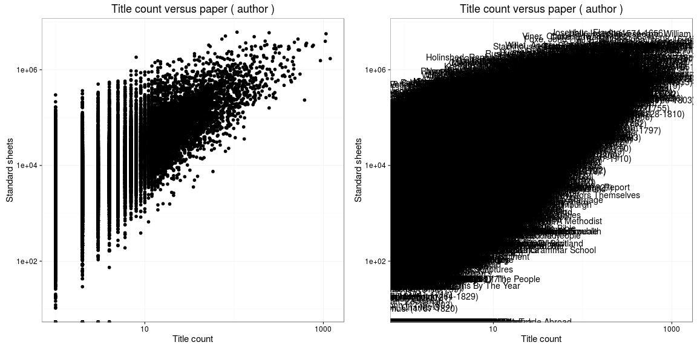

## Authors

[Accepted author names](output.tables/author_accepted.csv) These are the final accepted author names, merging all name variants from the custom [author synonyme table](https://github.com/rOpenGov/bibliographica/blob/master/inst/extdata/ambiguous-authors.csv) and excluding known pseudonymes. If multiple names for the same author are still being observed, the should be added on the author synonyme table.

[Accepted pseudonymes](output.tables/pseudonyme_accepted.csv) Recognized based on custom pseudonyme lists ([first](https://github.com/rOpenGov/bibliographica/blob/master/inst/extdata/names/pseudonymes/first.csv), [last](https://github.com/rOpenGov/bibliographica/blob/master/inst/extdata/names/pseudonymes/last.csv), [misc](https://github.com/rOpenGov/bibliographica/blob/master/inst/extdata/pseudonymes.csv))

[Discarded author names](output.tables/author_discarded.csv) These should not contain valid authors or pseudonymes. The following stopword lists are considered when discarding names:
  * [Stopwords for names](https://github.com/rOpenGov/bibliographica/blob/master/inst/extdata/stopwords_for_names.csv)
  * [Stopwords for titles](https://github.com/rOpenGov/bibliographica/blob/master/inst/extdata/stopwords_titles.csv)


Top-20 uniquely identified authors and their productivity (title count). In total, there are 54456 unique authors and 282774 documents with unambiguous author information (59%).


### Ambiguous authors

Authors with ambiguous living year information - can we spot here
cases where these are clearly known identical or distinct authors?
Should also add living year information from supporting sources later.

[Authors with missing life years](output.tables/authors_missing_lifeyears.csv) (Life year info can be augmented [here](https://github.com/rOpenGov/bibliographica/blob/master/inst/extdata/author_info.csv))

[Authors with ambiguous life years](output.tables/author_life_ambiguous.csv) Some of these might be synonymous and could be added to [author synonyme list](https://github.com/rOpenGov/bibliographica/blob/master/inst/extdata/ambiguous-authors.csv) (the first term will be selected for the final data)


### Life span of uniquely identified top authors

Ordered by productivity (number of documents))


```
## Error in seq.default(from = best$lmin, to = best$lmax, by = best$lstep): 'from' must be of length 1
```


### Author productivity

Title count versus paper consumption (all authors):



Publication timeline for top authors


