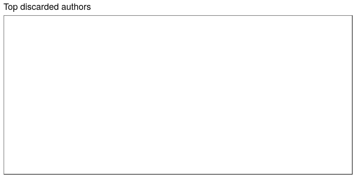

## Authors

 * 55089 [unique authors](output.tables/author_accepted.csv) These final names capture all name variants from the custom [author synonyme table](https://github.com/rOpenGov/bibliographica/blob/master/inst/extdata/ambiguous-authors.csv), and exclude known pseudonymes (see below). If multiple names for the same author are still observed on this list, they should be added on the [author synonyme table](https://github.com/rOpenGov/bibliographica/blob/master/inst/extdata/ambiguous-authors.csv).
 * 289312 documents have unambiguous author information (60%). 
 * 4603 [unique pseudonymes](output.tables/pseudonyme_accepted.csv) are recognized based on [custom pseudonyme lists](https://github.com/rOpenGov/bibliographica/blob/master/inst/extdata/names/pseudonymes/custom_pseudonymes.csv).
 * [Discarded author names](output.tables/author_discarded.csv) This list should not include any real authors (if it does, please send a note). The following stopword lists are considered when discarding names:
  * [Stopwords for names](https://github.com/rOpenGov/bibliographica/blob/master/inst/extdata/stopwords_for_names.csv)
  * [Stopwords for titles](https://github.com/rOpenGov/bibliographica/blob/master/inst/extdata/stopwords_titles.csv)

[Author name conversions](output.tables/author_conversion_nontrivial.csv) Non-trivial conversions from the original to final names

Top-20 uniquely identified authors and their productivity (title count).

### Ambiguous authors

Authors with ambiguous living year information - can we spot here
cases where these are clearly known identical or distinct authors?
Should also add living year information from supporting sources later.

[Authors with missing life years](output.tables/authors_missing_lifeyears.csv) (Life year info can be augmented [here](https://github.com/rOpenGov/bibliographica/blob/master/inst/extdata/author_info.csv))

[Authors with ambiguous life years](output.tables/author_life_ambiguous.csv) Some of these might be synonymous and could be added to [author synonyme list](https://github.com/rOpenGov/bibliographica/blob/master/inst/extdata/ambiguous-authors.csv) (the first term will be selected for the final data)

### Life span of uniquely identified top authors

Ordered by productivity (number of documents))

### Author productivity

Title count versus paper consumption (all authors):

