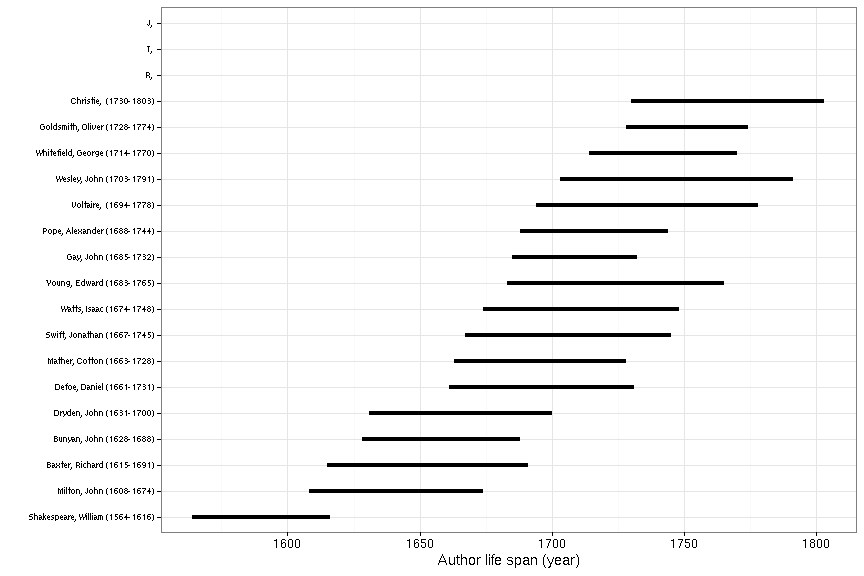
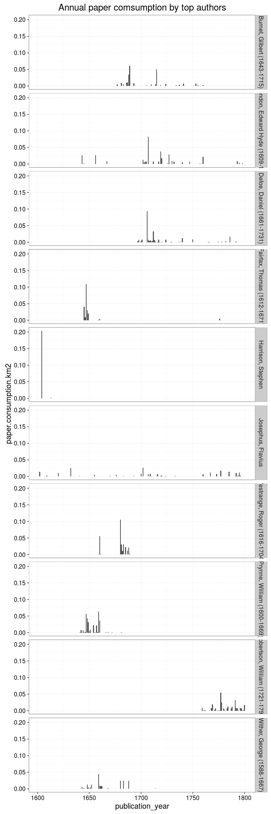

## Authors

[Accepted author names](output.tables/author_accepted.csv)

[Discarded author names](output.tables/author_discarded.csv)

[Author name conversions](output.tables/author_conversion_nontrivial.csv)

Top-20 uniquely identified authors and number of documents for each (duplicate docs not checked yet). In total, there are 46249 unique authors and 253770 documents with unambiguous author information (56%).


Title count versus paper consumption (all authors):


### Life span of uniquely identified top authors

Ordered by productivity (number of documents))


```
## Error in `[.data.frame`(df, , c("author_unique", "author_birth", "author_death")): undefined columns selected
```

```
## Error in filter_(.data, .dots = lazyeval::lazy_dots(...)): object 'dfa' not found
```

```
## Error in eval(expr, envir, enclos): object 'dfa' not found
```

```
## Error in eval(expr, envir, enclos): object 'dfa' not found
```

```
## Error in arrange_(.data, .dots = lazyeval::lazy_dots(...)): object 'dfa' not found
```

```
## Error in factor(dfa$author_unique, levels = dfa$author_unique): object 'dfa' not found
```

```
## Error in nrow(dfa): object 'dfa' not found
```

```
## Error in ggplot(dfa): object 'dfa' not found
```

```
## Error in eval(expr, envir, enclos): object 'author_birth' not found
```



### Ambiguous authors

Authors with ambiguous living year information - can we spot here
cases where these are clearly known identical or distinct authors?
Should also add living year information from supporting sources later.

[Authors with ambiguous life years](output.tables/author_life_ambiguous.csv)

[Authors with missing life years](output.tables/authors_missing_lifeyears.csv)


### Publication timeline for top authors

Title count


Paper consumption



