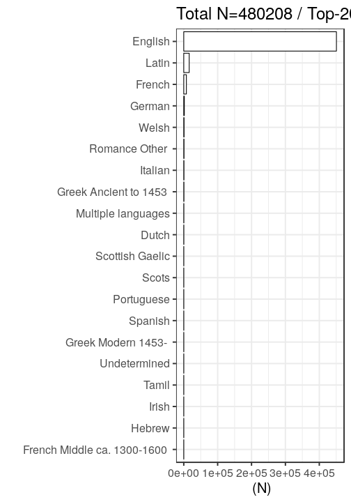

### Publication year

[Publication year conversions](output.tables/publication_year_conversion.csv)

[Publication year discarded](output.tables/publication_year_discarded.csv)

Publication year is available for 481205 documents (100%). The publication years span 1462-1826

### Titles

[Publication titles](output.tables/title_accepted.csv)

[Publication titles discarded](output.tables/title_discarded.csv)

[Title harmonization table](output.tables/title_conversion_nontrivial.csv)

Top-20 titles are shown together with the number of documents. This info is available for 481203 documents (100%). There are 360647 unique titles.

## Language

Title count for the 50 unique languages. Some documents may have more than one language listed.

[Accepted languages](output.tables/language_accepted.csv)

[Discarded languages](output.tables/language_discarded.csv)

[Language conversions](output.tables/language_conversion_nontrivial.csv)  

[Unrecognized language entries](output.tables/language_unidentified.csv)  

