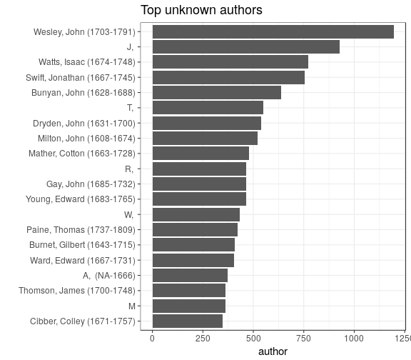
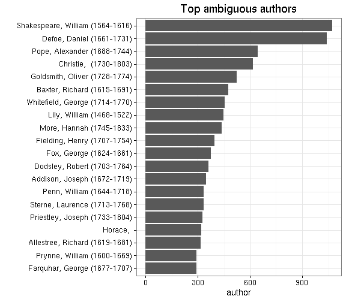
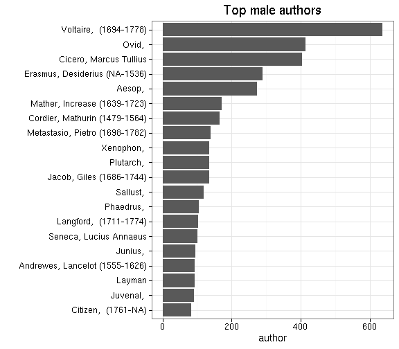
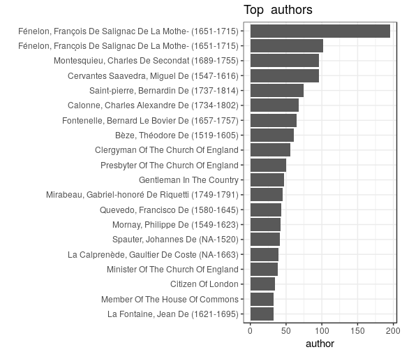
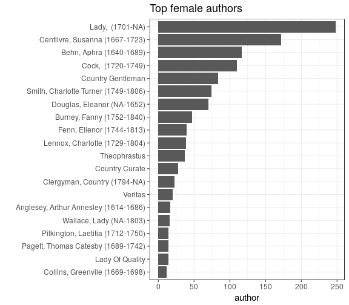
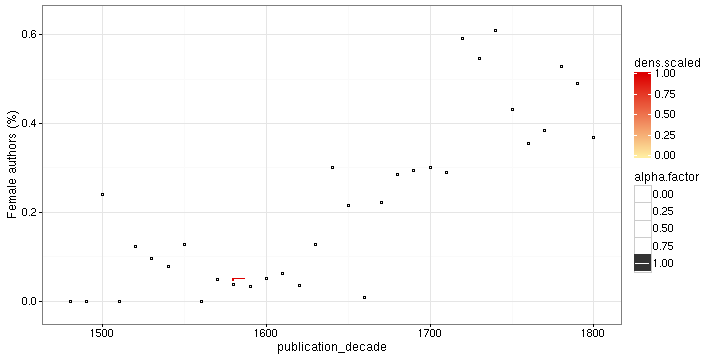

### Gender

 * [Author-gender mappings](output.tables/author_accepted.csv) in the final data

 * 3283 unique male authors
 
 * 375 unique female authors
 
 * 15314 documents (3.2%) with a male author
 
 * 1831 documents (0.4%) with a female author
 
 * 458465 documents (95.2%) with [unresolved gender](output.tables/author_gender_discarded.csv) (including pseudonymes)

 * [First names identified as female](output.tables/gender_female.csv) in the preprocessed data (including pseudonymes)

 * [First names identified as male](output.tables/gender_male.csv) in the preprocessed data (including pseudonymes)

 * [First names with ambiguous
   gender](output.tables/gender_ambiguous.csv) (both male and female
   listed in the gender mapping tables) in the preprocessed data
   (including pseudonymes). To override and resolve amiguous mappings,
   gender info can be added to the [custom name-gender
   mappings](https://github.com/rOpenGov/bibliographica/blob/master/inst/extdata/names/firstnames/custom_gender.csv)
   or the [custom author information
   table](https://github.com/rOpenGov/bibliographica/blob/master/inst/extdata/author_info.csv)

 * [First names with unknown gender](output.tables/gender_unknown.csv)
   (no gender mapping info available) in the preprocessed data
   (including pseudonymes). The missing info can be added to the
   [custom name-gender
   mappings](https://github.com/rOpenGov/bibliographica/blob/master/inst/extdata/names/firstnames/custom_gender.csv)
   or the [custom author information
   table](https://github.com/rOpenGov/bibliographica/blob/master/inst/extdata/author_info.csv)

Author gender distribution in the complete data:

|Gender    | Documents (n)| Fraction (%)|
|:---------|-------------:|------------:|
|          |          5853|         1.22|
|ambiguous |        119642|        24.85|
|female    |          1831|         0.38|
|male      |         15314|         3.18|
|NA        |        338823|        70.37|

Author gender distribution over time. Note that the name-gender mappings change over time and geography but this has not been taken into account here.

### Data sources

The [name-gender mappings](https://github.com/rOpenGov/bibliographica/blob/master/inst/extdata/gendermap.csv) were collected from the following sources using [this script](https://github.com/rOpenGov/bibliographica/blob/master/inst/extdata/data.gender.R):

  * U.S. Social Security Administration baby name data as implemented in the babynames and gender R packages. For each year from 1880 to 2013, the number of children of each sex given each name. All names with more than 5 uses are given.  
  * The U.S. Census data in the Integrated Public Use Microdata Series as implemented in the genderdata R package  
  * The Kantrowitz corpus of male and female names as implemented in the genderdata R package 
  * The genderdata R package mappings for Canada, UK, Germany, Iceland, Norway, and Sweden. 
 * [Multilingual database](http://www.lexique.org/public/prenoms.php) (Prenoms.txt) 
 * [French first names](http://www.excel-downloads.com/forum/86934-liste-des-prenoms.htmlhttp://http://www.excel-downloads.com/forum/86934-liste-des-prenoms.html)
 * [German first names](http://www.albertmartin.de/vornamen/)
 * [Finnish population register](https://www.avoindata.fi/data/fi/dataset/none) (Vaestorekisterikeskus; VRK). First names for living Finnish citizens that live in Finland and abroad in 2016. Only names with frequency n>10 are included. Source: avoindata.fi service and Vaestorekisterikeskus (VRK). Version: 3/2016. Data license CC-BY 4.0.
 * [Pseudonymes](https://github.com/rOpenGov/bibliographica/blob/master/inst/extdata/names/pseudonymes/custom_pseudonymes.csv) provided by the authors of the bibliographica R package.
 * [Custom name-gender mappings](https://github.com/rOpenGov/bibliographica/blob/master/inst/extdata/names/firstnames/custom_gender.csv) constructed manually by the authors of this R package
 * [Custom author information](https://github.com/rOpenGov/bibliographica/blob/master/inst/extdata/author_info.csv) constructed manually by the authors of this R package 

The name-gender mappings from different years and regions are
combined. When the sources give conflicting gender mappings, the
gender is marked to be ambiguous.  Afterwards, our [custom name-gender
mappings](https://github.com/rOpenGov/bibliographica/blob/master/inst/extdata/names/firstnames/custom_gender.csv)
and [custom author
information](https://github.com/rOpenGov/bibliographica/blob/master/inst/extdata/author_info.csv)
tables are used to augment this information. The genderizeR R package
could also be useful but the genderizer.io API has a limit of 1000
queries a day, hence omitted for now.

