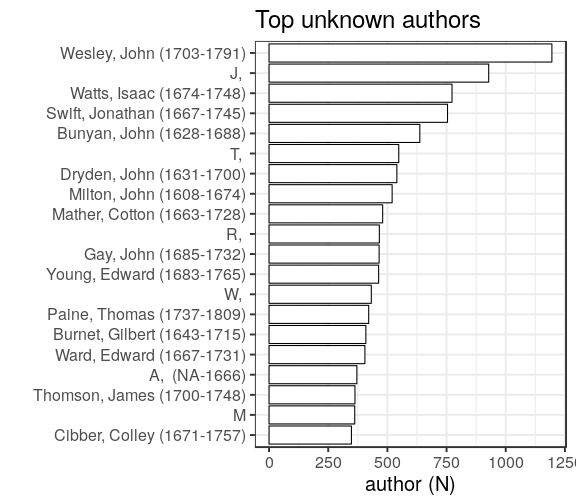

### Gender

[Female authors](output.tables/gender_female.csv)

[Male authors](output.tables/gender_male.csv)

[Authors with missing gender](output.tables/gender_unknown.csv)

Author gender distribution in the complete data:

|author_gender |   docs| fraction|
|:-------------|------:|--------:|
|female        |   9628|     2.00|
|male          | 229014|    47.59|
|NA            | 242563|    50.41|

Author gender distribution over time. Note that the name-gender mappings change over time. This has not been taken into account yet.

