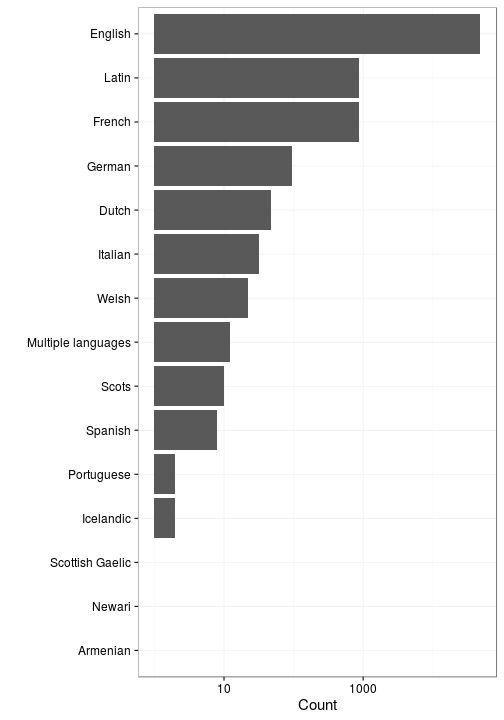

## Language

 * 47 [unique languages](output.tables/language_accepted.csv)
 * The languages may come in [combinations](output.tables/language_conversions.csv)
 * 279 multilingual documents (0.06%)  
 * 66 docs (0.01%) with empty or [unrecognized language](output.tables/language_discarded.csv)

Language codes are from [MARC](http://www.loc.gov/marc/languages/language_code.html); new custom abbreviations can be added in [this table](https://github.com/rOpenGov/bibliographica/blob/master/inst/extdata/language_abbreviations.csv).

Title count per language (including multi-language documents):

### Top languages

Number of documents assigned with each language. For a complete list,
see [accepted languages](output.tables/language_accepted.csv).

|Language      | Documents (n)| Fraction (%)|
|:-------------|-------------:|------------:|
|English       |        451789|         93.9|
|Latin         |         16078|          3.3|
|French        |          7791|          1.6|
|German        |          1649|          0.3|
|Welsh         |           952|          0.2|
|Romance Other |           772|          0.2|

