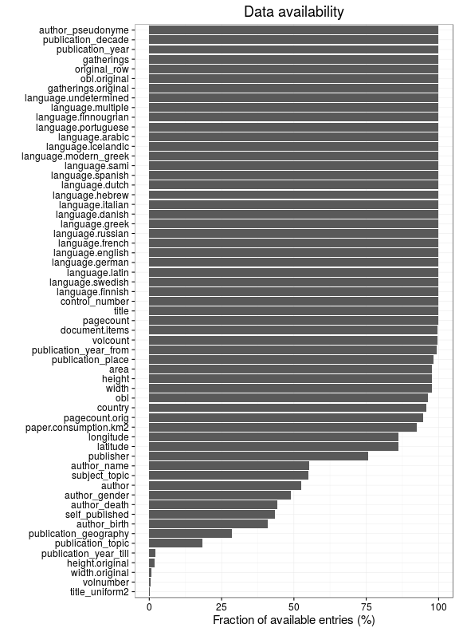

# Preprocessing summary

## Specific fields

  * [Author info](author.md)
  * [Gender info](gender.md)
  * [Publisher info](publisher.md)
  * [Publication geography](publicationplace.md)
  * [Publication year info](publicationyear.md)
  * [Titles](title.md)  
  * [Page counts](pagecount.md)
  * [Physical dimension](dimension.md)    
  * [Document and subject topics](topic.md)
  * [Languages](language.md)

## Field conversions

This documents the conversions from raw data to the final preprocessed version (accepted, discarded, conversions). Only some of the key tables are explicitly linked below. The complete list of all summary tables is [here](output.tables/).

## Annotated documents

  * 480279 documents in the original raw data
  * 480279 documents in the final preprocessed data (100%)

Fraction of documents with data:



Same in exact numbers: documents with available/missing entries, and number of unique entries for each field. Sorted by missing data:


|field name                           | missing (%)| available (%)| available (n)| unique (n)|
|:------------------------------------|-----------:|-------------:|-------------:|----------:|
|pagecount                            |       100.0|           0.0|             0|          1|
|volnumber                            |       100.0|           0.0|             0|          1|
|volcount                             |       100.0|           0.0|             0|          1|
|parts                                |       100.0|           0.0|             0|          1|
|publication_frequency_annual         |       100.0|           0.0|             0|          1|
|pagecount.orig                       |       100.0|           0.0|             0|          1|
|paper                                |       100.0|           0.0|             0|          1|
|paper.check                          |       100.0|           0.0|             0|          1|
|document.items                       |       100.0|           0.0|             0|          1|
|publication_frequency_text           |       100.0|           0.0|           105|          4|
|publication_interval_from            |        99.3|           0.7|          3493|        364|
|publication_interval_till            |        99.3|           0.7|          3507|        316|
|width.original                       |        99.2|           0.8|          3729|         72|
|height.original                      |        98.3|           1.7|          8161|         88|
|publication_year_till                |        97.6|           2.4|         11730|        368|
|publication_topic                    |        81.7|          18.3|         87736|       5052|
|author_age                           |        71.7|          28.3|        135858|        365|
|publication_geography                |        71.6|          28.4|        136258|      12672|
|author_gender                        |        70.4|          29.6|        142208|          5|
|first_edition                        |        67.6|          32.4|        155768|          3|
|author_birth                         |        57.6|          42.4|        203564|        493|
|author_death                         |        55.3|          44.7|        214504|        533|
|self_published                       |        50.2|          49.8|        239118|          2|
|subject_topic                        |        44.9|          55.1|        264575|      55621|
|author_name                          |        40.0|          60.0|        288129|      47927|
|author                               |        40.0|          60.0|        288129|      54979|
|publisher                            |        23.1|          76.9|        369567|     218473|
|latitude                             |         8.6|          91.4|        439034|        190|
|longitude                            |         8.6|          91.4|        439034|        190|
|obl                                  |         3.5|          96.5|        463306|          3|
|width                                |         2.3|          97.7|        469339|         78|
|height                               |         2.3|          97.7|        469339|         95|
|area                                 |         2.3|          97.7|        469339|        628|
|country                              |         0.7|          99.3|        477033|         55|
|publication_place                    |         0.6|          99.4|        477610|       1091|
|publication_year_from                |         0.2|          99.8|        479405|        347|
|language                             |         0.0|         100.0|        480213|         50|
|system_control_number                |         0.0|         100.0|        480263|     480254|
|title                                |         0.0|         100.0|        480277|     359847|
|control_number                       |         0.0|         100.0|        480279|     480279|
|language.English                     |         0.0|         100.0|        480279|          2|
|language.French                      |         0.0|         100.0|        480279|          2|
|language.Latin                       |         0.0|         100.0|        480279|          2|
|language.German                      |         0.0|         100.0|        480279|          2|
|language.Scottish Gaelic             |         0.0|         100.0|        480279|          2|
|language.Italian                     |         0.0|         100.0|        480279|          2|
|language.Greek Ancient to 1453       |         0.0|         100.0|        480279|          2|
|language.Welsh                       |         0.0|         100.0|        480279|          2|
|language.Portuguese                  |         0.0|         100.0|        480279|          2|
|language.Dutch                       |         0.0|         100.0|        480279|          2|
|language.Greek Modern 1453-          |         0.0|         100.0|        480279|          2|
|language.Hebrew                      |         0.0|         100.0|        480279|          2|
|language.Spanish                     |         0.0|         100.0|        480279|          2|
|language.Pahlavi                     |         0.0|         100.0|        480279|          2|
|language.Swedish                     |         0.0|         100.0|        480279|          2|
|language.Irish                       |         0.0|         100.0|        480279|          2|
|language.Manx                        |         0.0|         100.0|        480279|          2|
|language.Romance Other               |         0.0|         100.0|        480279|          2|
|language.Algonquian Other            |         0.0|         100.0|        480279|          2|
|language.Lithuanian                  |         0.0|         100.0|        480279|          2|
|language.Turkish                     |         0.0|         100.0|        480279|          2|
|language.English Old ca. 450-1100    |         0.0|         100.0|        480279|          2|
|language.Scots                       |         0.0|         100.0|        480279|          2|
|language.Arabic                      |         0.0|         100.0|        480279|          2|
|language.North American Indian Other |         0.0|         100.0|        480279|          2|
|language.Persian                     |         0.0|         100.0|        480279|          2|
|language.French Middle ca. 1300-1600 |         0.0|         100.0|        480279|          2|
|language.Newari                      |         0.0|         100.0|        480279|          2|
|language.Armenian                    |         0.0|         100.0|        480279|          2|
|language.Tamil                       |         0.0|         100.0|        480279|          2|
|language.Icelandic                   |         0.0|         100.0|        480279|          2|
|language.Bengali                     |         0.0|         100.0|        480279|          2|
|language.Russian                     |         0.0|         100.0|        480279|          2|
|language.Malayalam                   |         0.0|         100.0|        480279|          2|
|language.Danish                      |         0.0|         100.0|        480279|          2|
|language.English Middle 1100-1500    |         0.0|         100.0|        480279|          2|
|language.Coptic                      |         0.0|         100.0|        480279|          2|
|language.Mongolian                   |         0.0|         100.0|        480279|          2|
|language.Gujarati                    |         0.0|         100.0|        480279|          2|
|language.Malay                       |         0.0|         100.0|        480279|          2|
|language.Sanskrit                    |         0.0|         100.0|        480279|          2|
|language.Gothic                      |         0.0|         100.0|        480279|          2|
|language.Mohawk                      |         0.0|         100.0|        480279|          2|
|language.Delaware                    |         0.0|         100.0|        480279|          2|
|language.Iroquoian Other             |         0.0|         100.0|        480279|          2|
|language.Palauan                     |         0.0|         100.0|        480279|          2|
|language.Arawak                      |         0.0|         100.0|        480279|          2|
|language.Scottish Gaelix             |         0.0|         100.0|        480279|          2|
|multilingual                         |         0.0|         100.0|        480279|          2|
|gatherings.original                  |         0.0|         100.0|        480279|         18|
|obl.original                         |         0.0|         100.0|        480279|          2|
|original_row                         |         0.0|         100.0|        480279|     480279|
|author_pseudonyme                    |         0.0|         100.0|        480279|          2|
|publication_year                     |         0.0|         100.0|        480279|        347|
|publication_decade                   |         0.0|         100.0|        480279|         36|
|gatherings                           |         0.0|         100.0|        480279|         18|
|singlevol                            |         0.0|         100.0|        480279|          2|
|multivol                             |         0.0|         100.0|        480279|          1|
|issue                                |         0.0|         100.0|        480279|          1|

```
##             used   (Mb) gc trigger   (Mb)  max used   (Mb)
## Ncells   6102884  326.0   15225011  813.2  46463050 2481.4
## Vcells 195996624 1495.4  448540557 3422.1 448540557 3422.1
```


## Histograms of all entries for numeric variables


```
## Error in freq && !equidist: invalid 'x' type in 'x && y'
```


## Histograms of the top entries for factor variables

Non-trivial factors with at least 2 levels are shown.


