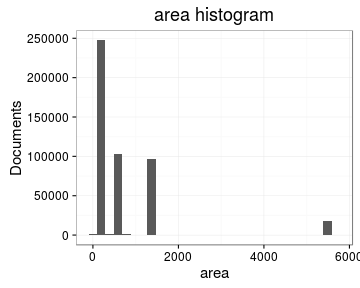

# Preprocessing summary

## Specific fields

  * [Author info](author.md)
  * [Gender info](gender.md)
  * [Publisher info](publisher.md)
  * [Publication geography](publicationplace.md)
  * [Publication year info](publicationyear.md)
  * [Titles](title.md)  
  * [Page counts](pagecount.md)
  * [Physical dimension](dimension.md)    
  * [Document and subject topics](topic.md)
  * [Languages](language.md)

## Field conversions

This documents the conversions from raw data to the final preprocessed version (accepted, discarded, conversions). Only some of the key tables are explicitly linked below. The complete list of all summary tables is [here](output.tables/).

## Annotated documents

  * 481210 documents in the original raw data
  * 481210 documents in the final preprocessed data (100%)

Fraction of documents with data:

Same in exact numbers: documents with available/missing entries, and number of unique entries for each field. Sorted by missing data:

|field name                           | missing (%)| available (%)| available (n)| unique (n)|
|:------------------------------------|-----------:|-------------:|-------------:|----------:|
|publisher                            |       100.0|           0.0|             0|          1|
|self_published                       |       100.0|           0.0|             0|          1|
|parts                                |       100.0|           0.0|           239|         57|
|volnumber                            |        99.8|           0.2|           946|         31|
|publication_frequency                |        99.3|           0.7|          3263|        149|
|publication_interval                 |        99.2|           0.8|          3694|       3665|
|width.original                       |        99.2|           0.8|          3731|         72|
|height.original                      |        98.3|           1.7|          8153|         88|
|publication_year_till                |        97.8|           2.2|         10556|        354|
|volcount                             |        96.3|           3.7|         17646|        150|
|document.items                       |        96.3|           3.7|         17884|        154|
|publication_topic                    |        81.7|          18.3|         87968|       5067|
|publication_geography                |        71.6|          28.4|        136615|      12717|
|author_gender                        |        70.4|          29.6|        142461|          4|
|first_edition                        |        67.6|          32.4|        155943|          3|
|author_birth                         |        58.9|          41.1|        197601|        469|
|author_death                         |        55.8|          44.2|        212915|        517|
|subject_topic                        |        44.9|          55.1|        265152|      55732|
|author_name                          |        39.9|          60.1|        289094|      47967|
|author                               |        39.9|          60.1|        289094|      54742|
|latitude                             |         8.6|          91.4|        439924|        190|
|longitude                            |         8.6|          91.4|        439924|        190|
|pagecount.orig                       |         3.7|          96.3|        463555|       1476|
|obl                                  |         3.5|          96.5|        464214|          3|
|paper                                |         2.6|          97.4|        468601|       6606|
|width                                |         2.3|          97.7|        470242|         78|
|height                               |         2.3|          97.7|        470242|         95|
|area                                 |         2.3|          97.7|        470242|        629|
|country                              |         0.7|          99.3|        477930|         55|
|publication_place                    |         0.6|          99.4|        478533|       1095|
|pagecount                            |         0.4|          99.6|        479154|       1565|
|publication_year_from                |         0.2|          99.8|        480082|        348|
|language                             |         0.0|         100.0|        481145|         50|
|title                                |         0.0|         100.0|        481208|     360651|
|control_number                       |         0.0|         100.0|        481210|     481210|
|language.English                     |         0.0|         100.0|        481210|          2|
|language.French                      |         0.0|         100.0|        481210|          2|
|language.Latin                       |         0.0|         100.0|        481210|          2|
|language.German                      |         0.0|         100.0|        481210|          2|
|language.Scottish Gaelic             |         0.0|         100.0|        481210|          2|
|language.Italian                     |         0.0|         100.0|        481210|          2|
|language.Greek Ancient to 1453       |         0.0|         100.0|        481210|          2|
|language.Welsh                       |         0.0|         100.0|        481210|          2|
|language.Portuguese                  |         0.0|         100.0|        481210|          2|
|language.Dutch                       |         0.0|         100.0|        481210|          2|
|language.Greek Modern 1453-          |         0.0|         100.0|        481210|          2|
|language.Hebrew                      |         0.0|         100.0|        481210|          2|
|language.Spanish                     |         0.0|         100.0|        481210|          2|
|language.Pahlavi                     |         0.0|         100.0|        481210|          2|
|language.Swedish                     |         0.0|         100.0|        481210|          2|
|language.Irish                       |         0.0|         100.0|        481210|          2|
|language.Manx                        |         0.0|         100.0|        481210|          2|
|language.Romance Other               |         0.0|         100.0|        481210|          2|
|language.Algonquian Other            |         0.0|         100.0|        481210|          2|
|language.Lithuanian                  |         0.0|         100.0|        481210|          2|
|language.Turkish                     |         0.0|         100.0|        481210|          2|
|language.English Old ca. 450-1100    |         0.0|         100.0|        481210|          2|
|language.Scots                       |         0.0|         100.0|        481210|          2|
|language.Arabic                      |         0.0|         100.0|        481210|          2|
|language.North American Indian Other |         0.0|         100.0|        481210|          2|
|language.Persian                     |         0.0|         100.0|        481210|          2|
|language.French Middle ca. 1300-1600 |         0.0|         100.0|        481210|          2|
|language.Newari                      |         0.0|         100.0|        481210|          2|
|language.Armenian                    |         0.0|         100.0|        481210|          2|
|language.Tamil                       |         0.0|         100.0|        481210|          2|
|language.Icelandic                   |         0.0|         100.0|        481210|          2|
|language.Bengali                     |         0.0|         100.0|        481210|          2|
|language.Russian                     |         0.0|         100.0|        481210|          2|
|language.Malayalam                   |         0.0|         100.0|        481210|          2|
|language.Danish                      |         0.0|         100.0|        481210|          2|
|language.English Middle 1100-1500    |         0.0|         100.0|        481210|          2|
|language.Coptic                      |         0.0|         100.0|        481210|          2|
|language.Mongolian                   |         0.0|         100.0|        481210|          2|
|language.Gujarati                    |         0.0|         100.0|        481210|          2|
|language.Malay                       |         0.0|         100.0|        481210|          2|
|language.Sanskrit                    |         0.0|         100.0|        481210|          2|
|language.Gothic                      |         0.0|         100.0|        481210|          2|
|language.Mohawk                      |         0.0|         100.0|        481210|          2|
|language.Delaware                    |         0.0|         100.0|        481210|          2|
|language.Iroquoian Other             |         0.0|         100.0|        481210|          2|
|language.Palauan                     |         0.0|         100.0|        481210|          2|
|language.Arawak                      |         0.0|         100.0|        481210|          2|
|language.Scottish Gaelix             |         0.0|         100.0|        481210|          2|
|multilingual                         |         0.0|         100.0|        481210|          2|
|gatherings.original                  |         0.0|         100.0|        481210|         18|
|obl.original                         |         0.0|         100.0|        481210|          2|
|original_row                         |         0.0|         100.0|        481210|     481210|
|author_pseudonyme                    |         0.0|         100.0|        481210|          2|
|publication_year                     |         0.0|         100.0|        481210|        348|
|publication_decade                   |         0.0|         100.0|        481210|         37|
|gatherings                           |         0.0|         100.0|        481210|         18|
|singlevol                            |         0.0|         100.0|        481210|          2|
|multivol                             |         0.0|         100.0|        481210|          2|
|issue                                |         0.0|         100.0|        481210|          2|

## Histograms of all entries for numeric variables

## Histograms of the top entries for factor variables

Non-trivial factors with at least 2 levels are shown.

