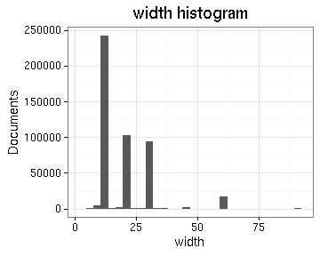
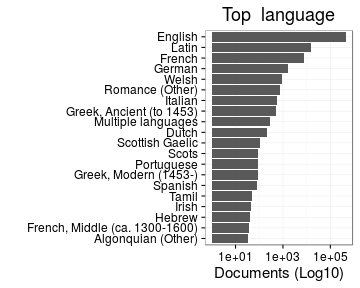
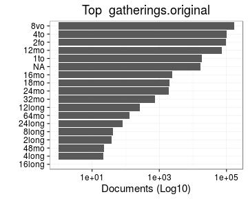

# Preprocessing summary

## Specific fields

  * [Author info](author.md)
  * [Gender info](gender.md)
  * [Publisher info](publisher.md)
  * [Publication geography](publicationplace.md)
  * [Generic document info](documents.md)
  * [Document sizes](size.md)
  * [Document topics](topic.md)

## Field conversions

This documents the conversions from raw data to the final preprocessed version (accepted, discarded, conversions). Only some of the key tables are explicitly linked below. The complete list of all summary tables is [here](output.tables/).

## Annotated documents

Fraction of documents with data:

Same in exact numbers: documents with available/missing entries, and number of unique entries for each field. Sorted by missing data:

|field name                              | missing (%)| available (%)| available (n)| unique (n)|
|:---------------------------------------|-----------:|-------------:|-------------:|----------:|
|volnumber                               |        99.8|           0.2|           946|         31|
|width.original                          |        99.2|           0.8|          3731|         72|
|height.original                         |        98.3|           1.7|          8153|         88|
|publication_year_till                   |        97.8|           2.2|         10552|        354|
|publication_topic                       |        81.7|          18.3|         87966|       5067|
|publication_geography                   |        71.6|          28.4|        136613|      12717|
|author_birth                            |        59.2|          40.8|        196512|        468|
|author_death                            |        56.1|          43.9|        211267|        517|
|author_date                             |        54.3|          45.7|        220096|      16084|
|self_published                          |        51.8|          48.2|        232008|          3|
|author_gender                           |        50.5|          49.5|        238324|          3|
|subject_topic                           |        44.9|          55.1|        265148|      55731|
|author_name                             |        41.2|          58.8|        282773|      47979|
|author                                  |        41.2|          58.8|        282773|      54435|
|publisher                               |        24.3|          75.7|        364231|     169608|
|latitude                                |        12.4|          87.6|        421519|         18|
|longitude                               |        12.4|          87.6|        421519|         18|
|pagecount.orig                          |         3.6|          96.4|        463650|       1488|
|obl                                     |         3.5|          96.5|        464209|          3|
|paper.consumption.km2                   |         2.3|          97.7|        470012|       6734|
|width                                   |         2.3|          97.7|        470237|         78|
|height                                  |         2.3|          97.7|        470237|         95|
|area                                    |         2.3|          97.7|        470237|        629|
|physical_dimension                      |         1.0|          99.0|        476507|       2226|
|country                                 |         0.5|          99.5|        478678|         56|
|publication_place                       |         0.5|          99.5|        478686|       1063|
|publication_year_from                   |         0.2|          99.8|        480080|        348|
|volcount                                |         0.2|          99.8|        480259|        150|
|document.items                          |         0.2|          99.8|        480259|        150|
|pagecount                               |         0.0|         100.0|        480980|       1592|
|physical_extent                         |         0.0|         100.0|        481033|     109493|
|title                                   |         0.0|         100.0|        481203|     360647|
|publication_time                        |         0.0|         100.0|        481205|      31870|
|control_number                          |         0.0|         100.0|        481205|     481205|
|language.English                        |         0.0|         100.0|        481205|          2|
|language.French                         |         0.0|         100.0|        481205|          2|
|language.Latin                          |         0.0|         100.0|        481205|          2|
|language.German                         |         0.0|         100.0|        481205|          2|
|language.Scottish Gaelic                |         0.0|         100.0|        481205|          2|
|language.Italian                        |         0.0|         100.0|        481205|          2|
|language.Greek, Ancient (to 1453)       |         0.0|         100.0|        481205|          1|
|language.Welsh                          |         0.0|         100.0|        481205|          2|
|language.Portuguese                     |         0.0|         100.0|        481205|          2|
|language.Multiple languages             |         0.0|         100.0|        481205|          2|
|language.Dutch                          |         0.0|         100.0|        481205|          2|
|language.Greek, Modern (1453-)          |         0.0|         100.0|        481205|          1|
|language.Hebrew                         |         0.0|         100.0|        481205|          2|
|language.Spanish                        |         0.0|         100.0|        481205|          2|
|language.Pahlavi                        |         0.0|         100.0|        481205|          2|
|language.Swedish                        |         0.0|         100.0|        481205|          2|
|language.Irish                          |         0.0|         100.0|        481205|          2|
|language.Manx                           |         0.0|         100.0|        481205|          2|
|language.Romance (Other)                |         0.0|         100.0|        481205|          1|
|language.Algonquian (Other)             |         0.0|         100.0|        481205|          1|
|language.Lithuanian                     |         0.0|         100.0|        481205|          2|
|language.Turkish                        |         0.0|         100.0|        481205|          2|
|language.English, Old (ca. 450-1100)    |         0.0|         100.0|        481205|          1|
|language.Scots                          |         0.0|         100.0|        481205|          2|
|language.Arabic                         |         0.0|         100.0|        481205|          2|
|language.North American Indian (Other)  |         0.0|         100.0|        481205|          1|
|language.Persian                        |         0.0|         100.0|        481205|          2|
|language.French, Middle (ca. 1300-1600) |         0.0|         100.0|        481205|          1|
|language.Newari                         |         0.0|         100.0|        481205|          2|
|language.Undetermined                   |         0.0|         100.0|        481205|          2|
|language.Armenian                       |         0.0|         100.0|        481205|          2|
|language.Tamil                          |         0.0|         100.0|        481205|          2|
|language.Icelandic                      |         0.0|         100.0|        481205|          2|
|language.Bengali                        |         0.0|         100.0|        481205|          2|
|language.Russian                        |         0.0|         100.0|        481205|          2|
|language.Malayalam                      |         0.0|         100.0|        481205|          2|
|language.Danish                         |         0.0|         100.0|        481205|          2|
|language.English, Middle (1100-1500)    |         0.0|         100.0|        481205|          1|
|language.Coptic                         |         0.0|         100.0|        481205|          2|
|language.Mongolian                      |         0.0|         100.0|        481205|          2|
|language.Gujarati                       |         0.0|         100.0|        481205|          2|
|language.Malay                          |         0.0|         100.0|        481205|          2|
|language.Sanskrit                       |         0.0|         100.0|        481205|          2|
|language.Gothic                         |         0.0|         100.0|        481205|          2|
|language.Mohawk                         |         0.0|         100.0|        481205|          2|
|language.Delaware                       |         0.0|         100.0|        481205|          2|
|language.Iroquoian (Other)              |         0.0|         100.0|        481205|          1|
|language.Palauan                        |         0.0|         100.0|        481205|          2|
|language.Arawak                         |         0.0|         100.0|        481205|          2|
|language.Scottish Gaelix                |         0.0|         100.0|        481205|          2|
|language.mul                            |         0.0|         100.0|        481205|          2|
|language                                |         0.0|         100.0|        481205|         52|
|gatherings.original                     |         0.0|         100.0|        481205|         18|
|obl.original                            |         0.0|         100.0|        481205|          2|
|original_row                            |         0.0|         100.0|        481205|     481205|
|publication_year                        |         0.0|         100.0|        481205|        348|
|publication_decade                      |         0.0|         100.0|        481205|         37|
|author_pseudonyme                       |         0.0|         100.0|        481205|          2|
|gatherings                              |         0.0|         100.0|        481205|         18|

## Histograms of all entries for numeric variables

## Histograms of the top entries for factor variables

