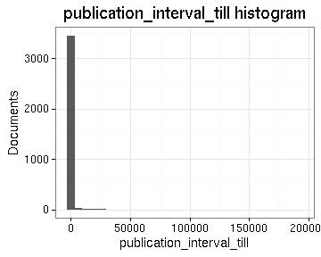

# Preprocessing summary

## Specific fields

  * [Author info](author.md)
  * [Gender info](gender.md)
  * [Publisher info](publisher.md)
  * [Publication geography](publicationplace.md)
  * [Publication year info](publicationyear.md)
  * [Titles](title.md)  
  * [Document sizes](size.md)
  * [Document and subject topics](topic.md)
  * [Languages](language.md)

## Field conversions

This documents the conversions from raw data to the final preprocessed version (accepted, discarded, conversions). Only some of the key tables are explicitly linked below. The complete list of all summary tables is [here](output.tables/).

## Annotated documents

Fraction of documents with data:

Same in exact numbers: documents with available/missing entries, and number of unique entries for each field. Sorted by missing data:

|field name                              | missing (%)| available (%)| available (n)| unique (n)|
|:---------------------------------------|-----------:|-------------:|-------------:|----------:|
|volnumber                               |        99.8|           0.2|           936|         31|
|publication_frequency                   |        99.3|           0.7|          3101|        144|
|width.original                          |        99.2|           0.8|          3454|         72|
|publication_interval                    |        99.2|           0.8|          3528|       3504|
|height.original                         |        98.4|           1.6|          7548|         87|
|volcount                                |        96.5|           3.5|         16239|        147|
|document.items                          |        96.5|           3.5|         16239|        147|
|latitude                                |        93.8|           6.2|         28722|         19|
|longitude                               |        93.8|           6.2|         28722|         19|
|publication_topic                       |        81.7|          18.3|         84098|       4888|
|publication_year_till                   |        79.6|          20.4|         93878|        354|
|publication_geography                   |        71.7|          28.3|        130009|      12221|
|author_gender                           |        70.4|          29.6|        136162|          4|
|first_edition                           |        67.9|          32.1|        147418|          3|
|author_birth                            |        58.4|          41.6|        191075|        468|
|author_death                            |        55.5|          44.5|        204514|        517|
|self_published                          |        48.0|          52.0|        239232|          3|
|subject_topic                           |        45.1|          54.9|        252317|      53465|
|author_name                             |        39.7|          60.3|        276964|      46750|
|author                                  |        39.7|          60.3|        276964|      53908|
|publisher                               |        16.5|          83.5|        383581|     162946|
|country                                 |         3.7|          96.3|        442575|         53|
|publication_place                       |         3.7|          96.3|        442600|       1001|
|pagecount.orig                          |         3.6|          96.4|        443181|       1452|
|obl                                     |         3.4|          96.6|        443830|          3|
|paper.consumption.km2                   |         2.4|          97.6|        448384|       6659|
|width                                   |         2.2|          97.8|        449365|         78|
|height                                  |         2.2|          97.8|        449365|         94|
|area                                    |         2.2|          97.8|        449365|        619|
|publication_year_from                   |         1.3|          98.7|        453788|        348|
|pagecount                               |         0.2|          99.8|        458646|       1629|
|language                                |         0.0|         100.0|        459598|         49|
|title                                   |         0.0|         100.0|        459643|     345783|
|control_number                          |         0.0|         100.0|        459644|     459644|
|language.English                        |         0.0|         100.0|        459644|          2|
|language.French                         |         0.0|         100.0|        459644|          2|
|language.Latin                          |         0.0|         100.0|        459644|          2|
|language.German                         |         0.0|         100.0|        459644|          2|
|language.Scottish Gaelic                |         0.0|         100.0|        459644|          2|
|language.Italian                        |         0.0|         100.0|        459644|          2|
|language.Greek, Ancient (to 1453)       |         0.0|         100.0|        459644|          1|
|language.Welsh                          |         0.0|         100.0|        459644|          2|
|language.Portuguese                     |         0.0|         100.0|        459644|          2|
|language.Dutch                          |         0.0|         100.0|        459644|          2|
|language.Greek, Modern (1453-)          |         0.0|         100.0|        459644|          1|
|language.Hebrew                         |         0.0|         100.0|        459644|          2|
|language.Spanish                        |         0.0|         100.0|        459644|          2|
|language.Pahlavi                        |         0.0|         100.0|        459644|          2|
|language.Swedish                        |         0.0|         100.0|        459644|          2|
|language.Irish                          |         0.0|         100.0|        459644|          2|
|language.Manx                           |         0.0|         100.0|        459644|          2|
|language.Romance (Other)                |         0.0|         100.0|        459644|          1|
|language.Algonquian (Other)             |         0.0|         100.0|        459644|          1|
|language.Lithuanian                     |         0.0|         100.0|        459644|          2|
|language.Turkish                        |         0.0|         100.0|        459644|          2|
|language.English, Old (ca. 450-1100)    |         0.0|         100.0|        459644|          1|
|language.Scots                          |         0.0|         100.0|        459644|          2|
|language.Arabic                         |         0.0|         100.0|        459644|          2|
|language.North American Indian (Other)  |         0.0|         100.0|        459644|          1|
|language.Persian                        |         0.0|         100.0|        459644|          2|
|language.French, Middle (ca. 1300-1600) |         0.0|         100.0|        459644|          1|
|language.Newari                         |         0.0|         100.0|        459644|          2|
|language.Armenian                       |         0.0|         100.0|        459644|          2|
|language.Tamil                          |         0.0|         100.0|        459644|          2|
|language.Icelandic                      |         0.0|         100.0|        459644|          2|
|language.Bengali                        |         0.0|         100.0|        459644|          2|
|language.Russian                        |         0.0|         100.0|        459644|          2|
|language.Malayalam                      |         0.0|         100.0|        459644|          2|
|language.Danish                         |         0.0|         100.0|        459644|          2|
|language.English, Middle (1100-1500)    |         0.0|         100.0|        459644|          1|
|language.Coptic                         |         0.0|         100.0|        459644|          2|
|language.Mongolian                      |         0.0|         100.0|        459644|          2|
|language.Gujarati                       |         0.0|         100.0|        459644|          2|
|language.Malay                          |         0.0|         100.0|        459644|          2|
|language.Sanskrit                       |         0.0|         100.0|        459644|          2|
|language.Gothic                         |         0.0|         100.0|        459644|          2|
|language.Mohawk                         |         0.0|         100.0|        459644|          2|
|language.Delaware                       |         0.0|         100.0|        459644|          2|
|language.Iroquoian (Other)              |         0.0|         100.0|        459644|          1|
|language.Palauan                        |         0.0|         100.0|        459644|          2|
|language.Arawak                         |         0.0|         100.0|        459644|          2|
|language.Scottish Gaelix                |         0.0|         100.0|        459644|          1|
|language.Multiple languages             |         0.0|         100.0|        459644|          2|
|gatherings.original                     |         0.0|         100.0|        459644|         18|
|obl.original                            |         0.0|         100.0|        459644|          2|
|original_row                            |         0.0|         100.0|        459644|     459644|
|author_pseudonyme                       |         0.0|         100.0|        459644|          2|
|publication_year                        |         0.0|         100.0|        459644|        348|
|publication_decade                      |         0.0|         100.0|        459644|         37|
|gatherings                              |         0.0|         100.0|        459644|         18|

## Histograms of all entries for numeric variables

## Histograms of the top entries for factor variables

