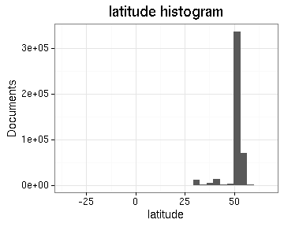
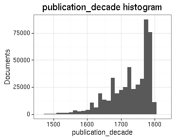
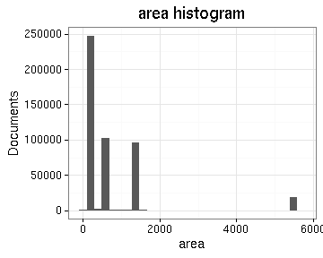
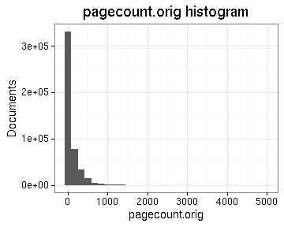
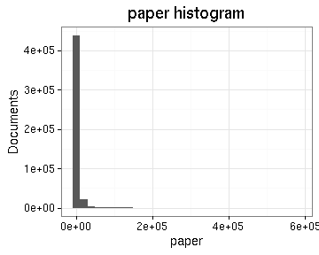
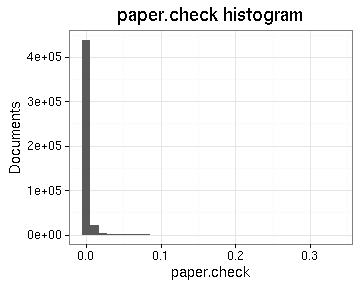
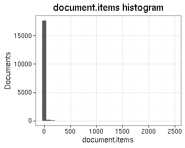

# Preprocessing summary

## Specific fields

  * [Author info](author.md)
  * [Gender info](gender.md)
  * [Publisher info](publisher.md)
  * [Publication geography](publicationplace.md)
  * [Publication year info](publicationyear.md)
  * [Titles](title.md)  
  * [Page counts](pagecount.md)
  * [Physical dimension](dimension.md)    
  * [Document and subject topics](topic.md)
  * [Languages](language.md)

## Field conversions

This documents the conversions from raw data to the final preprocessed version (accepted, discarded, conversions). Only some of the key tables are explicitly linked below. The complete list of all summary tables is [here](output.tables/).

## Annotated documents

  * 481463 documents in the original raw data
  * 481463 documents in the final preprocessed data (100%)

Fraction of documents with data:

Same in exact numbers: documents with available/missing entries, and number of unique entries for each field. Sorted by missing data:

|field name                           | missing (%)| available (%)| available (n)| unique (n)|
|:------------------------------------|-----------:|-------------:|-------------:|----------:|
|publication_frequency_annual         |       100.0|           0.0|             0|          1|
|publication_frequency_text           |       100.0|           0.0|           105|          4|
|parts                                |       100.0|           0.0|           239|         57|
|volnumber                            |        99.8|           0.2|           948|         31|
|publication_interval_from            |        99.3|           0.7|          3494|        364|
|publication_interval_till            |        99.3|           0.7|          3508|        316|
|width.original                       |        99.2|           0.8|          3732|         72|
|height.original                      |        98.3|           1.7|          8167|         88|
|publication_year_till                |        97.6|           2.4|         11791|        368|
|volcount                             |        96.3|           3.7|         17695|        151|
|document.items                       |        96.3|           3.7|         17933|        155|
|publication_topic                    |        81.7|          18.3|         87911|       5058|
|publication_geography                |        71.6|          28.4|        136555|      12702|
|author_gender                        |        70.4|          29.6|        142640|          5|
|first_edition                        |        67.6|          32.4|        156105|          3|
|author_birth                         |        57.4|          42.6|        204869|        507|
|author_death                         |        55.4|          44.6|        214729|        535|
|self_published                       |        50.1|          49.9|        240069|          2|
|subject_topic                        |        44.9|          55.1|        265373|      55770|
|author_name                          |        39.9|          60.1|        289312|      47974|
|author                               |        39.9|          60.1|        289312|      55089|
|publisher                            |        23.0|          77.0|        370519|     219114|
|latitude                             |         8.6|          91.4|        440143|        190|
|longitude                            |         8.6|          91.4|        440143|        190|
|pagecount.orig                       |         3.7|          96.3|        463752|       1482|
|obl                                  |         3.5|          96.5|        464451|          3|
|paper                                |         2.7|          97.3|        468425|       6605|
|paper.check                          |         2.7|          97.3|        468425|       6605|
|width                                |         2.3|          97.7|        470486|         78|
|height                               |         2.3|          97.7|        470486|         95|
|area                                 |         2.3|          97.7|        470486|        628|
|country                              |         0.7|          99.3|        478176|         55|
|publication_place                    |         0.6|          99.4|        478782|       1095|
|pagecount                            |         0.5|          99.5|        478966|       1624|
|publication_year_from                |         0.2|          99.8|        480589|        348|
|language                             |         0.0|         100.0|        481397|         50|
|system_control_number                |         0.0|         100.0|        481446|     481437|
|title                                |         0.0|         100.0|        481461|     360772|
|control_number                       |         0.0|         100.0|        481463|     481463|
|language.English                     |         0.0|         100.0|        481463|          2|
|language.French                      |         0.0|         100.0|        481463|          2|
|language.Latin                       |         0.0|         100.0|        481463|          2|
|language.German                      |         0.0|         100.0|        481463|          2|
|language.Scottish Gaelic             |         0.0|         100.0|        481463|          2|
|language.Italian                     |         0.0|         100.0|        481463|          2|
|language.Greek Ancient to 1453       |         0.0|         100.0|        481463|          2|
|language.Welsh                       |         0.0|         100.0|        481463|          2|
|language.Portuguese                  |         0.0|         100.0|        481463|          2|
|language.Dutch                       |         0.0|         100.0|        481463|          2|
|language.Greek Modern 1453-          |         0.0|         100.0|        481463|          2|
|language.Hebrew                      |         0.0|         100.0|        481463|          2|
|language.Spanish                     |         0.0|         100.0|        481463|          2|
|language.Pahlavi                     |         0.0|         100.0|        481463|          2|
|language.Swedish                     |         0.0|         100.0|        481463|          2|
|language.Irish                       |         0.0|         100.0|        481463|          2|
|language.Manx                        |         0.0|         100.0|        481463|          2|
|language.Romance Other               |         0.0|         100.0|        481463|          2|
|language.Algonquian Other            |         0.0|         100.0|        481463|          2|
|language.Lithuanian                  |         0.0|         100.0|        481463|          2|
|language.Turkish                     |         0.0|         100.0|        481463|          2|
|language.English Old ca. 450-1100    |         0.0|         100.0|        481463|          2|
|language.Scots                       |         0.0|         100.0|        481463|          2|
|language.Arabic                      |         0.0|         100.0|        481463|          2|
|language.North American Indian Other |         0.0|         100.0|        481463|          2|
|language.Persian                     |         0.0|         100.0|        481463|          2|
|language.French Middle ca. 1300-1600 |         0.0|         100.0|        481463|          2|
|language.Newari                      |         0.0|         100.0|        481463|          2|
|language.Armenian                    |         0.0|         100.0|        481463|          2|
|language.Tamil                       |         0.0|         100.0|        481463|          2|
|language.Icelandic                   |         0.0|         100.0|        481463|          2|
|language.Bengali                     |         0.0|         100.0|        481463|          2|
|language.Russian                     |         0.0|         100.0|        481463|          2|
|language.Malayalam                   |         0.0|         100.0|        481463|          2|
|language.Danish                      |         0.0|         100.0|        481463|          2|
|language.English Middle 1100-1500    |         0.0|         100.0|        481463|          2|
|language.Coptic                      |         0.0|         100.0|        481463|          2|
|language.Mongolian                   |         0.0|         100.0|        481463|          2|
|language.Gujarati                    |         0.0|         100.0|        481463|          2|
|language.Malay                       |         0.0|         100.0|        481463|          2|
|language.Sanskrit                    |         0.0|         100.0|        481463|          2|
|language.Gothic                      |         0.0|         100.0|        481463|          2|
|language.Mohawk                      |         0.0|         100.0|        481463|          2|
|language.Delaware                    |         0.0|         100.0|        481463|          2|
|language.Iroquoian Other             |         0.0|         100.0|        481463|          2|
|language.Palauan                     |         0.0|         100.0|        481463|          2|
|language.Arawak                      |         0.0|         100.0|        481463|          2|
|language.Scottish Gaelix             |         0.0|         100.0|        481463|          2|
|multilingual                         |         0.0|         100.0|        481463|          2|
|gatherings.original                  |         0.0|         100.0|        481463|         18|
|obl.original                         |         0.0|         100.0|        481463|          2|
|original_row                         |         0.0|         100.0|        481463|     481463|
|author_pseudonyme                    |         0.0|         100.0|        481463|          2|
|publication_year                     |         0.0|         100.0|        481463|        348|
|publication_decade                   |         0.0|         100.0|        481463|         37|
|gatherings                           |         0.0|         100.0|        481463|         18|
|singlevol                            |         0.0|         100.0|        481463|          2|
|multivol                             |         0.0|         100.0|        481463|          2|
|issue                                |         0.0|         100.0|        481463|          2|

## Histograms of all entries for numeric variables

## Histograms of the top entries for factor variables

Non-trivial factors with at least 2 levels are shown.

