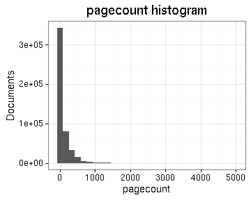
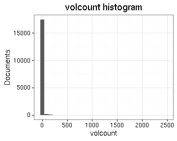
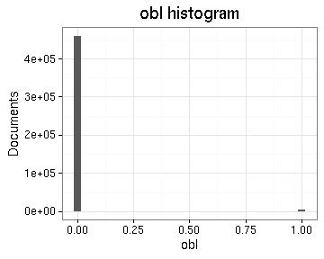

# Preprocessing summary

## Specific fields

  * [Author info](author.md)
  * [Gender info](gender.md)
  * [Publisher info](publisher.md)
  * [Publication geography](publicationplace.md)
  * [Generic document info](documents.md)
  * [Document sizes](size.md)
  * [Document topics](topic.md)

## Field conversions

This documents the conversions from raw data to the final preprocessed version (accepted, discarded, conversions). Only some of the key tables are explicitly linked below. The complete list of all summary tables is [here](output.tables/).

## Annotated documents

Fraction of documents with data:

Same in exact numbers: documents with available/missing entries, and number of unique entries for each field. Sorted by missing data:

|field name            | missing (%)| available (%)| available (n)| unique (n)|
|:---------------------|-----------:|-------------:|-------------:|----------:|
|volnumber             |        99.8|           0.2|           946|         31|
|width.original        |        99.2|           0.8|          3731|         72|
|height.original       |        98.3|           1.7|          8153|         88|
|publication_year_till |        97.8|           2.2|         10552|        354|
|publication_topic     |        81.7|          18.3|         87966|       5067|
|publication_geography |        71.6|          28.4|        136613|      12717|
|author_birth          |        59.2|          40.8|        196540|        468|
|author_death          |        56.1|          43.9|        211273|        517|
|author_date           |        54.3|          45.7|        220096|      16084|
|self_published        |        51.8|          48.2|        232004|          3|
|author_gender         |        50.4|          49.6|        238638|          3|
|subject_topic         |        44.9|          55.1|        265148|      55731|
|author_name           |        41.2|          58.8|        282774|      47986|
|author                |        41.2|          58.8|        282774|      54456|
|publisher             |        24.3|          75.7|        364225|     169768|
|latitude              |        12.4|          87.6|        421519|         18|
|longitude             |        12.4|          87.6|        421519|         18|
|pagecount.orig        |         3.6|          96.4|        463650|       1488|
|obl                   |         3.5|          96.5|        464209|          3|
|paper.consumption.km2 |         2.3|          97.7|        470012|       6734|
|width                 |         2.3|          97.7|        470237|         78|
|height                |         2.3|          97.7|        470237|         95|
|area                  |         2.3|          97.7|        470237|        629|
|physical_dimension    |         1.0|          99.0|        476507|       2226|
|country               |         0.5|          99.5|        478678|         56|
|publication_place     |         0.5|          99.5|        478686|       1063|
|publication_year_from |         0.2|          99.8|        480080|        348|
|volcount              |         0.2|          99.8|        480259|        150|
|document.items        |         0.2|          99.8|        480259|        150|
|pagecount             |         0.0|         100.0|        480980|       1592|
|physical_extent       |         0.0|         100.0|        481033|     109493|
|language              |         0.0|         100.0|        481152|         52|
|title                 |         0.0|         100.0|        481203|     360647|
|publication_time      |         0.0|         100.0|        481205|      31870|
|control_number        |         0.0|         100.0|        481205|     481205|
|English               |         0.0|         100.0|        481205|          2|
|French                |         0.0|         100.0|        481205|          2|
|Latin                 |         0.0|         100.0|        481205|          2|
|German                |         0.0|         100.0|        481205|          2|
|gla                   |         0.0|         100.0|        481205|          2|
|Italian               |         0.0|         100.0|        481205|          2|
|Greek                 |         0.0|         100.0|        481205|          2|
|Welsh                 |         0.0|         100.0|        481205|          2|
|Portuguese            |         0.0|         100.0|        481205|          2|
|Multiple              |         0.0|         100.0|        481205|          2|
|Dutch                 |         0.0|         100.0|        481205|          2|
|Modern_greek          |         0.0|         100.0|        481205|          2|
|Hebrew                |         0.0|         100.0|        481205|          2|
|Spanish               |         0.0|         100.0|        481205|          2|
|pal                   |         0.0|         100.0|        481205|          2|
|Swedish               |         0.0|         100.0|        481205|          2|
|gle                   |         0.0|         100.0|        481205|          2|
|glv                   |         0.0|         100.0|        481205|          2|
|roa                   |         0.0|         100.0|        481205|          2|
|alg                   |         0.0|         100.0|        481205|          2|
|lit                   |         0.0|         100.0|        481205|          2|
|tur                   |         0.0|         100.0|        481205|          2|
|ang                   |         0.0|         100.0|        481205|          2|
|sco                   |         0.0|         100.0|        481205|          2|
|Arabic                |         0.0|         100.0|        481205|          2|
|nai                   |         0.0|         100.0|        481205|          2|
|per                   |         0.0|         100.0|        481205|          2|
|frm                   |         0.0|         100.0|        481205|          2|
|new                   |         0.0|         100.0|        481205|          2|
|Undetermined          |         0.0|         100.0|        481205|          2|
|arm                   |         0.0|         100.0|        481205|          2|
|tam                   |         0.0|         100.0|        481205|          2|
|gc                    |         0.0|         100.0|        481205|          2|
|Icelandic             |         0.0|         100.0|        481205|          2|
|ben                   |         0.0|         100.0|        481205|          2|
|Russian               |         0.0|         100.0|        481205|          2|
|mal                   |         0.0|         100.0|        481205|          2|
|Danish                |         0.0|         100.0|        481205|          2|
|enm                   |         0.0|         100.0|        481205|          2|
|cop                   |         0.0|         100.0|        481205|          2|
|mon                   |         0.0|         100.0|        481205|          2|
|guj                   |         0.0|         100.0|        481205|          2|
|may                   |         0.0|         100.0|        481205|          2|
|san                   |         0.0|         100.0|        481205|          2|
|got                   |         0.0|         100.0|        481205|          2|
|moh                   |         0.0|         100.0|        481205|          2|
|del                   |         0.0|         100.0|        481205|          2|
|iro                   |         0.0|         100.0|        481205|          2|
|pau                   |         0.0|         100.0|        481205|          2|
|arw                   |         0.0|         100.0|        481205|          2|
|gae                   |         0.0|         100.0|        481205|          2|
|mul                   |         0.0|         100.0|        481205|          2|
|gatherings.original   |         0.0|         100.0|        481205|         18|
|obl.original          |         0.0|         100.0|        481205|          2|
|original_row          |         0.0|         100.0|        481205|     481205|
|publication_year      |         0.0|         100.0|        481205|        348|
|publication_decade    |         0.0|         100.0|        481205|         37|
|author_pseudonyme     |         0.0|         100.0|        481205|          2|
|gatherings            |         0.0|         100.0|        481205|         18|

## Histograms of all entries for numeric variables

## Histograms of the top entries for factor variables

