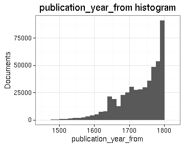

# Summary

Date:


```
## [1] "Tue Mar  8 15:16:13 2016"
```


## Specific fields

  * [Author info](author.md)
  * [Gender info](gender.md)
  * [Publisher info](publisher.md)
  * [Publication geography](publicationplace.md)
  * [Generic document info](documents.md)
  * [Document sizes](size.md)
  * [Document topics](topic.md)


## Field conversions

This documents the conversions from raw data to the final preprocessed version (accepted, discarded, conversions). Only some of the key tables are explicitly linked below. The complete list of all summary tables is [here](output.tables/).

## Annotated documents

Fraction of documents with entries:


Documents with data (number and percentage) and number of unique entries for each field:


|field_name            | missing| available|      n| unique_entries|
|:---------------------|-------:|---------:|------:|--------------:|
|title_uniform2        |    99.9|       0.1|    312|            111|
|volnumber             |    99.6|       0.4|   2033|             24|
|width.original        |    99.2|       0.8|   3741|             72|
|height.original       |    98.3|       1.7|   8160|             88|
|publication_year_till |    98.0|       2.0|   9671|            290|
|topic_publication     |    81.7|      18.3|  88079|           5069|
|publication_geography |    71.6|      28.4| 136738|          12719|
|author_death          |    62.7|      37.3| 179534|            440|
|author_birth          |    58.9|      41.1| 197860|            454|
|author_gender         |    51.0|      49.0| 235955|              3|
|author                |    47.3|      52.7| 253770|          45986|
|topic                 |    44.9|      55.1| 265575|          55812|
|author_name           |    44.5|      55.5| 267440|          42287|
|publisher             |    24.4|      75.6| 364208|         161356|
|latitude              |    13.9|      86.1| 414806|             16|
|longitude             |    13.9|      86.1| 414806|             16|
|paper.consumption.km2 |     7.6|      92.4| 445398|           5318|
|pagecount.orig        |     5.4|      94.6| 455971|           1137|
|country               |     4.3|      95.7| 461287|             35|
|obl                   |     3.5|      96.5| 464701|              3|
|width                 |     2.3|      97.7| 470747|             78|
|height                |     2.3|      97.7| 470747|             95|
|area                  |     2.3|      97.7| 470747|            629|
|publication_place     |     1.8|      98.2| 473035|            476|
|volcount              |     0.4|      99.6| 479755|            152|
|document.items        |     0.4|      99.6| 479755|            152|
|publication_year_from |     0.4|      99.6| 480039|            330|
|pagecount             |     0.1|      99.9| 481534|           1263|
|title                 |     0.0|     100.0| 481786|         361024|
|row.index             |     0.0|     100.0| 481788|         481788|
|language.finnish      |     0.0|     100.0| 481788|              1|
|language.swedish      |     0.0|     100.0| 481788|              2|
|language.latin        |     0.0|     100.0| 481788|              2|
|language.german       |     0.0|     100.0| 481788|              2|
|language.english      |     0.0|     100.0| 481788|              2|
|language.french       |     0.0|     100.0| 481788|              2|
|language.russian      |     0.0|     100.0| 481788|              2|
|language.greek        |     0.0|     100.0| 481788|              2|
|language.danish       |     0.0|     100.0| 481788|              2|
|language.italian      |     0.0|     100.0| 481788|              2|
|language.hebrew       |     0.0|     100.0| 481788|              2|
|language.dutch        |     0.0|     100.0| 481788|              2|
|language.spanish      |     0.0|     100.0| 481788|              2|
|language.sami         |     0.0|     100.0| 481788|              1|
|language.modern_greek |     0.0|     100.0| 481788|              2|
|language.icelandic    |     0.0|     100.0| 481788|              2|
|language.arabic       |     0.0|     100.0| 481788|              2|
|language.portuguese   |     0.0|     100.0| 481788|              2|
|language.finnougrian  |     0.0|     100.0| 481788|              1|
|language.multiple     |     0.0|     100.0| 481788|              2|
|language.undetermined |     0.0|     100.0| 481788|              1|
|original_row          |     0.0|     100.0| 481788|         481788|
|gatherings.original   |     0.0|     100.0| 481788|             18|
|obl.original          |     0.0|     100.0| 481788|              2|
|gatherings            |     0.0|     100.0| 481788|             18|
|unity                 |     0.0|     100.0| 481788|              1|
|publication_year      |     0.0|     100.0| 481788|            329|
|publication_decade    |     0.0|     100.0| 481788|             35|


## Histograms of all entries for numeric variables



## Histograms of the top entries for factor variables


