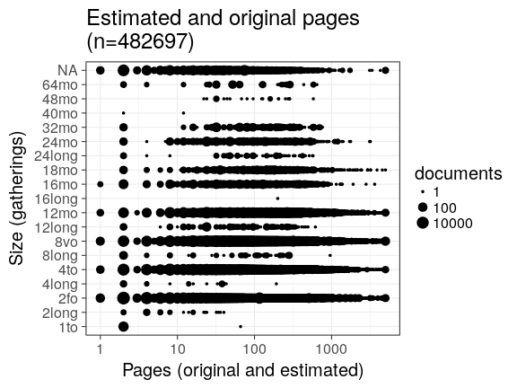
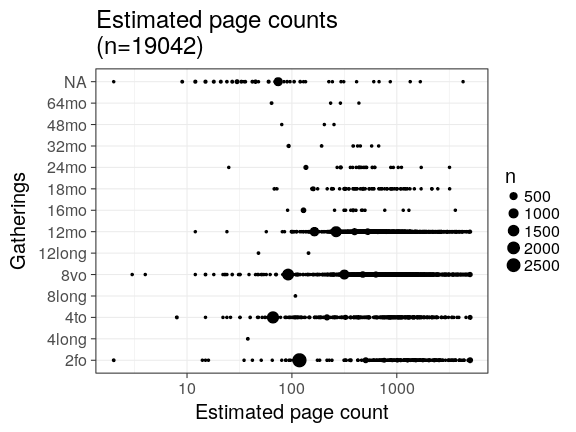
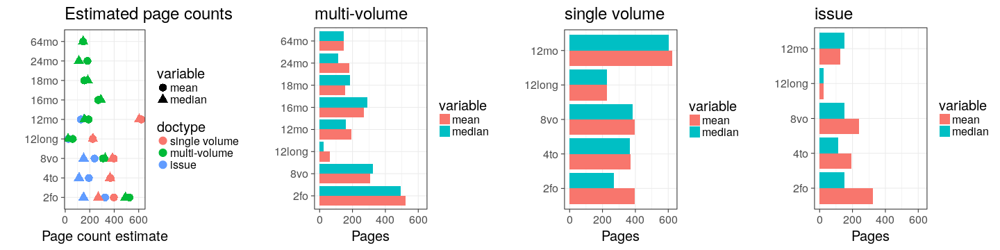

## Page counts

  * Page count missing and estimated for 15217 documents (3.2%).

  * Page count missing and could not be estimated for 2497 documents (0.5%).

  * Page count updated for 0 documents.
  
  * [Conversions from raw data to final page count estimates](output.tables/pagecount_conversion_nontrivial.csv)

<!--[Page conversions from raw data to final page count estimates with volume info](output.tables/page_conversion_table_full.csv)-->

  * [Discarded pagecount info](output.tables/pagecount_discarded.csv) For these cases the missing/discarded page count was estimated based on average page count estimates for [single volume](mean_pagecounts_singlevol.csv), [multi-volume](mean_pagecounts_multivol.csv) and [issues](mean_pagecounts_issue.csv), calculated from those documents where original pagecount info is available.

  * [Automated tests for page count conversions](https://github.com/rOpenGov/bibliographica/blob/master/inst/extdata/tests_polish_physical_extent.csv)


Left: Gatherings vs. overall pagecounts (original + estimated). Right: Only the estimated page counts (for the 15217 documents that have missing pagecount info in the original data):




<!--

## Average page counts (only works in CERL now)

Multi-volume documents average page counts are given per volume.


```
## Error in inherits(x, "list"): object 'mean.pagecounts' not found
```


```
## Error in melt(mean.pagecounts[, c("median.pages.multivol", "median.pages.singlevol", : object 'mean.pagecounts' not found
```

```
## Error in melt(mean.pagecounts[, c("mean.pages.multivol", "mean.pages.singlevol", : object 'mean.pagecounts' not found
```



-->
