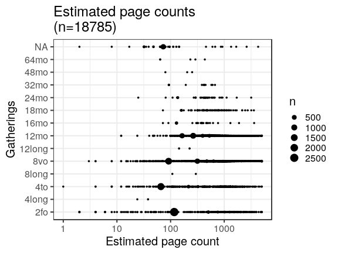

## Page counts

  * Page count missing and estimated for 15599 documents (3.2%).

  * Page count missing and could not be estimated for 2056 documents (0.4%).

  * Page count updated for 0 documents.
  
  * [Conversions from raw data to final page count estimates](output.tables/pagecount_conversion_nontrivial.csv)

<!--[Page conversions from raw data to final page count estimates with volume info](output.tables/page_conversion_table_full.csv)-->

  * [Discarded pagecount info](output.tables/pagecount_discarded.csv) For these cases the missing/discarded page count was estimated based on average page count estimates for [single volume](mean_pagecounts_singlevol.csv), [multi-volume](mean_pagecounts_multivol.csv) and [issues](mean_pagecounts_issue.csv), calculated from those documents where original pagecount info is available.

  * [Automated tests for page count conversions](https://github.com/rOpenGov/bibliographica/blob/master/inst/extdata/tests_polish_physical_extent.csv)

Left: Gatherings vs. overall pagecounts (original + estimated). Right: Only the estimated page counts (for the 15599 documents that have missing pagecount info in the original data):

<!--

## Average page counts (only works in CERL now)

Multi-volume documents average page counts are given per volume.

|doc.dimension | mean.pages.singlevol| median.pages.singlevol| n.singlevol| mean.pages.multivol| median.pages.multivol| n.multivol| mean.pages.issue| median.pages.issue| n.issue|
|:-------------|--------------------:|----------------------:|-----------:|-------------------:|---------------------:|----------:|----------------:|------------------:|-------:|
|2fo           |                75.95|                  93.50|       95159|               89.07|                  2.00|       1042|            10.47|               2.00|    1396|
|4long         |                  NaN|                     NA|          22|                  NA|                    NA|         NA|              NaN|                 NA|       2|
|4to           |                71.16|                   6.50|      100682|                  NA|                    NA|         NA|            12.64|               2.00|     696|
|8long         |                  NaN|                     NA|          39|                3.00|                  3.00|          1|             2.17|               2.17|       2|
|8vo           |                71.33|                   5.00|      160775|               27.97|                  2.00|       6815|            13.33|               1.40|     936|
|12long        |               226.00|                 226.00|         260|               42.00|                 18.00|          5|            18.00|              18.00|       4|
|12mo          |               506.22|                 552.50|       64014|               13.70|                  1.33|       6702|             9.36|               1.33|     136|
|16long        |                  NaN|                     NA|           1|                  NA|                    NA|         NA|               NA|                 NA|      NA|
|16mo          |                  NaN|                     NA|        2331|               19.59|                  2.00|         45|              NaN|                 NA|       2|
|18mo          |                  NaN|                     NA|        1756|                7.04|                  1.33|        244|             0.50|               0.33|       8|
|24long        |                  NaN|                     NA|          82|                  NA|                    NA|         NA|               NA|                 NA|      NA|
|24mo          |                  NaN|                     NA|        1814|               10.85|                  1.00|         55|             1.00|               1.00|       2|
|32mo          |                  NaN|                     NA|         742|                2.00|                  2.00|          7|             2.00|               2.00|       1|
|48mo          |                  NaN|                     NA|          21|                 NaN|                    NA|          2|               NA|                 NA|      NA|
|64mo          |                  NaN|                     NA|         123|              147.17|                147.00|          6|               NA|                 NA|      NA|
|NA            |                 2.38|                   2.38|       16748|                3.48|                  2.38|        198|             2.42|               2.38|     641|
|1to           |                   NA|                     NA|          NA|                  NA|                    NA|         NA|              NaN|                 NA|      16|
|2long         |                   NA|                     NA|          NA|                  NA|                    NA|         NA|              NaN|                 NA|       9|

-->
