## Page counts

  * Page count available for 479670 documents in total (99.9%), including both readily available and estimated page counts.

  * Page count readily available for 460916 documents (96%). 

  * Page count estimated for 18754 documents (3.9%).

  * Page count missing and could not be estimated for 511 documents (0.1%).

  * Page count updated for 5716 documents in the validation phase.
  
  * [Conversions from raw data to final page count estimates](output.tables/pagecount_conversions.csv)

  * [Augmented pagecounts](output.tables/pagecount_discarded.csv) For these cases the page count is missing (or discarded) in the original data, and estimated based on median page counts for [single volume](mean_pagecounts_singlevol.csv), [multi-volume](mean_pagecounts_multivol.csv) and [issues](mean_pagecounts_issue.csv), calculated from those documents where page count info was available.

  * [Automated unit tests for page count conversions](https://github.com/rOpenGov/bibliographica/blob/master/inst/extdata/tests_polish_physical_extent.csv) - these are used to control that the page count conversions remain correct when changes are made to the cleanup routines

## Average page counts

Mean and median page counts calculated based on the documents where
the page count information was readily available. Also see the
correponding numerical tables with page count estimates:

 * [Single volume](mean_pagecounts_singlevol.csv)
 * [Multi-volume](mean_pagecounts_multivol.csv)
 * [Issue](mean_pagecounts_issue.csv)

These estimates are used to fill in page count info for the remaining
documents where page count info is missing.

The multi-volume documents average page counts are given per volume.

The page count estimates are calculated without plates. Plate
information is added separately for each document on top of the page
count estimate.

### Document size distribution

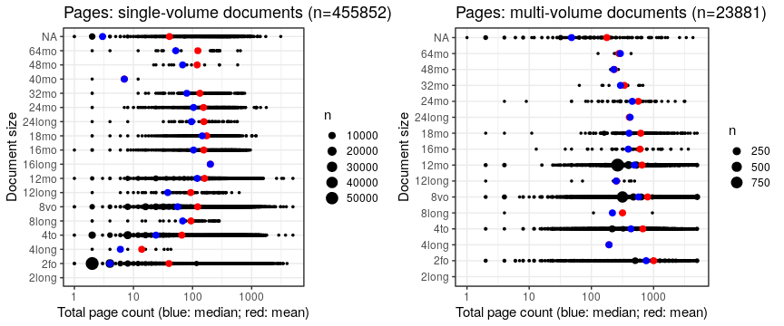

Left: Gatherings vs. overall pagecounts (original + estimated). Right: Only the estimated page counts (for the 18754 documents that have missing pagecount info in the original data):

## Documents with missing pages over years 

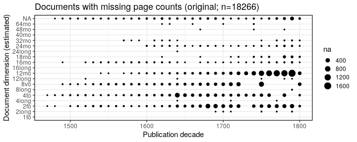

## Estimated paper consumption

Note: there are 10931 documents that have some dimension info but sheet area information could not be calculated. 

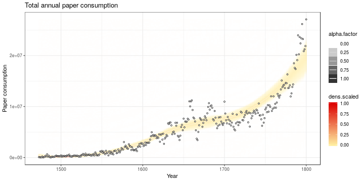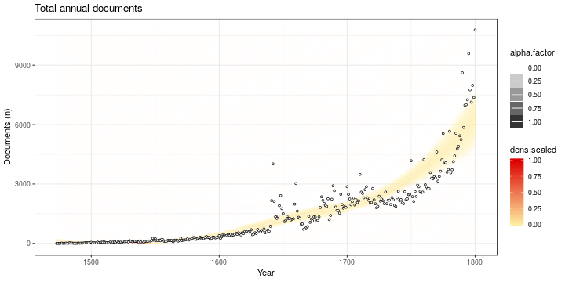

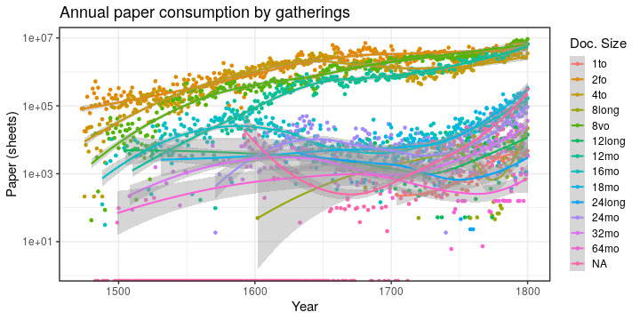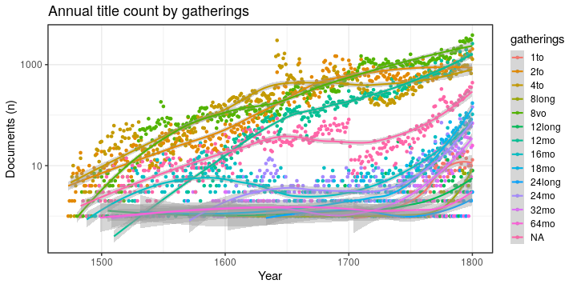

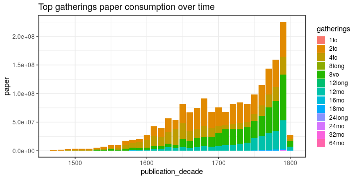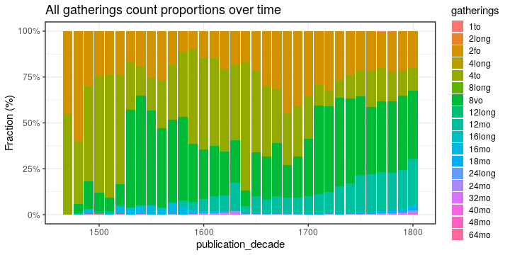

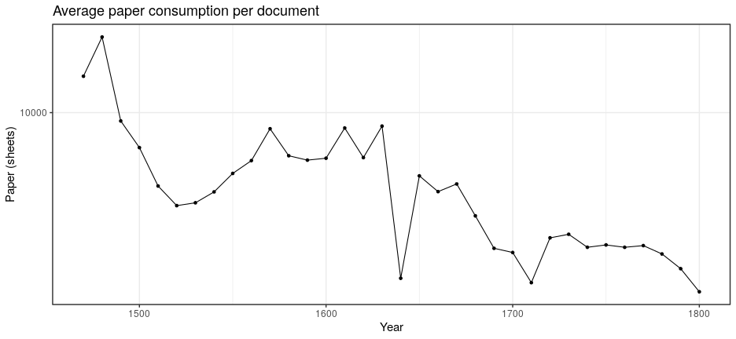

## Pamphlets vs. Books

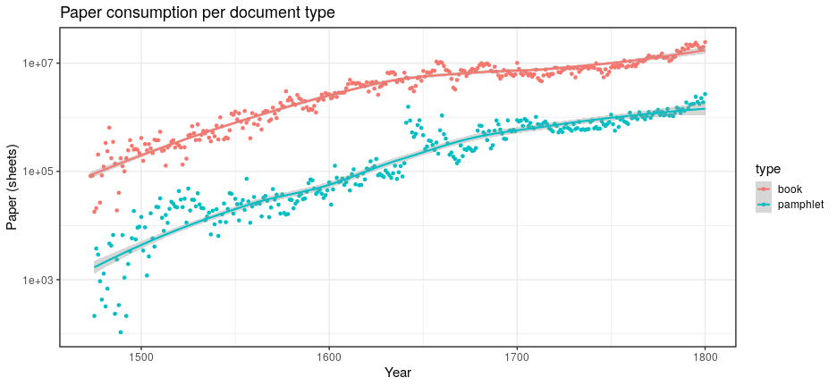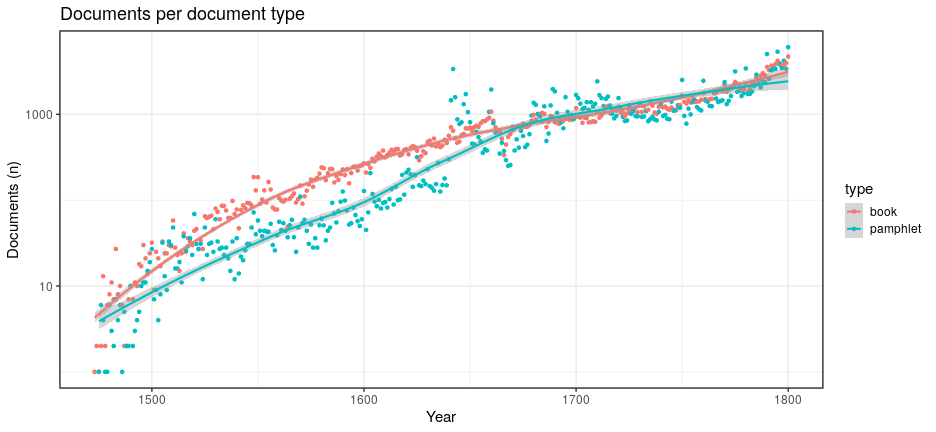

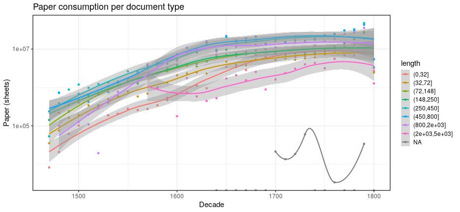

## Nature of the documents over time

Estimated paper consumption by document size

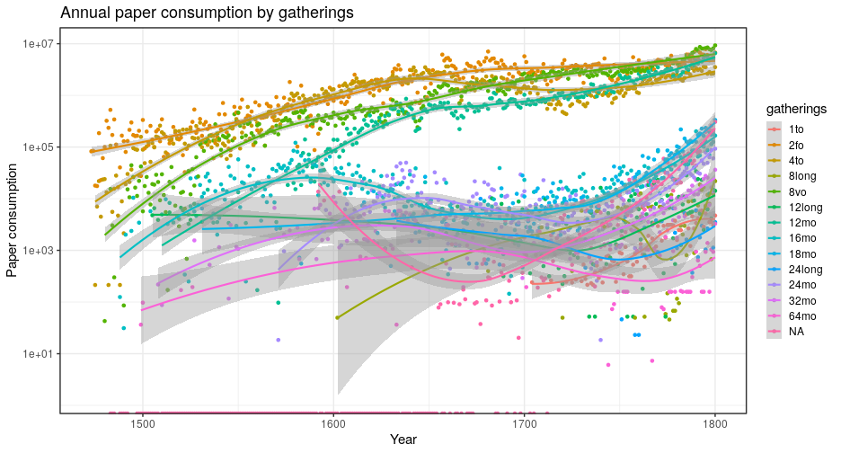

Gatherings height: does it change over time? How increased printing activity is related to book size trends? Alternatively, we could use area (height x width), or median over time. Note that only original (not augmented) dimension info is being used here.

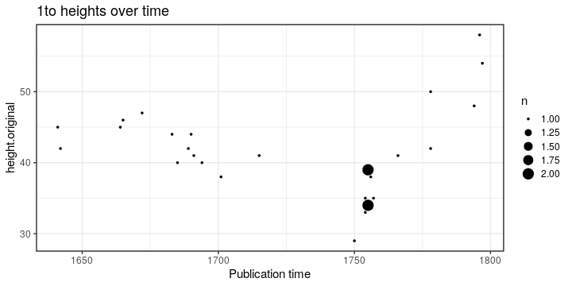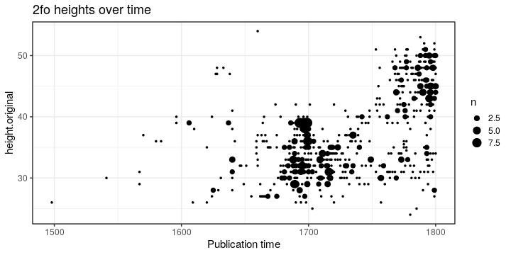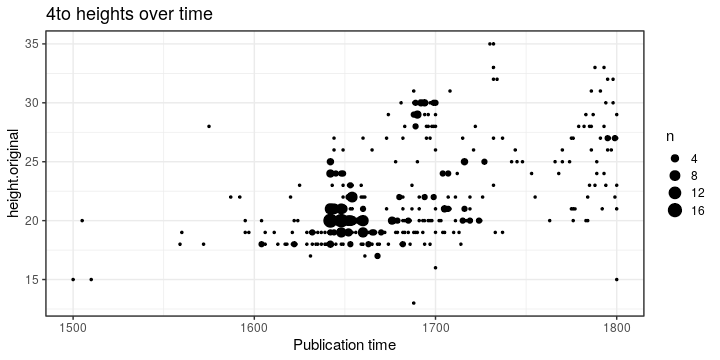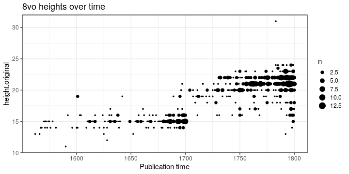

Page counts: does it change over time? Also suggested we could calculate some kind of factor for each time period based on this ? In principle, we could calculate this separately for any given publication place as well but leẗ́s discuss this later. Would help to specify some specific places of interest.

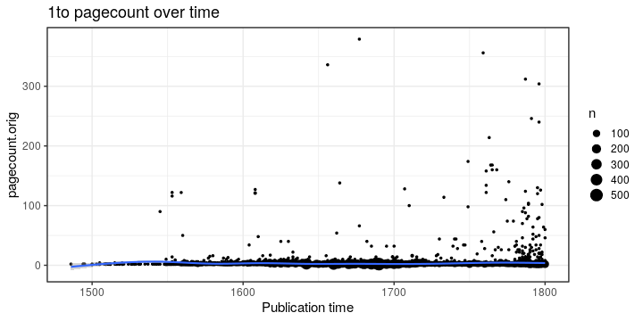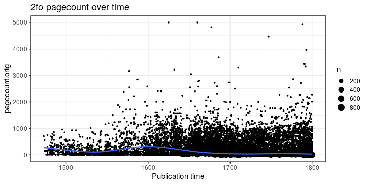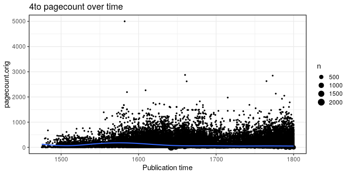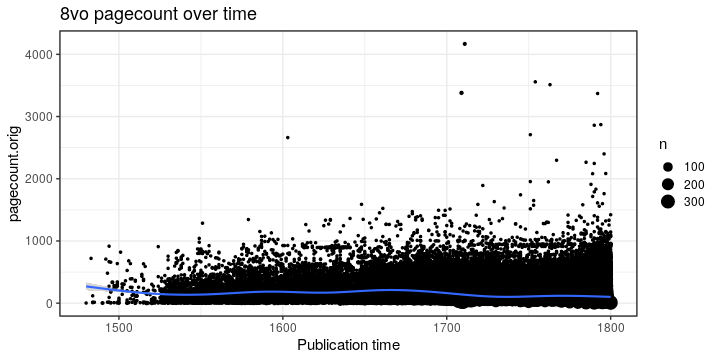

Same for documents that have a sufficient number of pages:

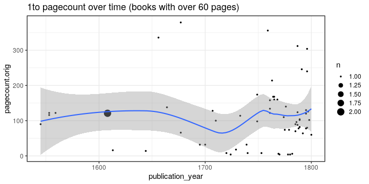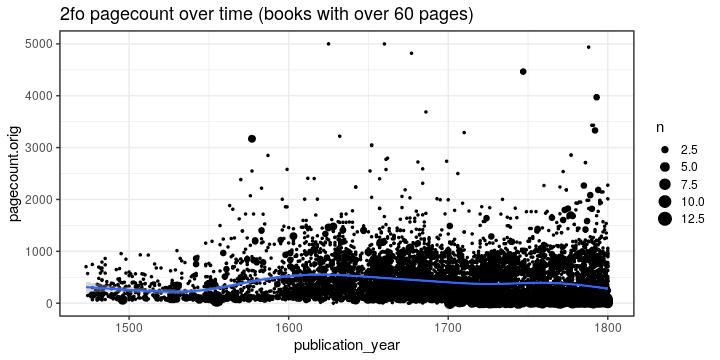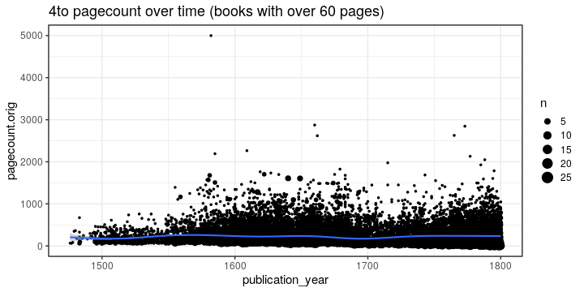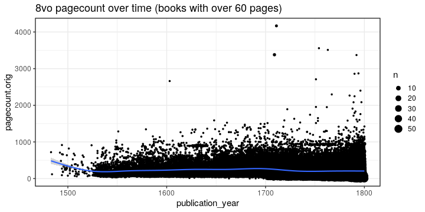

