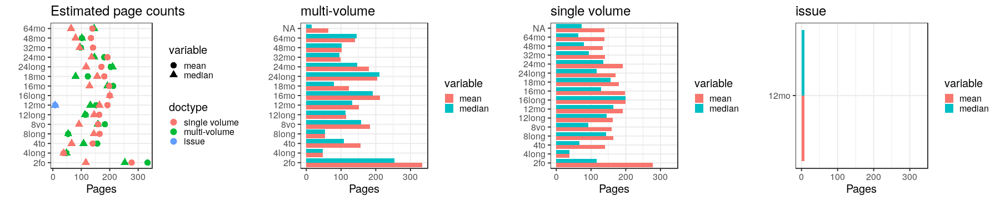

## Page counts

  * Page count available for 477206 documents in total (99.4%), including both readily available and estimated page counts.

  * Page count readily available for 457391 documents (95.2%). 

  * Page count estimated for 19815 documents (4.1%).

  * Page count missing and could not be estimated for 3073 documents (0.6%).

  * Page count updated for 0 documents in the validation phase.
  
  * [Conversions from raw data to final page count estimates](output.tables/pagecount_conversions.csv)

<!--[Page conversions from raw data to final page count estimates with volume info](output.tables/page_conversion_table_full.csv)-->

  * [Discarded pagecount info](output.tables/pagecount_discarded.csv) For these cases the missing/discarded page count is estimated based on average page count estimates for [single volume](mean_pagecounts_singlevol.csv), [multi-volume](mean_pagecounts_multivol.csv) and [issues](mean_pagecounts_issue.csv), calculated from those documents where original pagecount info is available.

  * [Automated unit tests for page count conversions](https://github.com/rOpenGov/bibliographica/blob/master/inst/extdata/tests_polish_physical_extent.csv) - these are used to control that the page count conversions remain correct when changes are made to the cleanup routines


Left: Gatherings vs. overall pagecounts (original + estimated). Right: Only the estimated page counts (for the 19815 documents that have missing pagecount info in the original data):


## Average page counts

This shows the average page count information calculated from those
documents where the page count information was readily
available. These estimated have been used to fill in page count info
for the remaining documents where page count info is missing.

Note that multi-volume documents average page counts are given per volume.


|doc.dimension | mean.pages.singlevol| median.pages.singlevol| n.singlevol|
|:-------------|--------------------:|----------------------:|-----------:|
|2fo           |               396.86|                    270|       14010|
|4long         |                  NaN|                     NA|           3|
|4to           |               369.44|                    366|       40937|
|8long         |                  NaN|                     NA|          32|
|8vo           |               396.16|                    385|      116390|
|12long        |               226.00|                    226|         138|
|12mo          |               622.29|                    604|       50627|
|16long        |                  NaN|                     NA|           1|
|16mo          |                  NaN|                     NA|        1758|
|18mo          |                  NaN|                     NA|        1656|
|24long        |                  NaN|                     NA|          74|
|24mo          |                  NaN|                     NA|        1325|
|32mo          |                  NaN|                     NA|         680|
|48mo          |                  NaN|                     NA|          18|
|64mo          |                  NaN|                     NA|         105|
|NA            |                  NaN|                     NA|        3508|


|doc.dimension | mean.pages.multivol| median.pages.multivol| n.multivol|
|:-------------|-------------------:|---------------------:|----------:|
|2fo           |              524.23|                492.25|       1053|
|8long         |                 NaN|                    NA|          1|
|8vo           |              309.28|                326.00|       6842|
|12long        |               62.00|                 24.00|          5|
|12mo          |              191.96|                157.50|       6717|
|16mo          |              268.67|                291.00|         45|
|18mo          |              156.28|                184.00|        246|
|24mo          |              181.33|                111.50|         56|
|32mo          |                 NaN|                    NA|          7|
|48mo          |                 NaN|                    NA|          2|
|64mo          |              146.33|                146.00|          6|
|NA            |               52.14|                  8.60|        199|


|doc.dimension | mean.pages.issue| median.pages.issue| n.issue|
|:-------------|----------------:|------------------:|-------:|
|1to           |              NaN|                 NA|      10|
|2long         |              NaN|                 NA|       1|
|2fo           |           325.89|             150.00|     256|
|4to           |           192.90|             113.00|     160|
|8vo           |           239.26|             150.67|     390|
|12long        |            24.00|              24.00|       4|
|12mo          |           127.02|             153.00|      97|
|18mo          |              NaN|                 NA|       8|
|24mo          |              NaN|                 NA|       2|
|32mo          |              NaN|                 NA|       1|
|NA            |             2.75|               2.75|     116|


```
## Error in mean.pagecounts[, c("median.pages.multivol", "median.pages.singlevol", : incorrect number of dimensions
```

```
## Error in mean.pagecounts[, c("mean.pages.multivol", "mean.pages.singlevol", : incorrect number of dimensions
```




