## Page counts

Page count: distribution of document sizes

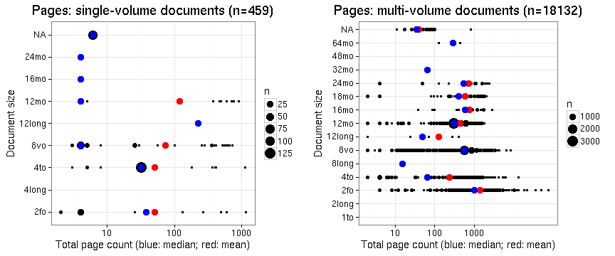


## Documents with missing pages over years 

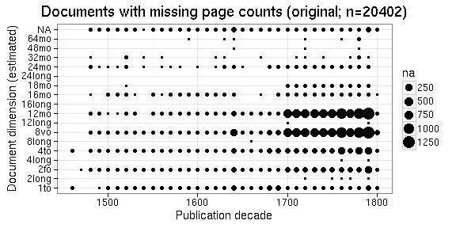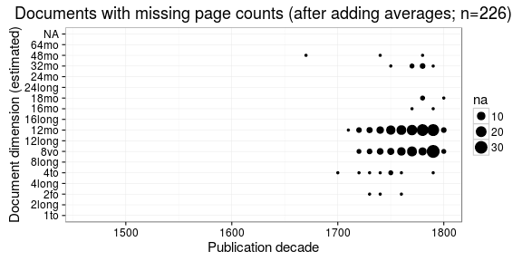


## Estimated paper consumption

Note: there are 0 documents that have some dimensions information but sheet area information could not be calculated for some reason. 


```
## Error in eval(expr, envir, enclos): could not find function "regression_plot"
```

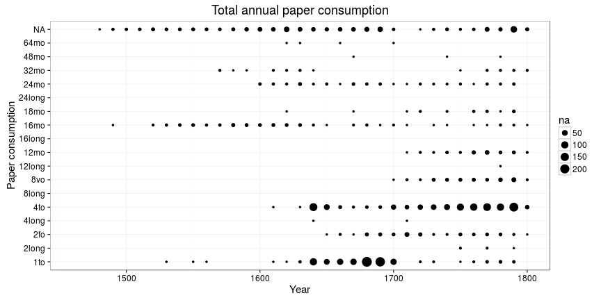

```
## Error in eval(expr, envir, enclos): could not find function "regression_plot"
```

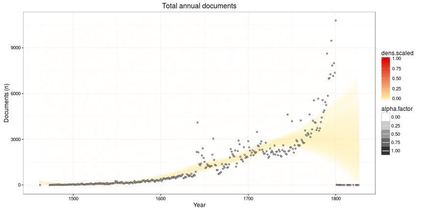

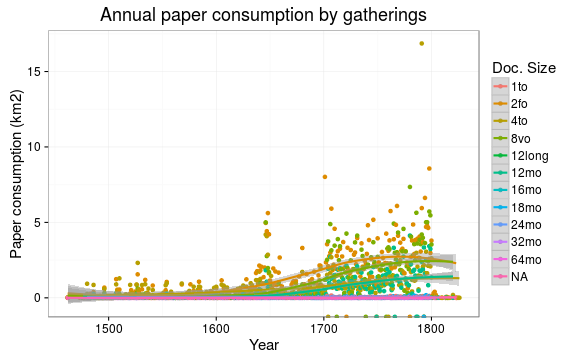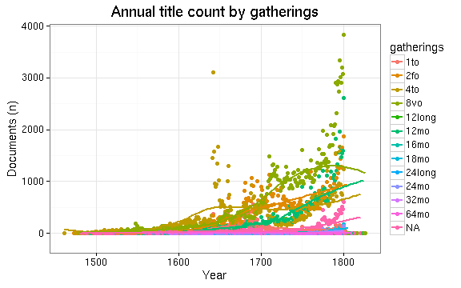
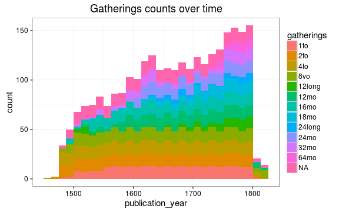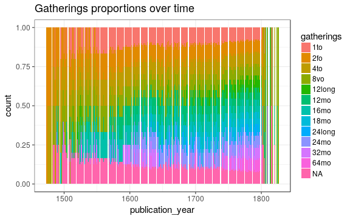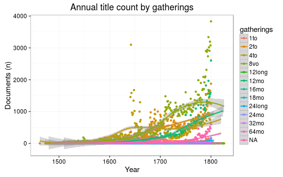

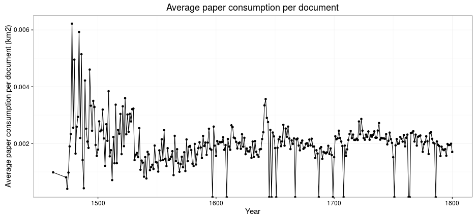


## Pamphlets vs. Books

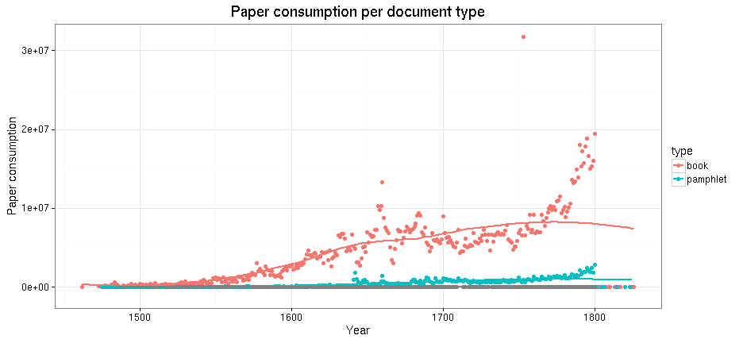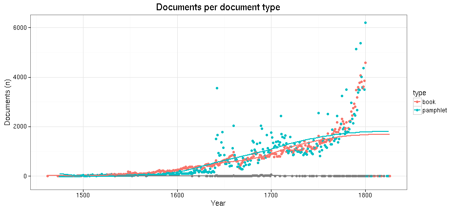


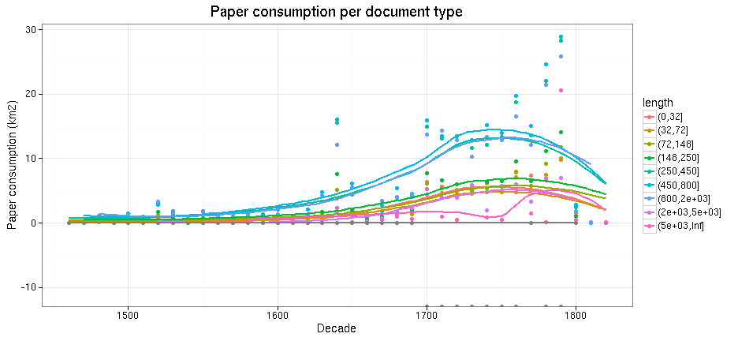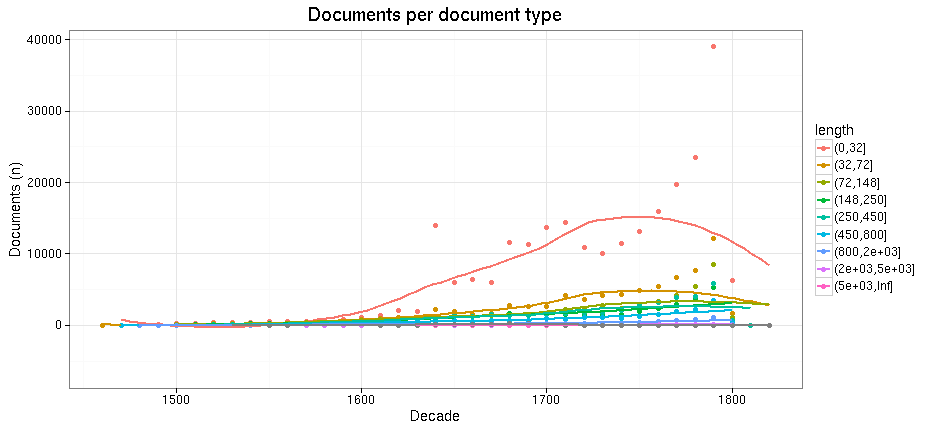


## Top authors

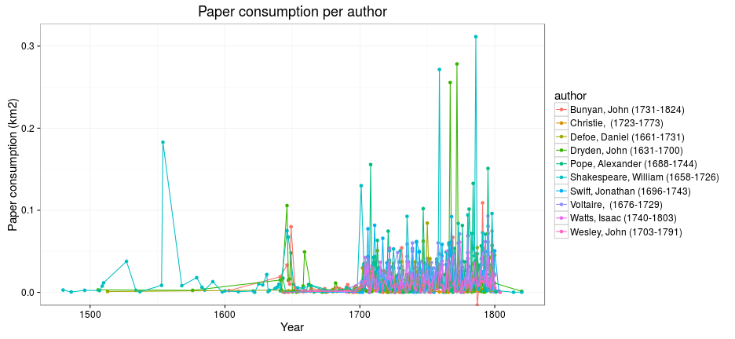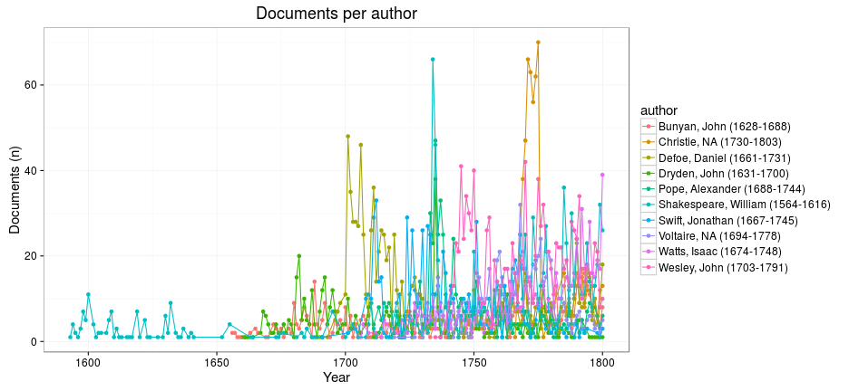


## Nature of the documents over time

Estimated paper consumption by document size

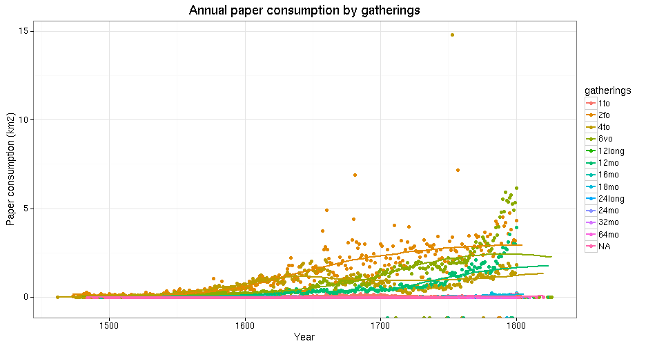


Gatherings height: does it change over time (1600's)? How increased printing activity is related to book size trends? Instead, we could use area (height x width), or simply calculate median over time but let's discuss this later.

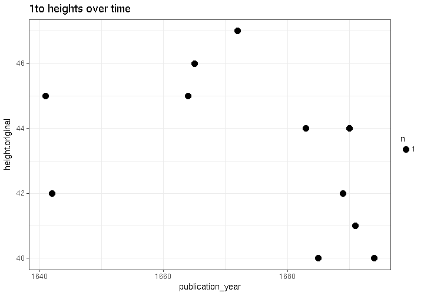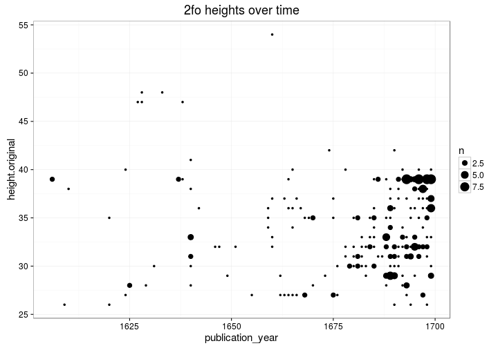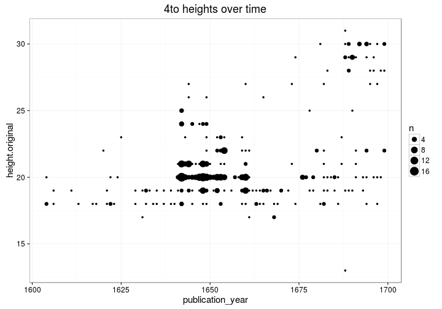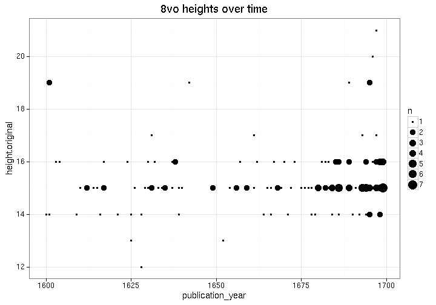


Page counts: does it change over time (1600's)? Also suggested we could calculate some kind of factor for each time period based on this ? In principle, we could calculate this separately for any given publication place as well but leẗ́s discuss this later. Would help to specify some specific places of interest.

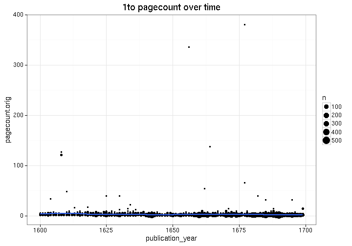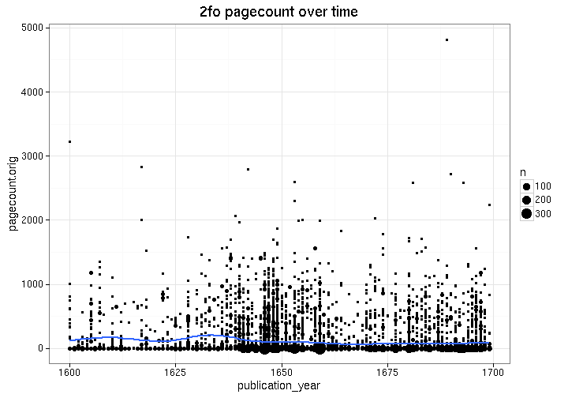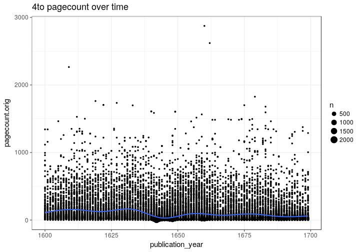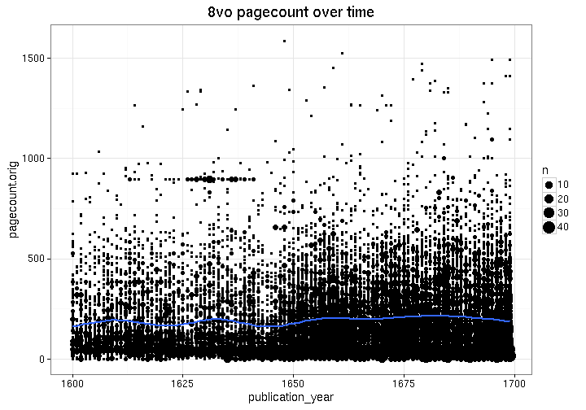


Same for documents that have a sufficient number of pages:

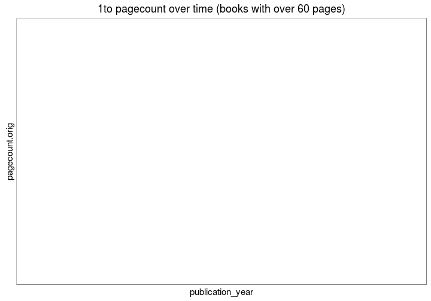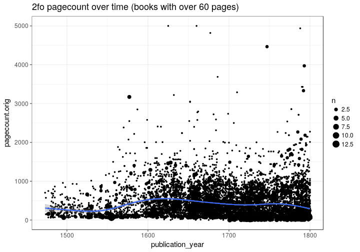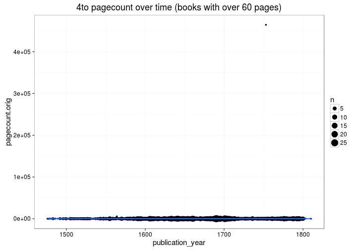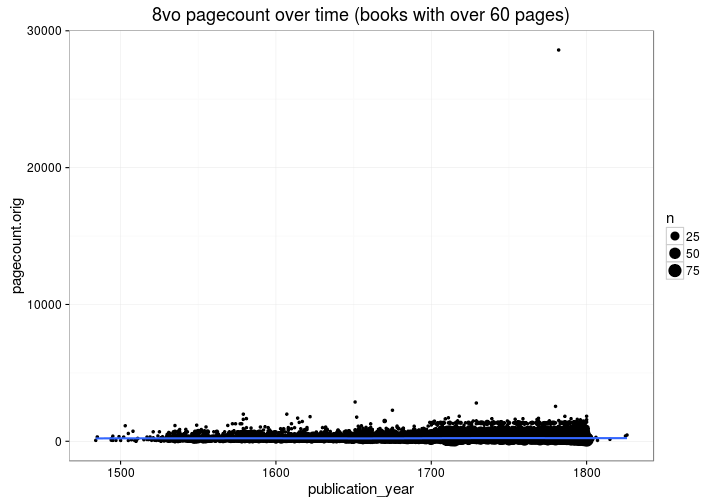
