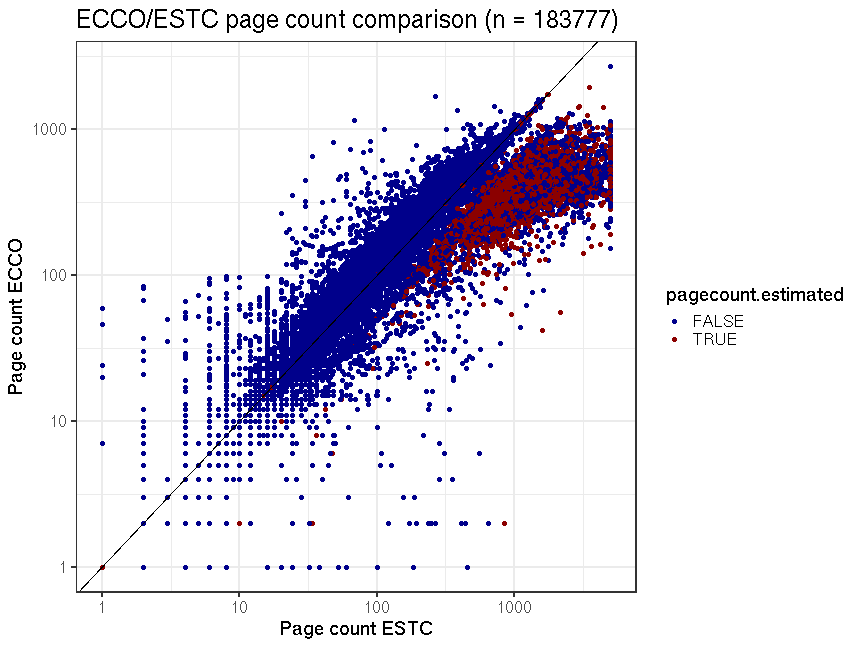

## ESTC/ECCO comparison

There are 207613 ECCO documents and 207613 have an ESTCID. Some of the ECCO entries refer to the same ESTCID; 206911 ECCO documents have a direct match in ESTC. The number of unique ECCO documents that have ESTC ID  is 184327 and 99.7% of these have a match in ESTC.

Total page count for the matched ESTC documents is 97.6% of the total page count over the same ECCO documents. This quantifies the correspondence between ESTC and ECCO.

The Spearman correlation between the ESTC and ECCO page counts is 0.99. This includes also the augmented page count information that is based on estimates.

Comparison between the page counts available in ESTC and ECCO helps to quantify the accuracy our automated page count cleaning and estimation procedure. Some ESTC page counts are missing in the original data and have been augmented based on predefined estimates for [single volume](mean_pagecounts_singlevol.csv), [multi-volume](mean_pagecounts_multivol.csv) and [issues](mean_pagecounts_issue.csv), calculated from those documents where original page count info is available. In the ESTC/ECCO comparison, where pagecounts are available for both data sets, 4.38% of the pagecounts are based on estimates; pagecount for 0 ESTC documents has been replaced or augmented from ECCO, improving the correlation.

Comparison without highlighting specific works. Showing the density of the points as well.

